# MVP Engenharia de Dados - Analise de Alimentos e suas informações de macronutrientes


**Nome:** Marcos Aurélio Guidolini

**Matrícula:** 4052025002325

 
# 📑 Índice

---

### 1.0 - Contexto de Negócio e Perguntas
- **1.1** - 🌐 Visão Geral do Projeto
  - **1.1.1** - 🧩 Descrição do Problema
  - **1.1.2** - 📌 Hipóteses e Perguntas para Análise
  - **1.1.3** - ❓ Perguntas que você pode responder com a tabela

### 2.0 - Preparação
- **2.1** - Preparando o Ambiente
  - **2.1.1** - Apaga o catálogo `MVP_ENG_DADOS`
  - **2.1.2** - Cria o catálogo `MVP_ENG_DADOS`
  - **2.1.3** - Utiliza o catálogo `MVP_ENG_DADOS`
  - **2.1.4** - Cria o schema `bronze`
  - **2.1.5** - Cria o schema `silver`
  - **2.1.6** - Cria o schema `gold`
  - **2.1.7** - Cria o schema `adaptacao`
  - **2.1.8** - Cria o schema `analise`
- **2.2** - Evidência de Catálogo e Schemas Criados

### 3.0 - Carga de Dados
- **3.1** - Download dos Arquivos
  - **3.1.1** - Utiliza o catálogo `MVP_ENG_DADOS`
  - **3.1.2** - Cria o volume `nutri_alimentos`
- **3.2** - Food Nutrition Dataset (USDA — 125 registros, 24 colunas)
  - **3.2.1** - Copia o arquivo `Food_Nutrition.csv`
  - **3.2.2** - Sobre o Conjunto de Dados
- **3.3** - Taco Dataset (TACO — 597 registros, 27 colunas)
  - **3.3.1** - Copia o arquivo `Taco.csv`
  - **3.3.2** - Sobre o Conjunto de Dados
- **3.4** - Evidência do Download dos Arquivos

### 4.0 - Pipeline, Modelagem e Catálogo de Dados
- **4.1** - Camada Bronze
  - **4.1.1** - Utilização de Catálogo e Schema
    - 4.1.1.1 - Resumo da Célula (Utiliza o catálogo `MVP_ENG_DADOS` e o schema `bronze`)
  - **4.1.2** - Criação da Tabela `Alimentos_Taco` (597 registros)
    - 4.1.2.1 - Carrega arquivo `Taco.csv`
    - 4.1.2.2 - Criar tabela `Alimentos_Taco` no schema Bronze
    - 4.1.2.3 - Descrição da Tabela `Alimentos_Taco`
    - 4.1.2.4 - Apresenta as informações da tabela (SELECT)
  - **4.1.3** - Criação da Tabela `Alimentos_Food_Nutrition` (125 registros)
    - 4.1.3.1 - Carrega arquivo `Food_Nutrition.csv`
    - 4.1.3.2 - Criar tabela `Alimentos_Food_Nutrition` no schema Bronze
    - 4.1.3.3 - Descrição da Tabela `Alimentos_Food_Nutrition`
    - 4.1.3.4 - Renomeação de colunas para português (24 colunas)
  - **4.1.4** - Evidência da Criação da Camada Bronze
- **4.2** - Camada Silver (Qualidade de Dados)
  - **4.2.1** - Utilização de Catálogo e Schema
    - 4.2.1.1 - Explicação da Célula (Utiliza o catálogo `MVP_ENG_DADOS` e o schema `silver`)
  - **4.2.2** - Tabela `alimentos_food_nutrition`
    - 4.2.2.1 - Renomeação de colunas para português
    - 4.2.2.2 - Gravação na tabela `silver.food_nutrition_silver`
    - 4.2.2.3 - Verificação de campos em branco
    - 4.2.2.4 - Tratamento de valores nulos ou em branco
    - 4.2.2.5 - Criação da tabela `silver.alimentos_food_nutrition_final` (enriquecimento)
    - 4.2.2.6 - Descrição e dicionário de dados
  - **4.2.3** - Tabela `alimentos_taco`
    - 4.2.3.1 - Criação da tabela `silver.alimentos_taco_silver`
    - 4.2.3.2 - Visualização da tabela `alimentos_taco_silver`
    - 4.2.3.3 - Tratamento de valores nulos, em branco e "Tr" (trace)
    - 4.2.3.4 - Verificação de valores nulos ou em branco
    - 4.2.3.5 - Explicação - Verificação de valores nulos
    - 4.2.3.6 - Explicação - Tratamento de valores nulos, em branco e "Tr"
    - 4.2.3.7 - Verificação de valores negativos
    - 4.2.3.8 - Explicação - Verificação de valores negativos
    - 4.2.3.9 - Substituição de valores negativos por zero
    - 4.2.3.10 - Seleção de colunas e criação da tabela `alimentos_taco_final`
    - 4.2.3.11 - Adição dos campos `acucares` e `densidade_nutritiva` (enriquecimento)
    - 4.2.3.12 - Remoção de colunas não necessárias
    - 4.2.3.13 - Descrição e dicionário de dados
  - **4.2.4** - Evidência da Criação da Camada Silver
- **4.3** - Camada Gold (Modelagem Dimensional — Star Schema)
  - **4.3.1** - Utilização de Catálogo e Schema
  - **4.3.2** - Modelo de Dados
    - 4.3.2.1 - Modelo Estrela (criação de `dim_fonte`, `dim_alimento`, `dim_grupo_alimentar`, `fato_nutricao`)
  - **4.3.3** - Evidência da Criação da Camada Gold

### 5.0 - Análise
- **5.1** - Utilização de Catálogo e Schema
  - **5.1.1** - Utiliza o catálogo `MVP_ENG_DADOS` e o schema `analise`
    - 5.1.1.1 - Resumo da Célula (Seleção de Catálogo e Schema Gold)
- **5.2** - Análise das Questões Respondidas
  - **5.2.1** - Questão 01 — Melhor relação proteína por caloria
    - 5.2.1.1 - Consulta SQL
    - 5.2.1.2 - Criação da VIEW `vw_melhor_proteina_por_caloria`
    - 5.2.1.3 - Gráfico de visualização
    - 5.2.1.4 - Explicação do Resultado
  - **5.2.2** - Questão 02 — Itens mais ricos em fibras por porção
    - 5.2.2.1 - Consulta SQL
    - 5.2.2.2 - Criação da VIEW `vw_mais_ricos_fibras`
    - 5.2.2.3 - Gráfico de visualização
    - 5.2.2.4 - Explicação do Resultado
  - **5.2.3** - Questão 03 — Maior densidade nutricional (micronutrientes por caloria)
    - 5.2.3.1 - Consulta SQL
    - 5.2.3.2 - Criação da VIEW `vw_maior_densidade_nutritiva`
    - 5.2.3.3 - Gráfico de visualização
    - 5.2.3.4 - Explicação do Resultado
  - **5.2.4** - Questão 04 — Opções com maior teor de sódio
    - 5.2.4.1 - Consulta SQL
    - 5.2.4.2 - Criação da VIEW `vw_maior_sodio`
    - 5.2.4.3 - Gráfico de visualização
    - 5.2.4.4 - Explicação do Resultado
  - **5.2.5** - Questão 05 — Alimentos mais adequados para dietas low-carb
    - 5.2.5.1 - Consulta SQL
    - 5.2.5.2 - Criação da VIEW `vw_low_carb`
    - 5.2.5.3 - Gráfico de visualização
    - 5.2.5.4 - Explicação do Resultado
  - **5.2.6** - Questão 06 — Itens com maior quantidade de gorduras saturadas
    - 5.2.6.1 - Consulta SQL
    - 5.2.6.2 - Criação da VIEW `vw_maior_gordura_saturada`
    - 5.2.6.3 - Gráfico de visualização
    - 5.2.6.4 - Explicação do Resultado
  - **5.2.7** - Questão 07 — Alimentos mais indicados para ganho de massa muscular
    - 5.2.7.1 - Consulta SQL
    - 5.2.7.2 - Criação da VIEW `vw_maior_massa_muscular`
    - 5.2.7.3 - Gráfico de visualização
    - 5.2.7.4 - Explicação do Resultado
  - **5.2.8** - Questão 08 — Alimentos mais eficientes para saciedade com poucas calorias
    - 5.2.8.1 - Consulta SQL
    - 5.2.8.2 - Criação da VIEW `vw_maior_saciedade`
    - 5.2.8.3 - Gráfico de visualização
    - 5.2.8.4 - Explicação do Resultado
  - **5.2.9** - Questão 09 — Alimentos com maior quantidade de açúcar
    - 5.2.9.1 - Consulta SQL
    - 5.2.9.2 - Criação da VIEW `vw_maior_acucares`
    - 5.2.9.3 - Gráfico de visualização
    - 5.2.9.4 - Explicação do Resultado
  - **5.2.10** - Questão 10 — Alimentos mais adequados para dietas veganas ou vegetarianas
    - 5.2.10.1 - Consulta SQL
    - 5.2.10.2 - Criação da VIEW `vw_melhor_vegano`
    - 5.2.10.3 - Gráfico de visualização
    - 5.2.10.4 - Explicação do Resultado
- **5.3** - Evidência da Criação das Views de Análise

### 6.0 - Autoavaliação
- **6.1** - Primeiros passos
- **6.2** - Expectativas
- **6.3** - Mudança de Rota
- **6.4** - Avaliação

---

> *Índice atualizado com todas as seções do notebook.*


# 1.0 - Contexto de Negócio e Perguntas

> **Resumo:** Esta seção apresenta o contexto de negócio do projeto, descrevendo a visão geral, o problema central e as hipóteses e perguntas analíticas que guiarão toda a exploração dos dados nutricionais. O objetivo é estabelecer, desde o início, quais questões de negócio devem ser respondidas e quais hipóteses serão testadas ao longo do pipeline de dados.

---

## 1.1 -  🌐Visão Geral do Projeto

O projeto consiste em analisar alimentos a partir de uma base nutricional ampla, padronizada e confiável, com o objetivo de responder perguntas sobre composição nutricional, densidade, qualidade dos alimentos e padrões alimentares. 

A análise segue uma metodologia robusta, abordando desde a exploração inicial dos dados até a engenharia de novas características, culminando na validação de hipóteses cruciais para o entendimento dos padrões alimentares.

### 1.1.1 🧩 Descrição do Problema

O problema central do projeto é: **como transformar dados nutricionais brutos em respostas claras, comparáveis e úteis sobre alimentos?**


### 1.1.2 📌 Hipóteses e Perguntas para Análise

#### 🧪 Hipóteses que você pode testar com uma tabela de nutrição
1. Alimentos com maior densidade calórica tendem a ter menor teor de fibras.
2. Frutas possuem maior concentração de carboidratos simples do que vegetais.
3. Fontes de proteína animal têm mais gordura saturada do que fontes vegetais.
4. Alimentos ultraprocessados apresentam maior teor de sódio do que alimentos naturais.
5. Alimentos com alto teor de proteína têm maior saciedade por porção.
6. Produtos integrais possuem mais fibras do que suas versões refinadas.
7. Alimentos ricos em gordura têm menor volume por porção.
8. Alimentos com maior teor de açúcar têm menor densidade de micronutrientes.
9. Vegetais verdes escuros são mais ricos em ferro e cálcio do que vegetais claros.
10. Snacks industrializados apresentam maior relação calorias/grama do que refeições completas.

### 1.1.3❓ Perguntas que você pode responder com a tabela
1. Quais alimentos têm a melhor relação proteína por caloria?
2. Quais itens são mais ricos em fibras por porção?
3. Quais alimentos têm maior densidade nutricional (micronutrientes por caloria)?
4. Quais opções possuem maior teor de sódio?
5. Quais alimentos são mais adequados para dietas low-carb?
6. Quais itens têm maior quantidade de gorduras saturadas?
7. Quais alimentos são mais indicados para ganho de massa muscular?
8. Quais opções são mais eficientes para quem busca saciedade com poucas calorias?
9. Quais alimentos apresentam maior quantidade de açúcar adicionado?
10. Quais itens são mais adequados para dietas veganas ou vegetarianas?


# 2.0 - Preparação

> **Resumo:** Esta seção é responsável por preparar todo o ambiente no Databricks antes da carga e transformação dos dados. O objetivo é garantir que a estrutura de organização — catálogo, schemas e volumes — esteja corretamente configurada no Unity Catalog, fornecendo uma base sólida e limpa para as etapas subsequentes do pipeline. Aqui são criados o catálogo `MVP_ENG_DADOS` e os schemas que compõem a **arquitetura de medalhão** (`bronze`, `silver`, `gold`), além dos schemas auxiliares `adaptacao` e `analise`, que servem para armazenar transformações intermediárias e resultados analíticos.

---

## 2.1 - Preparando o Ambiente

> **Resumo:** Esta seção prepara o ambiente no Databricks criando o catálogo `MVP_ENG_DADOS` e os schemas que organizam os dados ao longo do pipeline. Inicialmente, o catálogo anterior é removido para garantir um estado limpo; em seguida, o catálogo é recriado e definido como ativo. Por fim, são criados os schemas `bronze`, `silver` e `gold` — que compõem a **arquitetura de medalhão** (Medallion Architecture) — além dos schemas auxiliares `adaptacao` e `analise`, que servem para armazenar tabelas de apoio, transformações intermediárias e resultados analíticos.

### 📋 Etapas desta seção

1. **Apagar o catálogo `MVP_ENG_DADOS`** (se existir) para garantir um ambiente limpo.
2. **Criar o catálogo `MVP_ENG_DADOS`** no Unity Catalog.
3. **Definir o catálogo como ativo** com `USE CATALOG`.
4. **Criar o schema `bronze`** — camada de dados brutos.
5. **Criar o schema `silver`** — camada de dados tratados e normalizados.
6. **Criar o schema `gold`** — camada de dados consolidados prontos para consumo.
7. **Criar o schema `adaptacao`** — espaço auxiliar para transformações intermediárias.
8. **Criar o schema `analise`** — espaço auxiliar para análises e relatórios.

> Ao final desta seção, toda a estrutura de organização de dados estará pronta para receber as cargas e transformações das próximas etapas.

````
%sql
DROP CATALOG IF EXISTS MVP_ENG_DADOS CASCADE
````

### 2.1.1 - Resumo da célula - Apaga o catálogo MVP_ENG_DADOS

> **Resumo:** Esta célula remove completamente o catálogo `MVP_ENG_DADOS` e todos os seus objetos dependentes (schemas, tabelas, views), garantindo um ambiente limpo antes da recriação da estrutura.

O comando abaixo **remove completamente o catálogo** `MVP_ENG_DADOS`:

```
%sql
DROP CATALOG IF EXISTS MVP_ENG_DADOS CASCADE
```

- **`DROP CATALOG`**: exclui um catálogo do Unity Catalog, incluindo todos os schemas e tabelas associados a ele.
- **`IF EXISTS`**: evita erros caso o catálogo ainda não exista — se ele não estiver presente, o comando simplesmente não faz nada.
- **`CASCADE`**: garante que a exclusão seja recursiva, removendo automaticamente todos os objetos dependentes (schemas, tabelas, views, etc.) dentro do catálogo.

> Esse comando é útil em ambientes de desenvolvimento para garantir um estado limpo antes de recriar a estrutura do zero, que é exatamente o que acontece na célula seguinte.

```
%sql
CREATE CATALOG MVP_ENG_DADOS
```
### 2.1.2 - Resumo da célula - Cria o catálogo MVP_ENG_DADOS

> **Resumo:** Esta célula cria um novo catálogo `MVP_ENG_DADOS` no Unity Catalog, que servirá como namespace principal para agrupar os schemas (`bronze`, `silver`, `gold`) e suas respectivas tabelas.

O comando abaixo **cria um novo catálogo** no Unity Catalog:

```
%sql
CREATE CATALOG MVP_ENG_DADOS
```

- **`CREATE CATALOG`**: cria um catálogo no Unity Catalog, que é o nível mais alto da hierarquia de organização de dados (`CATALOG.SCHEMA.TABLE`).
- **`MVP_ENG_DADOS`**: é o nome do catálogo. Ele servirá como namespace principal para agrupar os schemas (`bronze`, `silver`, `gold`) e suas respectivas tabelas.

> Este catálogo foi criado logo após a remoção (DROP) do catálogo anterior, garantindo que o ambiente esteja limpo e pronto para a recriação da estrutura do zero.

```
%sql
USE CATALOG MVP_ENG_DADOS 
```
   

### 2.1.3 - Resumo da célula - Utiliza o catálogo MVP_ENG_DADOS

> **Resumo:** Esta célula define o catálogo `MVP_ENG_DADOS` como o catálogo ativo na sessão atual, fazendo com que todos os comandos SQL subsequentes que referenciem schemas ou tabelas sem qualificação de catálogo sejam resolvidos dentro dele.

O comando abaixo **seleciona o catálogo** `MVP_ENG_DADOS` como ativo:

```
%sql
USE CATALOG MVP_ENG_DADOS
```

- **`USE CATALOG`**: define o catálogo ativo para a sessão. A partir desse ponto, qualquer referência a um schema ou tabela sem prefixo de catálogo será automaticamente resolvida dentro de `MVP_ENG_DADOS`.
- **`MVP_ENG_DADOS`**: é o nome do catálogo que foi criado na célula anterior e agora será utilizado como namespace padrão.

> Este comando é executado logo após a criação do catálogo, garantindo que os próximos comandos (`CREATE SCHEMA bronze`, `CREATE SCHEMA silver`, etc.) sejam criados dentro do catálogo correto, sem necessidade de referenciar o catálogo explicitamente em cada comando.

```
%sql
CREATE SCHEMA bronze
```

### 2.1.4 - Resumo da célula - Cria o schema bronze

> **Resumo:** Esta célula cria o schema `bronze` dentro do catálogo ativo `MVP_ENG_DADOS`, estabelecendo a primeira camada da arquitetura de medalhão, onde os dados serão ingeridos em seu formato bruto, sem transformações significativas.

#### Explicação do código

O comando abaixo **cria o schema** `bronze` dentro do catálogo ativo `MVP_ENG_DADOS`:

```
%sql
CREATE SCHEMA bronze
```

- **`CREATE SCHEMA`**: cria um schema (também chamado de *database*) dentro do catálogo atualmente selecionado na sessão. Como o comando `USE CATALOG MVP_ENG_DADOS` já foi executado, não é necessário referenciar o catálogo explicitamente.
- **`bronze`**: é o nome do schema. Na arquitetura de medalhão (Medallion Architecture), a camada **bronze** é a primeira etapa, onde os dados são ingeridos em seu formato bruto, sem transformações significativas.

> O schema `bronze` servirá como local de armazenamento das tabelas de dados raw, que posteriormente serão tratadas e enviadas para as camadas `silver` e `gold`.

```
%sql
CREATE SCHEMA silver
```
   
### 2.1.5 - Resumo da célula - Cria o schema silver

> **Resumo:** Esta célula cria o schema `silver` dentro do catálogo ativo `MVP_ENG_DADOS`, estabelecendo a segunda camada da arquitetura de medalhão, onde os dados provenientes da camada `bronze` passam por limpeza, normalização e padronização.

#### Explicação do código

O comando abaixo **cria o schema** `silver` dentro do catálogo ativo `MVP_ENG_DADOS`:

```
%sql
CREATE SCHEMA silver
```

- **`CREATE SCHEMA`**: cria um schema (também chamado de *database*) dentro do catálogo atualmente selecionado na sessão. Como o comando `USE CATALOG MVP_ENG_DADOS` já foi executado, não é necessário referenciar o catálogo explicitamente.
- **`silver`**: é o nome do schema. Na arquitetura de medalhão (Medallion Architecture), a camada **silver** é a segunda etapa, onde os dados provenientes da camada `bronze` passam por limpeza, normalização e padronização, tornando-se mais confiáveis e prontos para análise.

> O schema `silver` servirá como local de armazenamento das tabelas com dados tratados e enriquecidos, que posteriormente serão consolidados na camada `gold` para consumo final.

```
%sql
CREATE SCHEMA gold
```


### 2.1.6 - Resumo da célula - Cria o schema gold

> **Resumo:** Esta célula cria o schema `gold` dentro do catálogo ativo `MVP_ENG_DADOS`, estabelecendo a última camada da arquitetura de medalhão, onde os dados já tratados e enriquecidos nas camadas `bronze` e `silver` são consolidados em sua forma final, prontos para consumo analítico e de negócio.

#### Explicação do código

O comando abaixo **cria o schema** `gold` dentro do catálogo ativo `MVP_ENG_DADOS`:

```
%sql
CREATE SCHEMA gold
```

- **`CREATE SCHEMA`**: cria um schema (também chamado de *database*) dentro do catálogo atualmente selecionado na sessão. Como o comando `USE CATALOG MVP_ENG_DADOS` já foi executado, não é necessário referenciar o catálogo explicitamente.
- **`gold`**: é o nome do schema. Na arquitetura de medalhão (Medallion Architecture), a camada **gold** é a última etapa, onde os dados já tratados e enriquecidos nas camadas `bronze` e `silver` são consolidados em sua forma final, prontos para consumo por analistas, cientistas de dados e aplicações de negócio.

> O schema `gold` servirá como local de armazenamento das tabelas com dados curados e em nível de negócio, que representam a visão final e analítica dos dados processados ao longo de todo o pipeline.

```
%sql
CREATE SCHEMA adaptacao
```

### 2.1.7 - Resumo da célula - Cria o schema adaptacao

> **Resumo:** Esta célula cria o schema `adaptacao` dentro do catálogo ativo `MVP_ENG_DADOS`, estabelecendo um espaço auxiliar fora do fluxo principal da arquitetura de medalhão, destinado a armazenar tabelas de apoio, ajustes e transformações intermediárias.

#### Explicação do código

O comando abaixo **cria o schema** `adaptacao` dentro do catálogo ativo `MVP_ENG_DADOS`:

```
%sql
CREATE SCHEMA adaptacao
```

- **`CREATE SCHEMA`**: cria um schema (também chamado de *database*) dentro do catálogo atualmente selecionado na sessão. Como o comando `USE CATALOG MVP_ENG_DADOS` já foi executado, não é necessário referenciar o catálogo explicitamente.
- **`adaptacao`**: é o nome do schema. Diferente das camadas da arquitetura de medalhão (`bronze`, `silver`, `gold`), este schema tem um propósito **auxiliar** e serve como um espaço separado para armazenar tabelas de **apoio, ajustes ou transformações intermediárias** que não se encaixam diretamente no fluxo principal de bronze → silver → gold.

> O schema `adaptacao` pode ser utilizado, por exemplo, para armazenar tabelas temporárias, dados de parametrização, tabelas de mapeamento (lookup) ou resultados de transformações intermediárias que ainda não estão prontos para a camada `gold`, mantendo o fluxo principal de dados organizado e separado.

```
%sql
CREATE SCHEMA analise
```

### 2.1.8 - Resumo da célula - Cria o schema analise

> **Resumo:** Esta célula cria o schema `analise` dentro do catálogo ativo `MVP_ENG_DADOS`, estabelecendo um espaço auxiliar fora do fluxo principal da arquitetura de medalhão, destinado a armazenar tabelas de análise, relatórios e resultados exploratórios que consomem dados já processados nas camadas anteriores.

#### Explicação do código

O comando abaixo **cria o schema** `analise` dentro do catálogo ativo `MVP_ENG_DADOS`:

```
%sql
CREATE SCHEMA analise
```

- **`CREATE SCHEMA`**: cria um schema (também chamado de *database*) dentro do catálogo atualmente selecionado na sessão. Como o comando `USE CATALOG MVP_ENG_DADOS` já foi executado, não é necessário referenciar o catálogo explicitamente.
- **`analise`**: é o nome do schema. Assim como o schema `adaptacao`, este schema tem um propósito **auxiliar** e não faz parte do fluxo principal da arquitetura de medalhão (`bronze` → `silver` → `gold`). Ele serve como um espaço dedicado para armazenar tabelas de **análise, relatórios ou resultados exploratórios** que consomem dados já processados nas camadas anteriores.

> O schema `analise` pode ser utilizado, por exemplo, para armazenar tabelas agregadas, views analíticas, resultados de consultas ad-hoc ou conjuntos de dados preparados especificamente para consumo por ferramentas de BI e relatórios de negócio, mantendo esses artefatos separados das camadas principais do pipeline.


## 2.2 - Evidência de Catálogo e Schemas Criados

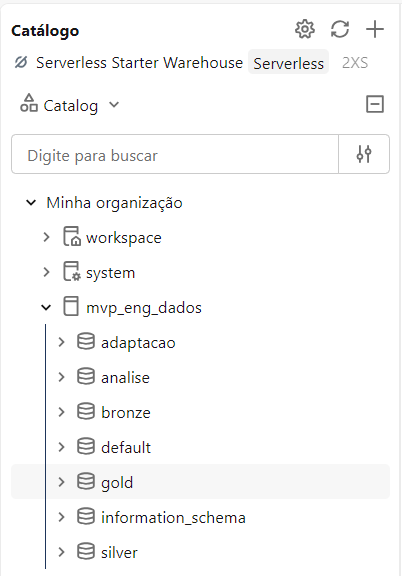


# 3.0 - Carga de Dados

> **Resumo:** Esta seção é responsável por realizar a carga de dados no pipeline, abrangendo o download dos arquivos de origem (Food_Nutrition.csv e Taco.csv) para um volume no Unity Catalog, a leitura desses arquivos CSV e a criação das tabelas na camada **bronze**, onde os dados serão armazenados em seu formato bruto para posterior processamento nas camadas `silver` e `gold`.

---

## 3.1 - Download dos Arquivos

> **Resumo:** Esta seção é responsável por preparar o ambiente para a carga de dados, definindo o catálogo ativo, criando um volume de armazenamento no Unity Catalog e copiando os arquivos de origem (Food_Nutrition.csv e Taco.csv) do workspace do Databricks para o volume `nutri_alimentos` no schema `adaptacao`, de onde poderão ser lidos e processados nas etapas subsequentes.

#### Etapas realizadas nesta seção:

1. **Utilização do catálogo:** Define `MVP_ENG_DADOS` como catálogo ativo na sessão atual do Unity Catalog, garantindo que todas as operações subsequentes sejam executadas dentro deste catálogo.

2. **Criação do volume:** Cria o volume `nutri_alimentos` no schema `adaptacao`, que servirá como local de armazenamento para os arquivos CSV contendo os dados de composição nutricional de alimentos.

3. **Download do Food Nutrition Dataset:** Copia o arquivo **Food_Nutrition.csv** — contendo dados de composição nutricional de alimentos dos EUA provenientes do USDA (Departamento de Agricultura dos EUA) — do workspace do Databricks para o volume criado.

4. **Download do Taco Dataset:** Copia o arquivo **Taco.csv** — contendo dados de composição nutricional de alimentos brasileiros baseados na Tabela Brasileira de Composição de Alimentos (TACO) — do workspace do Databricks para o mesmo volume.

> Ao final desta seção, os dois conjuntos de dados estarão disponíveis no volume `/Volumes/mvp_eng_dados/adaptacao/nutri_alimentos/`, prontos para serem lidos, transformados e carregados nas camadas da arquitetura de medalhão (bronze, silver e gold) nas próximas etapas do pipeline.
```
%sql
USE CATALOG MVP_ENG_DADOS;
```

### 3.1.1 - Resumo: 
Define o catálogo `MVP_ENG_DADOS` como ativo na sessão atual do Unity Catalog.

#### Explicação do Código: 
O comando `USE CATALOG MVP_ENG_DADOS;` acima, define o catálogo `MVP_ENG_DADOS` como o catálogo ativo para a sessão atual no Unity Catalog. Isso significa que todas as operações subsequentes (como criação de volumes, tabelas e schemas) serão realizadas dentro deste catálogo, a menos que seja explicitamente especificado outro catálogo.

```
%sql
CREATE VOLUME adaptacao.nutri_alimentos
```

### 3.1.2 - Resumo: 
Cria o volume `nutri_alimentos` no schema `adaptacao` do catálogo `MVP_ENG_DADOS`, que será utilizado como local de armazenamento para arquivos não estruturados, como CSVs, imagens, PDFs, etc.

#### Explicação do Código: 
O comando `CREATE VOLUME adaptacao.nutri_alimentos` acima, cria um volume chamado `nutri_alimentos` no schema `adaptacao` do catálogo `MVP_ENG_DADOS` (que foram definidos anteriormente). Um volume no Unity Catalog é um local de armazenamento para arquivos não estruturados, como CSVs, imagens, PDFs, etc. Isso significa que todos os arquivos copiados para este volume poderão ser acessados por comandos subsequentes (como leitura de CSVs, cópia de arquivos, etc.) utilizando o caminho `/Volumes/mvp_eng_dados/adaptacao/nutri_alimentos/`, a menos que seja explicitamente especificado outro caminho.

## 3.2 - Food Nutrition Dataset
```
dbutils.fs.cp(
    "file:/Workspace/Users/mguidolini@gmail.com/Engenharia de Dados/Food_Nutrition.csv",
    "/Volumes/mvp_eng_dados/adaptacao/nutri_alimentos/Food_Nutrition.csv"
)
```

### 3.2.1 - Resumo: 
Copia o arquivo **Food_Nutrition.csv** do workspace do Databricks para o volume `nutri_alimentos` no schema `adaptacao` do catálogo `MVP_ENG_DADOS`, disponibilizando-o para leitura e processamento nas próximas etapas.

#### Explicação do Código: 
O comando `dbutils.fs.cp()` acima copia o arquivo **Food_Nutrition.csv** de uma origem para um destino:

- **Origem:** `file:/Workspace/Users/mguidolini@gmail.com/Engenharia de Dados/Food_Nutrition.csv` — um arquivo armazenado no workspace do Databricks.
- **Destino:** `/Volumes/mvp_eng_dados/adaptacao/nutri_alimentos/Food_Nutrition.csv` — o volume `nutri_alimentos` criado anteriormente no schema `adaptacao` do catálogo `MVP_ENG_DADOS`.

Isso significa que o arquivo **Food_Nutrition.csv**, que contém dados de composição nutricional de alimentos, é copiado do workspace para o volume do Unity Catalog, onde poderá ser acessado por comandos subsequentes (como leitura de CSVs e criação de tabelas) utilizando o caminho `/Volumes/mvp_eng_dados/adaptacao/nutri_alimentos/Food_Nutrition.csv`.


### 3.2.2 - Sobre o Conjunto de Dados
#### Contexto
Este conjunto de dados provém do Laboratório de Métodos e Aplicações de Composição de Alimentos (***Methods and Application of Food Composition Laboratory***), cuja missão é identificar necessidades críticas de dados sobre composição de alimentos para pesquisadores, formuladores de políticas, produtores de alimentos e consumidores (**Departamento de Agricultura dos EUA – USDA**).

O objetivo principal é prever, analisar e explorar a composição de diversos alimentos dos EUA. A análise preditiva permite, tipicamente, prever a categoria do alimento utilizando outras características, como `Energy_kcal` (**energia em kcal**), `Protein_g` (**proteínas em g**), etc.

Conteúdo
O conjunto de dados foi obtido em: https://data.world/craigkelly/usda-national-nutrient-db. Foram realizadas etapas de limpeza e exploração para refinar os dados e dividi-los em conjuntos de treino e teste.
Cada registro refere-se a uma porção de 100 gramas.

#### Campos do arquivo Food_Nutrition.csv (24 colunas)

| # | Campo (CSV original) | Tipo | Descrição |
|---|---|---|---|
| 1 | `food` | string | Nome do alimento |
| 2 | `Caloric Value` | int | Valor calórico do alimento (kcal) |
| 3 | `Fat` | float | Quantidade total de gordura (g) |
| 4 | `Saturated Fats` | float | Quantidade de gorduras saturadas (g) |
| 5 | `Monounsaturated Fats` | float | Quantidade de gorduras monoinsaturadas (g) |
| 6 | `Polyunsaturated Fats` | float | Quantidade de gorduras poliinsaturadas (g) |
| 7 | `Carbohydrates` | float | Quantidade total de carboidratos (g) |
| 8 | `Sugars` | float | Quantidade de açúcares (g) |
| 9 | `Protein` | float | Quantidade de proteína (g) |
| 10 | `Dietary Fiber` | float | Quantidade de fibra alimentar (g) |
| 11 | `Cholesterol` | float | Quantidade de colesterol (mg) |
| 12 | `Sodium` | float | Quantidade de sódio (mg) |
| 13 | `Water` | float | Teor de água (g) |
| 14 | `Vitamins` | float | Quantidade total de vitaminas (mg) |
| 15 | `Calcium` | float | Quantidade de cálcio (mg) |
| 16 | `Copper` | float | Quantidade de cobre (mg) |
| 17 | `Iron` | float | Quantidade de ferro (mg) |
| 18 | `Magnesium` | float | Quantidade de magnésio (mg) |
| 19 | `Manganese` | float | Quantidade de manganês (mg) |
| 20 | `Phosphorus` | float | Quantidade de fósforo (mg) |
| 21 | `Potassium` | float | Quantidade de potássio (mg) |
| 22 | `Selenium` | float | Quantidade de selênio (µg) |
| 23 | `Zinc` | float | Quantidade de zinco (mg) |
| 24 | `Nutrition Density` | float | Densidade nutricional do alimento |

 **Dataset de Referência**  [Kaggle — USDA - National Nutrient Database](https://www.kaggle.com/datasets/haithemhermessi/usda-national-nutrient-database)


## 3.3 - Taco Dataset
```
dbutils.fs.cp(
    "file:/Workspace/Users/mguidolini@gmail.com/Engenharia de Dados/Taco.csv",
    "/Volumes/mvp_eng_dados/adaptacao/nutri_alimentos/Taco.csv"
)
```
   

### 3.3.1 - Resumo: 
Copia o arquivo **Taco.csv** do workspace do Databricks para o volume `nutri_alimentos` no schema `adaptacao` do catálogo `MVP_ENG_DADOS`, disponibilizando-o para leitura e processamento nas próximas etapas.

#### Explicação do Código: 
O comando `dbutils.fs.cp()` acima copia o arquivo **Taco.csv** de uma origem para um destino:

- **Origem:** `file:/Workspace/Users/mguidolini@gmail.com/Engenharia de Dados/Taco.csv` — um arquivo armazenado no workspace do Databricks.
- **Destino:** `/Volumes/mvp_eng_dados/adaptacao/nutri_alimentos/Taco.csv` — o volume `nutri_alimentos` criado anteriormente no schema `adaptacao` do catálogo `MVP_ENG_DADOS`.

Isso significa que o arquivo **Taco.csv**, que contém dados de composição nutricional de alimentos brasileiros baseada na TACO (Tabela Brasileira de Composição de Alimentos), é copiado do workspace para o volume do Unity Catalog, onde poderá ser acessado por comandos subsequentes (como leitura de CSVs e criação de tabelas) utilizando o caminho `/Volumes/mvp_eng_dados/adaptacao/nutri_alimentos/Taco.csv`.


### 3.2.2 - Sobre o Conjunto de Dados
#### Contexto
Composição dos alimentos por 100 gramas de parte comestível.

#### Legenda Abreviações:
- g: grama;
- µg: micrograma;
- kcal: kilocaloria;
- kJ: kilojoule;
- mg: miligrama;
- NA: não aplicável;
- Tr: traço.
- Valores em branco nesta tabela: análises não solicitadas.
(*): as análises estão sendo reavaliadas.
#### Adotou-se traço nas seguintes situações:
- valores de nutrientes arredondados para números que caiam entre 0 e 0.5;
- valores de nutrientes arredondados para números com uma casa decimal que caiam entre 0 e 0.05;
- valores de nutrientes arredondados para números, com duas casas decimais que caiam entre 0 e 0.005 e;
- valores abaixo dos limites de quantificação (33).
#### Limites de Quantificação:
- composição centesimal: 0.1g/100g;
- colesterol: 1mg/100g;
- Cu Fe Mn e Zn: 0.001mg/100g; d) Ca Na: 0.04mg/100g;
- K e P: 0.001mg/100g;
- Mg: 0.015mg/100g;
- tiamina riboflavina e piridoxina: 0.03mg/100g;
- niacina e vitamina C: 1mg/100g;
- retinol em produtos cárneos e outros: 3 µg/100g e;
- retinol em lácteos: 20µg/100g.

Valores correspondentes à somatória do resultado analítico do retinol mais o valor calculado com base no teor de carotenóides segundo o livro Fontes brasileiras de carotenóides: tabela brasileira, de composição de carotenóides em alimentos (25).

#### Campos do arquivo Taco.csv (27 colunas)

| # | Campo (CSV original) | Tipo | Descrição |
|---|---|---|---|
| 1 | `Número` | int | Código identificador do alimento |
| 2 | `Descrição` | string | Nome/descrição do alimento |
| 3 | `Umidade (%)` | float | Teor de umidade do alimento (g / 100 g) |
| 4 | `Energia (kcal)` | float | Valor energético (kcal / 100 g) |
| 5 | `Proteína (g)` | float | Quantidade de proteína (g / 100 g) |
| 6 | `Lipídeos (g)` | float | Quantidade de lipídeos (g / 100 g) |
| 7 | `Colesterol (mg)` | float | Quantidade de colesterol (mg / 100 g) |
| 8 | `Carboidrato (g)` | float | Quantidade de carboidratos (g / 100 g) |
| 9 | `Fibra alimentar (g)` | float | Quantidade de fibra alimentar (g / 100 g) |
| 10 | `Cinzas (g)` | float | Teor de cinzas — minerais residuais (g / 100 g) |
| 11 | `Cálcio (mg)` | float | Quantidade de cálcio (mg / 100 g) |
| 12 | `Magnésio (mg)` | float | Quantidade de magnésio (mg / 100 g) |
| 13 | `Manganês (mg)` | float | Quantidade de manganês (mg / 100 g) |
| 14 | `Fósforo (mg)` | float | Quantidade de fósforo (mg / 100 g) |
| 15 | `Ferro (mg)` | float | Quantidade de ferro (mg / 100 g) |
| 16 | `Sódio (mg)` | float | Quantidade de sódio (mg / 100 g) |
| 17 | `Potássio (mg)` | float | Quantidade de potássio (mg / 100 g) |
| 18 | `Cobre (mg)` | float | Quantidade de cobre (mg / 100 g) |
| 19 | `Zinco (mg)` | float | Quantidade de zinco (mg / 100 g) |
| 20 | `Retinolo (µg)` | float | Quantidade de retinol — vitamina A (µg / 100 g) |
| 21 | `RE (µg)` | float | Equivalente de retinol (µg / 100 g) |
| 22 | `RAE (µg)` | float | Atividade de equivalência de retinol (µg / 100 g) |
| 23 | `Tiamina (mg)` | float | Quantidade de tiamina — vitamina B1 (mg / 100 g) |
| 24 | `Riboflavina (mg)` | float | Quantidade de riboflavina — vitamina B2 (mg / 100 g) |
| 25 | `Piridoxamina (mg)` | float | Quantidade de piridoxamina — vitamina B6 (mg / 100 g) |
| 26 | `Niacina (mg)` | float | Quantidade de niacina — vitamina B3 (mg / 100 g) |
| 27 | `Vitamina C (mg)` | float | Quantidade de vitamina C — ácido ascórbico (mg / 100 g) |

 **Dataset de Referência**  [Kaggle — Composição Nutricional de Alimentos TACO](https://www.kaggle.com/datasets/ispangler/composio-nutricional-de-alimentos-taco) 

## 3.4 - Evidência do Download dos Arquivos

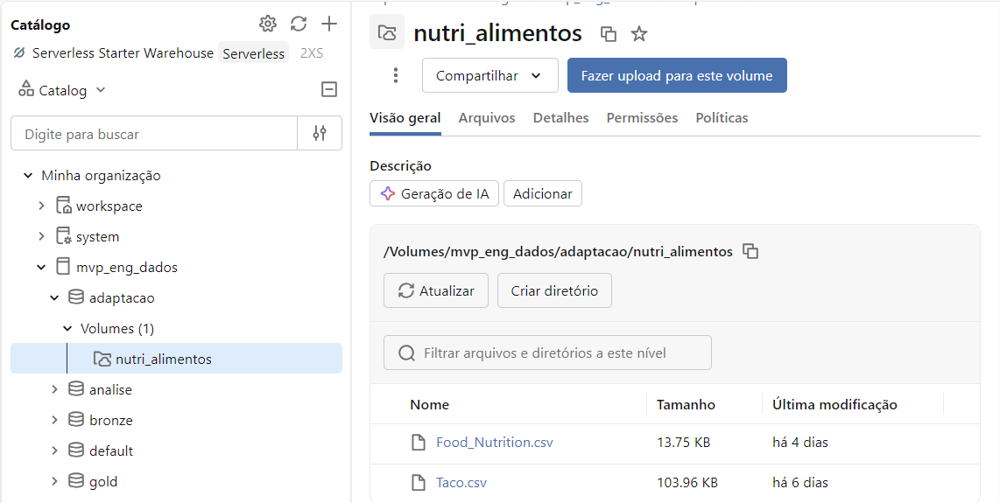


# 4.0 - Pipeline, Modelagem e Catálogo de Dados

> Esta seção descreve a construção do **pipeline de dados** utilizando a arquitetura **Medallion** (camadas Bronze, Silver e Gold) no **Unity Catalog**, bem como a **modelagem** e o **catálogo de dados** do projeto.

#### Arquitetura Medallion

A arquitetura *Medallion* organiza os dados em camadas lógicas progressivas, cada uma com um nível crescente de qualidade e estruturação:

| Camada | Descrição |
|---|---|
| **Bronze** | Ingestão dos dados brutos no formato original, sem transformações de negócio. Os dados são carregados dos arquivos CSV e persistidos como tabelas Delta. |
| **Silver** | Limpeza, padronização e enriquecimento dos dados da camada Bronze. Inclui tratamento de valores nulos, normalização de nomes de colunas, conversão de tipos e junção (*merge*) das fontes. |
| **Gold** | Dados prontos para consumo analítico e modelagem. Contém tabelas e visões otimizadas para consultas, relatórios e alimentação de modelos de *Machine Learning*. |

#### Catálogo de Dados

Todos os dados são governados pelo **Unity Catalog** sob o catálogo `MVP_ENG_DADOS`, organizado em *schemas* que refletem as camadas da arquitetura:

- **`adaptacao`** — volume de armazenamento de arquivos não estruturados (CSVs de origem);
- **`Bronze`** — tabelas Delta com dados brutos;
- **`Silver`** — tabelas Delta com dados tratados e padronizados;
- **`Gold`** — tabelas e visões analíticas prontas para consumo.


#### Modelagem Dimensional (Esquema Estrela)

A camada Gold também adota a **modelagem dimensional no estilo estrela** (*Star Schema*), que organiza os dados em **tabelas de fatos** e **tabelas de dimensões** para otimizar consultas analíticas e relatórios:

- **Tabelas de Fatos (*Fact Tables*)** — contêm as **métricas quantitativas** (medidas) e as **chaves estrangeiras** que referenciam as dimensões. Representam os eventos ou transações do domínio (ex.: composição nutricional por alimento).
- **Tabelas de Dimensões (*Dimension Tables*)** — contêm os **atributos descritivos** que dão contexto às métricas (ex.: categoria do alimento, unidade de medida, origem do dado).
- **Relacionamentos** — cada tabela de fato é cercada por suas tabelas de dimensões, formando uma estrutura em forma de estrela, o que simplifica as consultas e melhora o desempenho das junções.

| Elemento | Descrição |
|---|---|
| **Tabela de Fatos** | Armazena as medidas numéricas (ex.: calorias, proteínas, gorduras) e as chaves estrangeiras para as dimensões |
| **Tabela de Dimensão** | Armazena os atributos descritivos (ex.: nome do alimento, categoria, origem) |
| **Chave Primária (PK)** | Identificador único de cada registro na tabela de dimensão |
| **Chave Estrangeira (FK)** | Referência à chave primária da dimensão na tabela de fatos |
| **Granularidade** | Nível de detalhe de cada registro na tabela de fatos (ex.: um registro por alimento por 100 g) |

A modelagem estrela traz os seguintes benefícios:

- **Simplicidade** — consultas analíticas tornam-se mais intuitivas, com junções diretas entre fato e dimensões;
- **Desempenho** — o número reduzido de junções e a desnormalização das dimensões aceleram as consultas;
- **Facilidade de leitura** — a estrutura é facilmente compreendida por usuários de negócio e ferramentas de *BI*;
- **Escalabilidade** — novas dimensões podem ser adicionadas sem impacto significativo na tabela de fatos.

---


## 4.1 - Camada Bronze

A **Camada Bronze** é a primeira etapa da arquitetura *Medallion* e tem como objetivo **ingerir os dados brutos** oriundos das fontes originais, preservando sua forma original sem transformações significativas. Nesta camada, os dados são carregados diretamente dos arquivos CSV disponíveis no volume `nutri_alimentos` e persistidos como **tabelas Delta** no catálogo `MVP_ENG_DADOS`, schema `Bronze`.

As principais características da Camada Bronze incluem:

- **Ingestão de dados no formato original**, mantendo a fidelidade dos dados de origem;
- **Persistência no formato Delta**, garantindo características ACID e versionamento;
- **Sanitização mínima de nomes de colunas**, apenas para compatibilidade com o formato Delta (substituição de espaços, parênteses e caracteres especiais);
- **Sem transformações de negócio** — limpeza, enriquecimento e padronização ocorrem nas camadas posteriores (Silver e Gold).

Nesta seção, serão criadas as seguintes tabelas na camada Bronze:

| # | Tabela | Arquivo de Origem | Descrição |
|---|---|---|---|
| 1 | `Alimentos_Taco` | `Taco.csv` | Composição nutricional de alimentos brasileiros (TACO — UNICAMP) |
| 2 | `Alimentos_Food_Nutrition` | `Food_Nutrition.csv` | Composição nutricional de alimentos dos EUA (USDA) |

### 4.1.1 - Utilização de Catálogo e Schema
```
spark.sql("USE CATALOG MVP_ENG_DADOS")
spark.sql("USE SCHEMA Bronze")
```
   
#### 4.1.1.1 - Resumo da célula (Utiliza o Catálogo MVP_ENG_DADOS e Schema Bronze)

A célula acima configura o contexto do Unity Catalog para a sessão Spark, definindo:

- O **catálogo** ativo como `MVP_ENG_DADOS`;
- O **schema** ativo como `Bronze`.

Essa configuração garante que as tabelas criadas nas próximas células sejam armazenadas automaticamente no catálogo e schema corretos, sem necessidade de qualificar o nome completo em cada operação.


### 4.1.2 - Criação da Tabela Alimentos_Taco.
```
# Carrega arquivo csv usando Pandas
import pandas as pd

# Carrega diretamente do workspace usando o caminho do arquivo
file_path = "/Volumes/mvp_eng_dados/adaptacao/nutri_alimentos/Taco.csv"

# Lê o arquivo CSV - ele já tem cabeçalho, então não precisa renomear colunas
Alimentos_Taco = pd.read_csv(file_path, encoding='ISO-8859-1', sep=';', decimal=',')

# Pega apenas os dados do dataset e guardando em um array
array = Alimentos_Taco.values


# Separa o array em variáveis preditoras (X) e variável target (Y)
X = array[:,0:8]
Y = array[:,0:8]

dafr_Alimentos_Taco = pd.DataFrame(data=Alimentos_Taco)

# Verificar e imprimir na tela o total de instâncias
print(f"Total de instâncias: {len(Alimentos_Taco)}")
print("\nTipos de dados por coluna:")
print(dafr_Alimentos_Taco.info())
print("✅ Dataset carregado com sucesso!")
print("\nColunas disponíveis:")
print(dafr_Alimentos_Taco.columns.tolist())
print("\nPrimeiras 5 linhas:")
display(dafr_Alimentos_Taco.head(5))
print(f"\nTotal de registros: {len(dafr_Alimentos_Taco)}")
     
Total de instâncias: 597

Tipos de dados por coluna:
<class 'pandas.core.frame.DataFrame'>
RangeIndex: 597 entries, 0 to 596
Data columns (total 29 columns):
 #   Column                 Non-Null Count  Dtype 
---  ------                 --------------  ----- 
 0   Número                 597 non-null    int64 
 1   Grupo                  597 non-null    object
 2   Descrição do Alimento  597 non-null    object
 3   Umidade(%)             588 non-null    object
 4   Energia(kcal)          595 non-null    object
 5   Energia(kJ)            595 non-null    object
 6   Proteína(g)            586 non-null    object
 7   Lipídeos(g)            594 non-null    object
 8   Colesterol(mg)         267 non-null    object
 9   Carboidrato(g)         586 non-null    object
 10  Fibra Alimentar(g)     370 non-null    object
 11  Cinzas(g)              587 non-null    object
 12  Cálcio(mg)             586 non-null    object
 13  Magnésio(mg)           586 non-null    object
 14  Manganês(mg)           586 non-null    object
 15  Fósforo(mg)            586 non-null    object
 16  Ferro(mg)              586 non-null    object
 17  Sódio(mg)              589 non-null    object
 18  Potássio(mg)           587 non-null    object
 19  Cobre(mg)              586 non-null    object
 20  Zinco(mg)              585 non-null    object
 21  Retinol(mcg)           275 non-null    object
 22  RE(mcg)                276 non-null    object
 23  RAE (mcg)              275 non-null    object
 24  Tiamina(mg)            577 non-null    object
 25  Riboflavina(mg)        577 non-null    object
 26  Piridoxina(mg)         577 non-null    object
 27  Niacina(mg)            575 non-null    object
 28  VitaminaC(mg)          400 non-null    object
dtypes: int64(1), object(28)
memory usage: 135.4+ KB
None
✅ Dataset carregado com sucesso!

Colunas disponíveis:
['Número', 'Grupo', 'Descrição do Alimento', 'Umidade(%)', 'Energia(kcal)', 'Energia(kJ)', 'Proteína(g)', 'Lipídeos(g)', 'Colesterol(mg)', 'Carboidrato(g)', 'Fibra Alimentar(g)', 'Cinzas(g)', 'Cálcio(mg)', 'Magnésio(mg)', 'Manganês(mg)', 'Fósforo(mg)', 'Ferro(mg)', 'Sódio(mg)', 'Potássio(mg)', 'Cobre(mg)', 'Zinco(mg)', 'Retinol(mcg)', 'RE(mcg)', 'RAE (mcg)', 'Tiamina(mg)', 'Riboflavina(mg)', 'Piridoxina(mg)', 'Niacina(mg)', 'VitaminaC(mg)']

# Carrega arquivo csv usando Pandas
import pandas as pd

# Carrega diretamente do workspace usando o caminho do arquivo
file_path = "/Volumes/mvp_eng_dados/adaptacao/nutri_alimentos/Taco.csv"

# Lê o arquivo CSV - ele já tem cabeçalho, então não precisa renomear colunas
Alimentos_Taco = pd.read_csv(file_path, encoding='ISO-8859-1', sep=';', decimal=',')

# Pega apenas os dados do dataset e guardando em um array
array = Alimentos_Taco.values


# Separa o array em variáveis preditoras (X) e variável target (Y)
X = array[:,0:8]
Y = array[:,0:8]

dafr_Alimentos_Taco = pd.DataFrame(data=Alimentos_Taco)

# Verificar e imprimir na tela o total de instâncias
print(f"Total de instâncias: {len(Alimentos_Taco)}")
print("\nTipos de dados por coluna:")
print(dafr_Alimentos_Taco.info())
print("✅ Dataset carregado com sucesso!")
print("\nColunas disponíveis:")
print(dafr_Alimentos_Taco.columns.tolist())
print("\nPrimeiras 5 linhas:")
display(dafr_Alimentos_Taco.head(5))
print(f"\nTotal de registros: {len(dafr_Alimentos_Taco)}")

Primeiras 5 linhas:

Número	Grupo	Descrição do Alimento	Umidade(%)	Energia(kcal)	Energia(kJ)	Proteína(g)	Lipídeos(g)	Colesterol(mg)	Carboidrato(g)	Fibra Alimentar(g)	Cinzas(g)	Cálcio(mg)	Magnésio(mg)	Manganês(mg)	Fósforo(mg)	Ferro(mg)	Sódio(mg)	Potássio(mg)	Cobre(mg)	Zinco(mg)	Retinol(mcg)	RE(mcg)	RAE (mcg)	Tiamina(mg)	Riboflavina(mg)	Piridoxina(mg)	Niacina(mg)	VitaminaC(mg)
1	Cereais e derivados	Arroz, integral, cozido	70,14	123,53	516,87	2,59	1,00	null	25,81	2,75	0,46	5,20	58,70	0,63	105,85	0,26	1,24	75,15	0,02	0,68	null	null	null	0,08	Tr	0,08	Tr	null
2	Cereais e derivados	Arroz, integral, cru	12,18	359,68	1504,89	7,32	1,86	null	77,45	4,82	1,18	7,82	109,71	2,99	250,87	0,95	1,65	173,34	0,07	1,40	null	null	null	0,26	Tr	0,18	4,18	null
3	Cereais e derivados	Arroz, tipo 1, cozido	69,11	128,26	536,63	2,52	0,23	null	28,06	1,56	0,08	3,54	2,25	0,30	17,95	0,08	1,20	14,67	0,02	0,49	null	null	null	Tr	Tr	Tr	Tr	null
4	Cereais e derivados	Arroz, tipo 1, cru	13,22	357,79	1496,99	7,16	0,34	null	78,76	1,64	0,52	4,41	30,38	1,03	104,21	0,68	1,02	62,50	0,11	1,22	null	null	null	0,16	Tr	0,07	1,12	null
5	Cereais e derivados	Arroz, tipo 2, cozido	68,73	130,12	544,42	2,57	0,36	null	28,19	1,07	0,15	3,33	6,05	0,37	21,52	0,05	1,96	20,20	0,04	0,55	null	null	null	Tr	Tr	Tr	Tr	null
```
#### 4.1.2.1 - Resumo da célula (Carrega arquivo Taco.csv)

A célula acima carrega o arquivo **Taco.csv** a partir de um caminho no Databricks Volumes usando **Pandas**, com encoding `ISO-8859-1`, separador `;` e decimal `,`. Em seguida:

- Extrai os valores para um array e separa as variáveis preditoras (`X`) e a variável target (`Y`);
- Cria um DataFrame Pandas (`dafr_Alimentos_Taco`) a partir dos dados carregados;
- Exibe informações sobre o dataset: total de instâncias, tipos de dados, colunas disponíveis e as primeiras 5 linhas.

Este DataFrame será utilizado na próxima célula para criar a tabela **Alimentos_Taco** no catálogo `MVP_ENG_DADOS`, schema `Bronze`.

```
# Criar tabela Alimentos_Taco no catálogo MVP_ENG_DADOS e schema Bronze
# e inserir os dados do dataframe dafr_Alimentos

# Converte o dataframe pandas para Spark DataFrame
# Sanitiza nomes de colunas removendo caracteres inválidos para Delta (espaços, parênteses, etc.)
for col_name in list(dafr_Alimentos_Taco.columns):
    safe_name = col_name.replace(' ', '_').replace('(', '').replace(')', '').replace('%', 'pct')
    dafr_Alimentos_Taco.rename(columns={col_name: safe_name}, inplace=True)

spark_df_Alimentos_Taco = spark.createDataFrame(dafr_Alimentos_Taco)

# Escreve o DataFrame no formato Delta como tabela no catálogo especificado
spark_df_Alimentos_Taco.write.mode("overwrite").saveAsTable("MVP_ENG_DADOS.Bronze.Alimentos_Taco")

print("✅ Tabela Alimentos_Taco criada com sucesso no catálogo MVP_ENG_DADOS, schema Bronze!")
print(f"Total de registros inseridos: {spark_df_Alimentos_Taco.count()}")

✅ Tabela Alimentos_Taco criada com sucesso no catálogo MVP_ENG_DADOS, schema Bronze!
Total de registros inseridos: 597
```

#### 4.1.2.2 - Resumo da célula (Criar tabela Alimentos_Taco)

A célula acima cria a tabela **Alimentos_Taco** no catálogo `MVP_ENG_DADOS`, schema `Bronze`, a partir do DataFrame Pandas `dafr_Alimentos_Taco`. Para isso:

- **Sanitiza os nomes das colunas**, substituindo caracteres inválidos para o formato Delta (espaços por `_`, removendo parênteses e trocando `%` por `pct`);
- **Converte** o DataFrame Pandas em um **Spark DataFrame** (`spark_df_Alimentos_Taco`);
- **Escreve** o DataFrame no formato Delta usando `saveAsTable` com modo `overwrite`, criando a tabela `MVP_ENG_DADOS.Bronze.Alimentos_Taco`;
- Exibe uma mensagem de sucesso e o total de registros inseridos.

A tabela criada pode ser consultada na próxima célula com um `SELECT` simples.


#### 4.1.2.3 - Descrição da Tabela `Alimentos_Taco`

#### Visão Geral

| Propriedade | Valor |
|---|---|
| **Catálogo** | `MVP_ENG_DADOS` |
| **Schema** | `Bronze` |
| **Nome da Tabela** | `Alimentos_Taco` |
| **Formato** | Delta |
| **Origem** | `/Volumes/mvp_eng_dados/adaptacao/nutri_alimentos/Taco.csv` |
| **Dataset de Referência** | [Kaggle — Composição Nutricional de Alimentos TACO](https://www.kaggle.com/datasets/ispangler/composio-nutricional-de-alimentos-taco) |

A tabela **Alimentos_Taco** armazena a composição nutricional de alimentos brasileiros baseada na **TACO** (Tabela Brasileira de Composição de Alimentos), desenvolvida pela UNICAMP. Os valores nutricionais referem-se a **100 g ou 100 mL** do alimento.

---

#### Dicionário de Dados

> **Nota:** Os nomes originais das colunas do arquivo CSV foram **sanitizados** para o formato Delta — espaços substituídos por `_`, parênteses removidos e `%` substituído por `pct`.

| # | Coluna (na tabela) | Coluna (no CSV original) | Descrição | Unidade |
|---|---|---|---|---|
| 1 | `Número` | Número | Código identificador do alimento | — |
| 2 | `Descrição` | Descrição | Nome/descrição do alimento | — |
| 3 | `Umidade_pct` | Umidade (%) | Teor de umidade do alimento | g / 100 g |
| 4 | `Energia_kcal` | Energia (kcal) | Valor energético | kcal / 100 g |
| 5 | `Proteína_g` | Proteína (g) | Quantidade de proteína | g / 100 g |
| 6 | `Lipídeos_g` | Lipídeos (g) | Quantidade de lipídeos (gorduras) | g / 100 g |
| 7 | `Colesterol_mg` | Colesterol (mg) | Quantidade de colesterol | mg / 100 g |
| 8 | `Carboidrato_g` | Carboidrato (g) | Quantidade de carboidratos | g / 100 g |
| 9 | `Fibra_alimentar_g` | Fibra alimentar (g) | Quantidade de fibra alimentar | g / 100 g |
| 10 | `Cinzas_g` | Cinzas (g) | Teor de cinzas (minerais residuais) | g / 100 g |
| 11 | `Cálcio_mg` | Cálcio (mg) | Quantidade de cálcio | mg / 100 g |
| 12 | `Magnésio_mg` | Magnésio (mg) | Quantidade de magnésio | mg / 100 g |
| 13 | `Manganês_mg` | Manganês (mg) | Quantidade de manganês | mg / 100 g |
| 14 | `Fósforo_mg` | Fósforo (mg) | Quantidade de fósforo | mg / 100 g |
| 15 | `Ferro_mg` | Ferro (mg) | Quantidade de ferro | mg / 100 g |
| 16 | `Sódio_mg` | Sódio (mg) | Quantidade de sódio | mg / 100 g |
| 17 | `Potássio_mg` | Potássio (mg) | Quantidade de potássio | mg / 100 g |
| 18 | `Cobre_mg` | Cobre (mg) | Quantidade de cobre | mg / 100 g |
| 19 | `Zinco_mg` | Zinco (mg) | Quantidade de zinco | mg / 100 g |
| 20 | `Retinolo_µg` | Retinolo (µg) | Quantidade de retinol (vitamina A) | µg / 100 g |
| 21 | `RE_µg` | RE (µg) | Equivalente de retinol | µg / 100 g |
| 22 | `RAE_µg` | RAE (µg) | Atividade de equivalência de retinol | µg / 100 g |
| 23 | `Tiamina_mg` | Tiamina (mg) | Quantidade de tiamina (vitamina B1) | mg / 100 g |
| 24 | `Riboflavina_mg` | Riboflavina (mg) | Quantidade de riboflavina (vitamina B2) | mg / 100 g |
| 25 | `Piridoxamina_mg` | Piridoxamina (mg) | Quantidade de piridoxamina (vitamina B6) | mg / 100 g |
| 26 | `Niacina_mg` | Niacina (mg) | Quantidade de niacina (vitamina B3) | mg / 100 g |
| 27 | `Vitamina_C_mg` | Vitamina C (mg) | Quantidade de vitamina C (ácido ascórbico) | mg / 100 g |

---

#### Notas

- A tabela foi criada a partir de um arquivo **CSV** carregado com **Pandas** (`encoding='ISO-8859-1'`, `sep=';'`, `decimal=','`) e posteriormente convertido em **Spark DataFrame** e persistida como **Delta Table**.
- Os valores nutricionais seguem o padrão da **TACO — Tabela Brasileira de Composição de Alimentos**, instrumento de referência para estudos nutricionais no Brasil.
- Os nomes das colunas refletem a sanitização aplicada no momento da criação da tabela (substituição de espaços, parênteses e `%`).
- Para validar os nomes reais das colunas, execute: `DESCRIBE MVP_ENG_DADOS.Bronze.Alimentos_Taco`

```
%sql
SELECT * 
FROM MVP_ENG_DADOS.Bronze.Alimentos_Taco
LIMIT 10

Número	Grupo	Descrição_do_Alimento	Umidadepct	Energiakcal	EnergiakJ	Proteínag	Lipídeosg	Colesterolmg	Carboidratog	Fibra_Alimentarg	Cinzasg	Cálciomg	Magnésiomg	Manganêsmg	Fósforomg	Ferromg	Sódiomg	Potássiomg	Cobremg	Zincomg	Retinolmcg	REmcg	RAE_mcg	Tiaminamg	Riboflavinamg	Piridoxinamg	Niacinamg	VitaminaCmg
1	Cereais e derivados	Arroz, integral, cozido	70,14	123,53	516,87	2,59	1,00	null	25,81	2,75	0,46	5,20	58,70	0,63	105,85	0,26	1,24	75,15	0,02	0,68	null	null	null	0,08	Tr	0,08	Tr	null
2	Cereais e derivados	Arroz, integral, cru	12,18	359,68	1504,89	7,32	1,86	null	77,45	4,82	1,18	7,82	109,71	2,99	250,87	0,95	1,65	173,34	0,07	1,40	null	null	null	0,26	Tr	0,18	4,18	null
3	Cereais e derivados	Arroz, tipo 1, cozido	69,11	128,26	536,63	2,52	0,23	null	28,06	1,56	0,08	3,54	2,25	0,30	17,95	0,08	1,20	14,67	0,02	0,49	null	null	null	Tr	Tr	Tr	Tr	null
4	Cereais e derivados	Arroz, tipo 1, cru	13,22	357,79	1496,99	7,16	0,34	null	78,76	1,64	0,52	4,41	30,38	1,03	104,21	0,68	1,02	62,50	0,11	1,22	null	null	null	0,16	Tr	0,07	1,12	null
5	Cereais e derivados	Arroz, tipo 2, cozido	68,73	130,12	544,42	2,57	0,36	null	28,19	1,07	0,15	3,33	6,05	0,37	21,52	0,05	1,96	20,20	0,04	0,55	null	null	null	Tr	Tr	Tr	Tr	null
6	Cereais e derivados	Arroz, tipo 2, cru	13,16	358,12	1498,36	7,24	0,28	null	78,88	1,72	0,44	4,83	29,24	0,83	82,04	0,60	0,57	57,28	0,05	1,27	null	null	null	0,16	Tr	0,05	0,92	null
7	Cereais e derivados	Aveia, flocos, crua	9,13	393,82	1647,75	13,92	8,50	null	66,64	9,13	1,81	47,89	118,76	1,89	153,40	4,45	4,63	336,33	0,44	2,63	null	null	null	0,55	0,03	Tr	4,47	1,35
8	Cereais e derivados	Biscoito, doce, maisena	3,22	442,82	1852,76	8,07	11,97	null	75,23	2,10	1,51	54,45	37,14	0,78	166,10	1,76	352,03	141,64	0,17	1,03	null	null	null	1,01	0,42	0,23	3,91	6,22
9	Cereais e derivados	Biscoito, doce, recheado com chocolate	2,18	471,82	1974,11	6,40	19,58	Tr	70,55	2,96	1,29	27,23	47,98	0,59	139,45	2,27	239,20	232,40	0,27	0,99	Tr	 	 	0,32	0,39	0,46	2,52	3,53
10	Cereais e derivados	Biscoito, doce, recheado com morango	2,73	471,17	1971,40	5,72	19,57	Tr	71,01	1,53	0,96	35,78	27,10	0,66	137,74	1,48	229,82	113,01	0,13	0,73	Tr	 	 	0,90	0,42	0,21	1,50	Tr
```

#### 4.1.2.4 - Resumo da célula (Apresenta as informações da tabela Alimentos_Taco)

A célula acima executa um `SELECT *` na tabela **Alimentos_Taco**, criada no catálogo `MVP_ENG_DADOS`, schema `Bronze`, limitando o resultado aos **10 primeiros registros**. O objetivo é validar visualmente se os dados carregados a partir do arquivo **Taco.csv** foram persistidos corretamente, exibindo todas as colunas e seus valores para inspeção rápida.


###4.1.3 - Criação da Tabela Alimentos_Food_Nutrition
```
# Carrega arquivo csv usando Pandas
import pandas as pd

# Carrega diretamente do workspace usando o caminho do arquivo
file_path = "/Volumes/mvp_eng_dados/adaptacao/nutri_alimentos/Food_Nutrition.csv"

# Lê o arquivo CSV - ele já tem cabeçalho, então não precisa renomear colunas
Alimentos_Food_Nutrition = pd.read_csv(file_path)

# Pega apenas os dados do dataset e guardando em um array
array = Alimentos_Food_Nutrition.values


# Separa o array em variáveis preditoras (X) e variável target (Y)
X = array[:,0:8]
Y = array[:,0:8]

dafr_Alimentos_Food_Nutrition = pd.DataFrame(data=Alimentos_Food_Nutrition)

# Verificar e imprimir na tela o total de instâncias
print(f"Total de instâncias: {len(Alimentos_Food_Nutrition)}")
print("\nTipos de dados por coluna:")
print(dafr_Alimentos_Food_Nutrition.info())
print("✅ Dataset carregado com sucesso!")
print("\nColunas disponíveis:")
print(dafr_Alimentos_Food_Nutrition.columns.tolist())
print("\nPrimeiras 5 linhas:")
display(dafr_Alimentos_Food_Nutrition.head(5))
print(f"\nTotal de registros: {len(dafr_Alimentos_Food_Nutrition)}")

Total de instâncias: 125

Tipos de dados por coluna:
<class 'pandas.core.frame.DataFrame'>
RangeIndex: 125 entries, 0 to 124
Data columns (total 24 columns):
 #   Column                Non-Null Count  Dtype  
---  ------                --------------  -----  
 0   food                  125 non-null    object 
 1   Caloric Value         125 non-null    int64  
 2   Fat                   125 non-null    float64
 3   Saturated Fats        125 non-null    float64
 4   Monounsaturated Fats  125 non-null    float64
 5   Polyunsaturated Fats  125 non-null    float64
 6   Carbohydrates         125 non-null    float64
 7   Sugars                125 non-null    float64
 8   Protein               125 non-null    float64
 9   Dietary Fiber         125 non-null    float64
 10  Cholesterol           125 non-null    float64
 11  Sodium                125 non-null    float64
 12  Water                 125 non-null    float64
 13  Vitamins              125 non-null    float64
 14  Calcium               125 non-null    float64
 15  Copper                125 non-null    float64
 16  Iron                  125 non-null    float64
 17  Magnesium             125 non-null    float64
 18  Manganese             125 non-null    float64
 19  Phosphorus            125 non-null    float64
 20  Potassium             125 non-null    float64
 21  Selenium              125 non-null    float64
 22  Zinc                  125 non-null    float64
 23  Nutrition Density     125 non-null    float64
dtypes: float64(22), int64(1), object(1)
memory usage: 23.6+ KB
None
✅ Dataset carregado com sucesso!

Colunas disponíveis:
['food', 'Caloric Value', 'Fat', 'Saturated Fats', 'Monounsaturated Fats', 'Polyunsaturated Fats', 'Carbohydrates', 'Sugars', 'Protein', 'Dietary Fiber', 'Cholesterol', 'Sodium', 'Water', 'Vitamins', 'Calcium', 'Copper', 'Iron', 'Magnesium', 'Manganese', 'Phosphorus', 'Potassium', 'Selenium', 'Zinc', 'Nutrition Density']

Primeiras 5 linhas:

food	Caloric Value	Fat	Saturated Fats	Monounsaturated Fats	Polyunsaturated Fats	Carbohydrates	Sugars	Protein	Dietary Fiber	Cholesterol	Sodium	Water	Vitamins	Calcium	Copper	Iron	Magnesium	Manganese	Phosphorus	Potassium	Selenium	Zinc	Nutrition Density
crispy chicken strips tyson	145	6	7.7	14.5	1	0	0	0	0	0	0	0	0	0	0	0	0	0	0	0	0	0	6
nectarine	66	0.5	0.066	0.1	0.2	15.8	11.8	1.6	2.6	0	0	131.4	1.6	0.081	9	0.1	0.4	13.5	0.002	39	301.5	0	20.735
kiwifruit gold	51	0.2	0.008	0.099	0.051	12.8	10	0.8	1.1	0	0.046	66.8	22.02	13.8	0.1	0.2	9.7	0.072	20.3	255.2	0.003	0.077	159.686
prickly pear raw	8	0.072	0	0	0	1.9	0.2	0.001	1	0	0.065	17	0.36	34.2	0.051	0.021	13.1	0.1	2.1	24.7	0.023	0.073	39.263
pineapple	45	0.1	0.074	0.001	0.087	11.8	8.9	0.5	1.3	0	0.099	77.4	7.21	0.061	11.7	0.091	0.3	10.8	0.8	7.2	98.1	0.061	13.97
```

#### 4.1.3.1 - Resumo da célula (Carrega arquivo Food_Nutrition.csv)

A célula acima carrega o arquivo **Food_Nutrition.csv** a partir de um caminho no Databricks Volumes usando **Pandas**. Em seguida:

- Extrai os valores para um array e separa as variáveis preditoras (`X`) e a variável target (`Y`);
- Cria um DataFrame Pandas (`dafr_Alimentos_Food_Nutrition`) a partir dos dados carregados;
- Exibe informações sobre o dataset: total de instâncias, tipos de dados, colunas disponíveis e as primeiras 5 linhas.

Este DataFrame será utilizado na próxima célula para criar a tabela **Alimentos_Food_Nutrition** no catálogo `MVP_ENG_DADOS`, schema `Bronze`.

```
# Criar tabela Alimentos_Food_Nutrition no catálogo MVP_ENG_DADOS e schema Bronze
# e inserir os dados do dataframe dafr_Alimentos_Food_Nutrition

# Sanitiza nomes de colunas removendo caracteres inválidos para Delta (espaços, parênteses, etc.)
for col_name in list(dafr_Alimentos_Food_Nutrition.columns):
    safe_name = col_name.replace(' ', '_').replace('(', '').replace(')', '').replace('%', 'pct')
    dafr_Alimentos_Food_Nutrition.rename(columns={col_name: safe_name}, inplace=True)

# Converte o dataframe pandas para Spark DataFrame
spark_df_Alimentos_Food_Nutrition = spark.createDataFrame(dafr_Alimentos_Food_Nutrition)

# Escreve o DataFrame no formato Delta como tabela no catálogo especificado
spark_df_Alimentos_Food_Nutrition.write.mode("overwrite").saveAsTable("MVP_ENG_DADOS.Bronze.Alimentos_Food_Nutrition")

print("✅ Tabela Alimentos_Food_Nutrition criada com sucesso no catálogo MVP_ENG_DADOS, schema Bronze!")
print(f"Total de registros inseridos: {spark_df_Alimentos_Food_Nutrition.count()}")
```
```
✅ Tabela Alimentos_Food_Nutrition criada com sucesso no catálogo MVP_ENG_DADOS, schema Bronze!
Total de registros inseridos: 125
```

#### 4.1.3.2 - Resumo da célula (Criar tabela Alimentos_Food_Nutrition)

A célula acima cria a tabela **Alimentos_Food_Nutrition** no catálogo `MVP_ENG_DADOS`, schema `Bronze`, a partir do DataFrame Pandas `dafr_Alimentos_Food_Nutrition`. Para isso:

- **Sanitiza os nomes das colunas**, substituindo caracteres inválidos para o formato Delta (espaços por `_`, removendo parênteses e trocando `%` por `pct`);
- **Converte** o DataFrame Pandas em um **Spark DataFrame** (`spark_df_Alimentos_Food_Nutrition`);
- **Escreve** o DataFrame no formato Delta usando `saveAsTable` com modo `overwrite`, criando a tabela `MVP_ENG_DADOS.Bronze.Alimentos_Food_Nutrition`;
- Exibe uma mensagem de sucesso e o total de registros inseridos.

A tabela criada pode ser consultada na próxima célula com um `SELECT` simples.


#### 4.1.3.3 - Descrição da Tabela `Alimentos_Food_Nutrition`

#### Visão Geral

| Propriedade | Valor |
|---|---|
| **Catálogo** | `MVP_ENG_DADOS` |
| **Schema** | `Bronze` |
| **Nome da Tabela** | `Alimentos_Food_Nutrition` |
| **Formato** | Delta |
| **Origem** | [Kaggle — USDA - National Nutrient Database](https://www.kaggle.com/datasets/haithemhermessi/usda-national-nutrient-database) |

A tabela **Alimentos_Food_Nutrition** armazena informações nutricionais detalhadas de diversos alimentos. Os dados incluem valor calórico, macronutrientes (gorduras, carboidratos, proteínas), fibras, colesterol, sódio, água, vitaminas, minerais e densidade nutricional.

---

#### Dicionário de Dados

> **Nota:** As colunas originais do arquivo CSV estavam em **inglês** e foram **renomeadas para português** via `ALTER TABLE ... RENAME COLUMN` após a criação da tabela.

| # | Coluna (na tabela) | Coluna (no CSV original) | Descrição | Unidade |
|---|---|---|---|---|
| 1 | `Alimento` | food | Nome do alimento | — |
| 2 | `Valor_Calorico` | Caloric_Value | Valor energético do alimento | kcal |
| 3 | `Gordura` | Fat | Quantidade total de gordura | g |
| 4 | `Gorduras_Saturadas` | Saturated_Fats | Quantidade de gorduras saturadas | g |
| 5 | `Gorduras_Monoinsaturadas` | Monounsaturated_Fats | Quantidade de gorduras monoinsaturadas | g |
| 6 | `Gorduras_Poliinsaturadas` | Polyunsaturated_Fats | Quantidade de gorduras poliinsaturadas | g |
| 7 | `Carboidratos` | Carbohydrates | Quantidade total de carboidratos | g |
| 8 | `Acucares` | Sugars | Quantidade de açúcares | g |
| 9 | `Proteina` | Protein | Quantidade de proteína | g |
| 10 | `Fibra_Alimentar` | Dietary_Fiber | Quantidade de fibra alimentar | g |
| 11 | `Colesterol` | Cholesterol | Quantidade de colesterol | mg |
| 12 | `Sodio` | Sodium | Quantidade de sódio | mg |
| 13 | `Agua` | Water | Teor de água | g |
| 14 | `Vitaminas` | Vitamins | Quantidade total de vitaminas | mg |
| 15 | `Calcio` | Calcium | Quantidade de cálcio | mg |
| 16 | `Cobre` | Copper | Quantidade de cobre | mg |
| 17 | `Ferro` | Iron | Quantidade de ferro | mg |
| 18 | `Magnesio` | Magnesium | Quantidade de magnésio | mg |
| 19 | `Manganes` | Manganese | Quantidade de manganês | mg |
| 20 | `Fosforo` | Phosphorus | Quantidade de fósforo | mg |
| 21 | `Potassio` | Potassium | Quantidade de potássio | mg |
| 22 | `Selenio` | Selenium | Quantidade de selênio | µg |
| 23 | `Zinco` | Zinc | Quantidade de zinco | mg |
| 24 | `Densidade_Nutricional` | Nutrition_Density | Densidade nutricional do alimento | — |

---

#### Notas

- A tabela foi criada a partir de um arquivo **CSV** carregado com **Pandas** e posteriormente convertido em **Spark DataFrame** e persistida como **Delta Table**.
- Após a criação, as colunas foram **renomeadas do inglês para o português** utilizando `ALTER TABLE ... RENAME COLUMN`, com a propriedade `delta.columnMapping.mode = 'name'` habilitada.
- Para validar os nomes reais das colunas, execute: `DESCRIBE MVP_ENG_DADOS.Bronze.Alimentos_Food_Nutrition`

```
# Renomeia as colunas da tabela Alimentos_Food_Nutrition para português
renomeacoes = {
    "food": "Alimento",
    "Caloric_Value": "Valor_Calorico",
    "Fat": "Gordura",
    "Saturated_Fats": "Gorduras_Saturadas",
    "Monounsaturated_Fats": "Gorduras_Monoinsaturadas",
    "Polyunsaturated_Fats": "Gorduras_Poliinsaturadas",
    "Carbohydrates": "Carboidratos",
    "Sugars": "Acucares",
    "Protein": "Proteina",
    "Dietary_Fiber": "Fibra_Alimentar",
    "Cholesterol": "Colesterol",
    "Sodium": "Sodio",
    "Water": "Agua",
    "Vitamins": "Vitaminas",
    "Calcium": "Calcio",
    "Copper": "Cobre",
    "Iron": "Ferro",
    "Magnesium": "Magnesio",
    "Manganese": "Manganes",
    "Phosphorus": "Fosforo",
    "Potassium": "Potassio",
    "Selenium": "Selenio",
    "Zinc": "Zinco",
    "Nutrition_Density": "Densidade_Nutricional",
}

spark.sql("ALTER TABLE MVP_ENG_DADOS.Bronze.Alimentos_Food_Nutrition SET TBLPROPERTIES ('delta.columnMapping.mode' = 'name')")

for nome_ingles, nome_portugues in renomeacoes.items():
    spark.sql(f"ALTER TABLE MVP_ENG_DADOS.Bronze.Alimentos_Food_Nutrition RENAME COLUMN {nome_ingles} TO {nome_portugues}")

print(f"✅ {len(renomeacoes)} colunas renomeadas para português com sucesso!")
print("\nNovos nomes das colunas:")
for nome_portugues in renomeacoes.values():
    print(f"  - {nome_portugues}")

    
    ✅ 24 colunas renomeadas para português com sucesso!

Novos nomes das colunas:
  - Alimento
  - Valor_Calorico
  - Gordura
  - Gorduras_Saturadas
  - Gorduras_Monoinsaturadas
  - Gorduras_Poliinsaturadas
  - Carboidratos
  - Acucares
  - Proteina
  - Fibra_Alimentar
  - Colesterol
  - Sodio
  - Agua
  - Vitaminas
  - Calcio
  - Cobre
  - Ferro
  - Magnesio
  - Manganes
  - Fosforo
  - Potassio
  - Selenio
  - Zinco
  - Densidade_Nutricional
```

#### 4.1.3.4 - Resumo da célula (Renomear colunas para português)

A célula acima renomeia as colunas da tabela **Alimentos_Food_Nutrition** do inglês para o português. Para isso:

- Habilita a propriedade `delta.columnMapping.mode = 'name'` na tabela, necessária para renomear colunas em tabelas Delta;
- Percorre um dicionário de mapeamento (`renomeacoes`) com **24 colunas**, executando `ALTER TABLE ... RENAME COLUMN` para cada par inglês → português;
- Exibe uma mensagem de sucesso e lista os novos nomes das colunas.

Após essa etapa, a tabela passa a ter todas as colunas em português, facilitando a consulta e o entendimento dos dados.


### 4.1.4 - Evidência da Criação da Camada Bronze

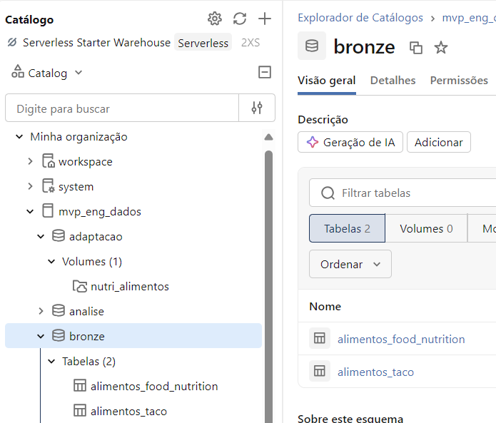


## 4.2 - Camada Silver (Qualidade de Dados)

A **Camada Silver** é o pilar central da **qualidade de dados** na arquitetura medalhão. Recebe os dados brutos persistidos na camada **Bronze** e aplica transformações sistemáticas de **padronização, limpeza e auditoria**, garantindo que apenas dados confiáveis e consistentes avancem para consumo analítico.

### Foco em Qualidade de Dados

A qualidade dos dados é tratada nesta camada como uma responsabilidade primária, não como uma etapa acessória. Cada transformação aplicada tem como objetivo eliminar ambiguidades, padronizar nomenclaturas e detectar inconsistências antes que os dados cheguem à camada Gold ou a qualquer consumidor analítico. As ações de qualidade executadas incluem:

| # | Etapa | Ação de Qualidade de Dados |
|---|---|---|
| 1 | **Seleção do catálogo e schema** | Define `MVP_ENG_DADOS` como catálogo ativo e `silver` como schema padrão, garantindo isolamento e governança dos dados tratados. |
| 2 | **Leitura da tabela Bronze** | Carrega a tabela `MVP_ENG_DADOS.bronze.alimentos_food_nutrition` em um DataFrame Spark, ponto de partida para as transformações de qualidade. |
| 3 | **Renomeação de colunas** | Traduz os nomes das colunas do inglês para o português, padronizando a nomenclatura para消除 ambiguidades e facilitar a leitura, auditoria e o uso dos dados. |
| 4 | **Gravação na camada Silver** | Persiste o DataFrame transformado na tabela `MVP_ENG_DADOS.silver.food_nutrition_silver` no formato Delta, com sobrescrita de esquema (`overwriteSchema = true`), garantindo reprodutibilidade e consistência estrutural. |
| 5 | **Verificação de qualidade** | Executa auditoria abrangente de **campos em branco** (nulos ou strings vazias) em **todas as colunas** da tabela Silver, identificando possíveis inconsistências e fornecendo visibilidade sobre a integridade dos dados. |

### O que foi feito nesta seção

- **Padronização de nomenclatura:** Todos os nomes de colunas foram traduzidos do inglês para o português, eliminando barreiras de idioma e tornando o dicionário de dados mais acessível.
- **Persistência controlada:** A gravação em formato Delta com sobrescrita de esquema garante que cada execução produza um estado limpo e previsível da tabela Silver.
- **Auditoria de campos nulos e vazios:** Foi executada uma query SQL que contabiliza, coluna por coluna, a quantidade de registros em branco (nulos ou strings vazias), transformando o resultado em formato longo via `UNPIVOT` e filtrando apenas as colunas com inconsistências (`qtd_em_branco > 0`), ordenadas por severidade.
- **Rastreabilidade:** Cada etapa é acompanhada de células explicativas que documentam as decisões de transformação, garantindo transparência e reprodutibilidade do pipeline de qualidade.

> **Resumo:** A camada Silver transforma dados brutos em dados confiáveis, aplicando padronização de nomenclatura, persistência estruturada em Delta e auditoria sistemática de campos em branco — assegurando que apenas dados de qualidade comprovada estejam disponíveis para as camadas e consumidores subsequentes.

---


### 4.2.1 - Utilização de Catálogo e Schema
```
spark.sql("USE CATALOG MVP_ENG_DADOS")
spark.sql("USE SCHEMA silver")
```

### 4.2.1.1 - Explicação da Célula — Utiliza o Catálogo MVP_ENG_DADOS e Schema Silver

Esta célula define o contexto de trabalho no Databricks, executando dois comandos Spark SQL:

1. **`USE CATALOG MVP_ENG_DADOS`** — Seleciona o catálogo `MVP_ENG_DADOS` como catálogo ativo, de modo que todas as operações subsequentes (criação de tabelas, consultas, etc.) utilizem esse catálogo por padrão.

2. **`USE SCHEMA silver`** — Seleciona o schema `silver` dentro do catálogo ativo, definindo-o como schema padrão para as próximas operações.

> **Resumo:** o objetivo desta célula é configurar o catálogo e o schema padrão (`MVP_ENG_DADOS.silver`) para que as células seguintes possam criar e acessar tabelas sem precisar qualificar totalmente os nomes em cada comando.


### 4.2.2 - Tabela - alimentos_food_nutrition
```
# Carregar a tabela alimentos_food_nutrition em um DataFrame
df_alimentos = spark.table("MVP_ENG_DADOS.bronze.alimentos_food_nutrition")

# Exibir os nomes atuais das colunas para referência
print("Colunas originais:", df_alimentos.columns)

# Dicionário de mapeamento: nome original -> nome em português
# (Ajuste os nomes conforme necessário após visualizar as colunas reais)
renomear_colunas = {
    "food": "alimento",
    "Caloric_Value": "valor_calorico",
    "Protein": "proteina",
    "Carbohydrates": "carboidratos",
    "Fat": "gordura",
    "Saturated_Fats": "gordura_saturada",
    "Monounsaturated_Fats": "gordura_monoinsaturada",
    "Polyunsaturated_Fats": "gordura_poliinsaturada",
    "Sugars": "acucares",
    "Dietary_Fiber":"fibras_alimentar",
    "Cholesterol": "colesterol",
    "Sodium": "sodio",
    "Water": "agua",
    "Vitamin A": "vitamina_a",
    "Vitamin B11": "vitamina_b11",
    "Vitamin B12": "vitamina_b12",
    "Vitamin B1": "vitamina_b1",
    "Vitamin B2": "vitamina_b2",
    "Vitamin B3": "vitamina_b3",
    "Vitamin B5": "vitamina_b5",
    "Vitamin B6": "vitamina_b6",
    "Vitamin B7": "vitamina_b7",
    "Vitamin B9": "vitamina_b9",
    "Vitamin C": "vitamina_c",
    "Vitamin D": "vitamina_d",
    "Vitamin E": "vitamina_e",
    "Vitamin K": "vitamina_k",
    "Calcium": "calcio",
    "Copper": "cobre",
    "Iron": "ferro",
    "Magnesium": "magnesio",
    "Manganese": "manganes",
    "Phosphorus": "fosforo",
    "Potassium": "potassio",
    "Selenium": "selnio",
    "Zinc": "zinco",
    "Nutrition_Density": "densidade_nutritiva",
}

# Aplicar a renomeação das colunas
for nome_original, nome_pt in renomear_colunas.items():
    if nome_original in df_alimentos.columns:
        df_alimentos = df_alimentos.withColumnRenamed(nome_original, nome_pt)

# Exibir o esquema atualizado e os primeiros registros
df_alimentos.printSchema()
display(df_alimentos.limit(10))
```
```
Colunas originais: ['food', 'Caloric_Value', 'Fat', 'Saturated_Fats', 'Monounsaturated_Fats', 'Polyunsaturated_Fats', 'Carbohydrates', 'Sugars', 'Protein', 'Dietary_Fiber', 'Cholesterol', 
'Sodium', 'Water', 'Vitamins', 'Calcium', 'Copper', 'Iron', 'Magnesium', 'Manganese', 'Phosphorus', 'Potassium', 'Selenium', 'Zinc', 'Nutrition_Density']
root
 |-- alimento: string (nullable = true)
 |-- valor_calorico: long (nullable = true)
 |-- gordura: double (nullable = true)
 |-- gordura_saturada: double (nullable = true)
 |-- gordura_monoinsaturada: double (nullable = true)
 |-- gordura_poliinsaturada: double (nullable = true)
 |-- carboidratos: double (nullable = true)
 |-- acucares: double (nullable = true)
 |-- proteina: double (nullable = true)
 |-- fibras_alimentar: double (nullable = true)
 |-- colesterol: double (nullable = true)
 |-- sodio: double (nullable = true)
 |-- agua: double (nullable = true)
 |-- Vitamins: double (nullable = true)
 |-- calcio: double (nullable = true)
 |-- cobre: double (nullable = true)
 |-- ferro: double (nullable = true)
 |-- magnesio: double (nullable = true)
 |-- manganes: double (nullable = true)
 |-- fosforo: double (nullable = true)
 |-- potassio: double (nullable = true)
 |-- selnio: double (nullable = true)
 |-- zinco: double (nullable = true)
 |-- densidade_nutritiva: double (nullable = true)
```
```
alimento	valor_calorico	gordura	gordura_saturada	gordura_monoinsaturada	gordura_poliinsaturada	carboidratos	acucares	proteina	fibras_alimentar	colesterol	sodio	agua	Vitamins	calcio	cobre	ferro	magnesio	manganes	fosforo	potassio	selnio	zinco	densidade_nutritiva
crispy chicken strips tyson	145	6	7.7	14.5	1	0	0	0	0	0	0	0	0	0	0	0	0	0	0	0	0	0	6
nectarine	66	0.5	0.066	0.1	0.2	15.8	11.8	1.6	2.6	0	0	131.4	1.6	0.081	9	0.1	0.4	13.5	0.002	39	301.5	0	20.735
kiwifruit gold	51	0.2	0.008	0.099	0.051	12.8	10	0.8	1.1	0	0.046	66.8	22.02	13.8	0.1	0.2	9.7	0.072	20.3	255.2	0.003	0.077	159.686
prickly pear raw	8	0.072	0	0	0	1.9	0.2	0.001	1	0	0.065	17	0.36	34.2	0.051	0.021	13.1	0.1	2.1	24.7	0.023	0.073	39.263
pineapple	45	0.1	0.074	0.001	0.087	11.8	8.9	0.5	1.3	0	0.099	77.4	7.21	0.061	11.7	0.091	0.3	10.8	0.8	7.2	98.1	0.061	13.97
rowan	253	4.6	0.6	0	0	54.5	32.1	5.2	14.1	0	0.083	162.8	9.8	34.2	2.4	5	73	0.4	118.6	298.7	0	1	176.4
muscadine grapes	3	0.056	0	0	0	0.8	0	0.014	0.2	0	0.024	5.1	0	2.2	0.023	0.014	0.8	0.1	1.4	12.2	0	0.027	3.38
heidelbeeren jutro	17	0.2	0.039	2.5	2.4	0.4	0	0	0	0	0	0	0	0	0	0	0	0	0	0	0	0	0.6
prunes stewed	316	0.7	0.085	0.5	0.1	83.2	0	3.4	0	0	0.039	190.4	0.09	67.2	0.6	3.3	58.8	0.3	103.6	988.4	0	0.7	157.8
tangerine	40	0.2	0.07	0.097	0.05	10.1	8	0.6	1.4	0	0.056	64.7	3.44	28.1	0.001	0.1	9.1	0.057	15.2	126.2	0.008	0.078	60.8
```
#### 4.2.2.1 - Explicação da Célula — Renomeação de colunas para português

Esta célula realiza as seguintes etapas:

1. **Carrega a tabela bronze** `MVP_ENG_DADOS.bronze.alimentos_food_nutrition` em um DataFrame Spark (`df_alimentos`).

2. **Exibe os nomes originais das colunas** (`print`) para que o desenvolvedor confirme os nomes antes de renomear.

3. **Define um dicionário de mapeamento** (`renomear_colunas`) que relaciona cada nome original em inglês (ex.: `"food"`, `"Caloric_Value"`, `"Protein"`) ao seu equivalente em português (ex.: `"alimento"`, `"valor_calorico"`, `"proteina"`).

4. **Renomeia as colunas** percorrendo o dicionário com `withColumnRenamed`. Para cada par, o código verifica se o nome original existe no DataFrame antes de aplicar a renomeação, evitando erros caso alguma coluna não esteja presente.

5. **Exibe o esquema atualizado** (`printSchema`) e os **10 primeiros registros** (`display(df_alimentos.limit(10))`) para confirmar que a transformação foi aplicada corretamente.

> **Resumo:** o objetivo desta célula é padronizar os nomes das colunas da tabela de alimentos, traduzindo-os do inglês para o português, facilitando a leitura e o uso nos próximos passos do notebook.

```
# Escrever o DataFrame transformado na tabela silver.food_nutrition_silver
(df_alimentos.write
    .mode("overwrite")
    .option("overwriteSchema", "true")
    .saveAsTable("MVP_ENG_DADOS.silver.food_nutrition_silver"))

print("Tabela 'MVP_ENG_DADOS.silver.food_nutrition_silver' criada com sucesso!")

# Verificar os dados gravados
display(spark.table("MVP_ENG_DADOS.silver.food_nutrition_silver").limit(10))
```
```
alimento	valor_calorico	gordura	gordura_saturada	gordura_monoinsaturada	gordura_poliinsaturada	carboidratos	acucares	proteina	fibras_alimentar	colesterol	sodio	agua	Vitamins	calcio	cobre	ferro	magnesio	manganes	fosforo	potassio	selnio	zinco	densidade_nutritiva
crispy chicken strips tyson	145	6	7.7	14.5	1	0	0	0	0	0	0	0	0	0	0	0	0	0	0	0	0	0	6
nectarine	66	0.5	0.066	0.1	0.2	15.8	11.8	1.6	2.6	0	0	131.4	1.6	0.081	9	0.1	0.4	13.5	0.002	39	301.5	0	20.735
kiwifruit gold	51	0.2	0.008	0.099	0.051	12.8	10	0.8	1.1	0	0.046	66.8	22.02	13.8	0.1	0.2	9.7	0.072	20.3	255.2	0.003	0.077	159.686
prickly pear raw	8	0.072	0	0	0	1.9	0.2	0.001	1	0	0.065	17	0.36	34.2	0.051	0.021	13.1	0.1	2.1	24.7	0.023	0.073	39.263
pineapple	45	0.1	0.074	0.001	0.087	11.8	8.9	0.5	1.3	0	0.099	77.4	7.21	0.061	11.7	0.091	0.3	10.8	0.8	7.2	98.1	0.061	13.97
rowan	253	4.6	0.6	0	0	54.5	32.1	5.2	14.1	0	0.083	162.8	9.8	34.2	2.4	5	73	0.4	118.6	298.7	0	1	176.4
muscadine grapes	3	0.056	0	0	0	0.8	0	0.014	0.2	0	0.024	5.1	0	2.2	0.023	0.014	0.8	0.1	1.4	12.2	0	0.027	3.38
heidelbeeren jutro	17	0.2	0.039	2.5	2.4	0.4	0	0	0	0	0	0	0	0	0	0	0	0	0	0	0	0	0.6
prunes stewed	316	0.7	0.085	0.5	0.1	83.2	0	3.4	0	0	0.039	190.4	0.09	67.2	0.6	3.3	58.8	0.3	103.6	988.4	0	0.7	157.8
tangerine	40	0.2	0.07	0.097	0.05	10.1	8	0.6	1.4	0	0.056	64.7	3.44	28.1	0.001	0.1	9.1	0.057	15.2	126.2	0.008	0.078	60.8
```
#### 4.2.2.2 - Explicação da Célula — Gravação na camada Silver

Esta célula realiza as seguintes etapas:

1. **Grava o DataFrame transformado** (`df_alimentos`, que teve suas colunas renomeadas para português na célula anterior) em uma tabela Delta na camada silver, no caminho completo `MVP_ENG_DADOS.silver.food_nutrition_silver`.

2. **Utiliza `mode("overwrite")`** para sobrescrever a tabela caso ela já exista — toda execução recria a tabela do zero com os dados mais recentes do DataFrame.

3. **Utiliza `option("overwriteSchema", "true")`** para permitir que o esquema (nomes e tipos de colunas) seja sobrescrito junto com os dados. Isso evita erros quando o esquema do DataFrame diverge do esquema existente na tabela (por exemplo, após renomear colunas).

4. **Exibe uma mensagem de sucesso** confirmando que a tabela foi criada.

5. **Verifica os dados gravados** executando `spark.table(...).limit(10)` dentro de `display(...)`, que mostra os 10 primeiros registros da tabela recém-criada — uma validação visual de que os dados foram persistidos corretamente.

> **Resumo:** o objetivo desta célula é persistir o resultado da transformação (colunas traduzidas) em uma tabela Delta persistente na camada silver, sobrescrevendo o conteúdo e o esquema anteriores, e em seguida validar visualmente os dados gravados.
```
%sql
-- Verificar campos em branco (nulos ou strings vazias) na tabela silver.food_nutrition_silver
WITH blank_counts AS (
  SELECT
    SUM(CASE WHEN alimento              IS NULL OR TRIM(alimento)              = '' THEN 1 ELSE 0 END) AS alimento,
    SUM(CASE WHEN valor_calorico        IS NULL OR TRIM(CAST(valor_calorico        AS STRING)) = '' THEN 1 ELSE 0 END) AS valor_calorico,
    SUM(CASE WHEN proteina              IS NULL OR TRIM(CAST(proteina              AS STRING)) = '' THEN 1 ELSE 0 END) AS proteina,
    SUM(CASE WHEN carboidratos           IS NULL OR TRIM(CAST(carboidratos           AS STRING)) = '' THEN 1 ELSE 0 END) AS carboidratos,
    SUM(CASE WHEN gordura                IS NULL OR TRIM(CAST(gordura                AS STRING)) = '' THEN 1 ELSE 0 END) AS gordura,
    SUM(CASE WHEN gordura_saturada       IS NULL OR TRIM(CAST(gordura_saturada       AS STRING)) = '' THEN 1 ELSE 0 END) AS gordura_saturada,
    SUM(CASE WHEN gordura_monoinsaturada IS NULL OR TRIM(CAST(gordura_monoinsaturada AS STRING)) = '' THEN 1 ELSE 0 END) AS gordura_monoinsaturada,
    SUM(CASE WHEN gordura_poliinsaturada IS NULL OR TRIM(CAST(gordura_poliinsaturada AS STRING)) = '' THEN 1 ELSE 0 END) AS gordura_poliinsaturada,
    SUM(CASE WHEN acucares               IS NULL OR TRIM(CAST(acucares               AS STRING)) = '' THEN 1 ELSE 0 END) AS acucares,
    SUM(CASE WHEN fibras_alimentar       IS NULL OR TRIM(CAST(fibras_alimentar       AS STRING)) = '' THEN 1 ELSE 0 END) AS fibras_alimentar,
    SUM(CASE WHEN colesterol             IS NULL OR TRIM(CAST(colesterol             AS STRING)) = '' THEN 1 ELSE 0 END) AS colesterol,
    SUM(CASE WHEN sodio                  IS NULL OR TRIM(CAST(sodio                  AS STRING)) = '' THEN 1 ELSE 0 END) AS sodio,
    SUM(CASE WHEN agua                   IS NULL OR TRIM(CAST(agua                   AS STRING)) = '' THEN 1 ELSE 0 END) AS agua,
    SUM(CASE WHEN Vitamins               IS NULL OR TRIM(CAST(Vitamins               AS STRING)) = '' THEN 1 ELSE 0 END) AS Vitamins,
    SUM(CASE WHEN calcio                 IS NULL OR TRIM(CAST(calcio                 AS STRING)) = '' THEN 1 ELSE 0 END) AS calcio,
    SUM(CASE WHEN cobre                    IS NULL OR TRIM(CAST(cobre                    AS STRING)) = '' THEN 1 ELSE 0 END) AS cobre,
    SUM(CASE WHEN ferro                     IS NULL OR TRIM(CAST(ferro                     AS STRING)) = '' THEN 1 ELSE 0 END) AS ferro,
    SUM(CASE WHEN magnesio                  IS NULL OR TRIM(CAST(magnesio                  AS STRING)) = '' THEN 1 ELSE 0 END) AS magnesio,
    SUM(CASE WHEN manganes                  IS NULL OR TRIM(CAST(manganes                  AS STRING)) = '' THEN 1 ELSE 0 END) AS manganes,
    SUM(CASE WHEN fosforo                   IS NULL OR TRIM(CAST(fosforo                   AS STRING)) = '' THEN 1 ELSE 0 END) AS fosforo,
    SUM(CASE WHEN potassio                  IS NULL OR TRIM(CAST(potassio                  AS STRING)) = '' THEN 1 ELSE 0 END) AS potassio,
    SUM(CASE WHEN selnio                    IS NULL OR TRIM(CAST(selnio                    AS STRING)) = '' THEN 1 ELSE 0 END) AS selnio,
    SUM(CASE WHEN zinco                     IS NULL OR TRIM(CAST(zinco                     AS STRING)) = '' THEN 1 ELSE 0 END) AS zinco,
    SUM(CASE WHEN densidade_nutritiva       IS NULL OR TRIM(CAST(densidade_nutritiva       AS STRING)) = '' THEN 1 ELSE 0 END) AS densidade_nutritiva
  FROM MVP_ENG_DADOS.silver.food_nutrition_silver
)
SELECT coluna, qtd_em_branco
FROM blank_counts
UNPIVOT (qtd_em_branco FOR coluna IN (
  alimento, valor_calorico, proteina, carboidratos, gordura, gordura_saturada,
  gordura_monoinsaturada, gordura_poliinsaturada, acucares, fibras_alimentar,
  colesterol, sodio, agua, Vitamins, calcio, cobre, ferro,
  magnesio, manganes, fosforo, potassio, selnio, zinco, densidade_nutritiva
))
WHERE qtd_em_branco > 0
ORDER BY qtd_em_branco DESC;
```
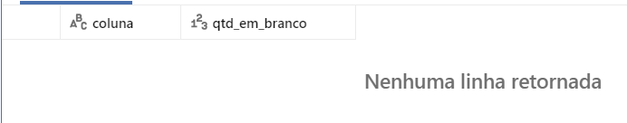

#### 4.2.2.3 - Explicação da Célula — Verificação de campos em branco na tabela Silver

Esta célula SQL realiza uma auditoria de qualidade de dados, verificando **campos em branco (nulos ou strings vazias)** em todas as colunas da tabela `MVP_ENG_DADOS.silver.food_nutrition_silver`. Funciona da seguinte forma:

1. **CTE `blank_counts`**: Executa um `SELECT` com um `SUM(CASE WHEN ... THEN 1 ELSE 0 END)` para **cada coluna** da tabela. Para cada coluna, a lógica é:
   - Se a coluna for **string** (`alimento`), verifica `IS NULL` ou `TRIM(coluna) = ''` (vazio ou apenas espaços).
   - Se a coluna for **numérica**, faz um `CAST(coluna AS STRING)` e aplica a mesma verificação de `IS NULL` ou `TRIM(...) = ''`.
   - O resultado é a **quantidade de registros em branco** para cada coluna.

2. **`UNPIVOT`**: Transforma o resultado de formato largo (uma coluna por métrica) para formato longo, gerando duas colunas: `coluna` (nome da métrica) e `qtd_em_branco` (quantidade de registros em branco).

3. **Filtro `WHERE qtd_em_branco > 0`**: Exibe apenas as colunas que possuem **pelo menos um** campo em branco, ignorando as colunas totalmente preenchidas.

4. **`ORDER BY qtd_em_branco DESC`**: Ordena as colunas daquela com mais campos em branco para a que tem menos.

> **Resumo:** o objetivo desta célula é identificar quais colunas da tabela silver possuem dados faltantes (nulos ou vazios) e quantos registros afetados há em cada uma, ordenando da mais problemática para a menos problemática. Essa auditoria orienta os tratamentos de limpeza que serão aplicados nas células seguintes (ex.: substituir nulos por `0` ou por string vazia).

> **Observação:** A coluna `Vitamins` aparece com nome em inglês, indicando que ela não foi renomeada na célula de tradução (não estava no dicionário `renomear_colunas`).

```
# Verificar se tem valores negativos na tabela silver.food_nutrition_silver

from pyspark.sql.functions import col
from pyspark.sql import functions as F

df = spark.table("MVP_ENG_DADOS.silver.food_nutrition_silver")

# Identificar colunas numéricas
colunas_numericas = [c for c in df.columns if df.schema[c].dataType.typeName() in ("int", "bigint", "long", "short", "byte", "float", "double", "decimal")]

# Construir contagem de valores negativos por coluna
neg_counts = df.select([
    (col(c) < 0).cast("int").alias(c) for c in colunas_numericas
]).agg(*[F.sum(c).alias(c) for c in colunas_numericas])

# Transformar em formato longo (coluna, qtd_negativos)
null_counts = neg_counts.collect()[0]
rows = [(c, null_counts[c]) for c in colunas_numericas]

df_neg = spark.createDataFrame(rows, ["coluna", "qtd_negativos"])
df_neg = df_neg.filter("qtd_negativos > 0").orderBy(df_neg["qtd_negativos"].desc())

print("Colunas com valores negativos:")
display(df_neg)

if df_neg.count() == 0:
    print("\nNenhum valor negativo encontrado na tabela!")
else:
    print(f"\nTotal de colunas com valores negativos: {df_neg.count()}")
    # Exibir amostra dos registros com valores negativos
    for c in colunas_numericas:
        if null_counts[c] > 0:
            print(f"\nAmostra de registros negativos na coluna '{c}':")
            display(df.filter(col(c) < 0).select("alimento", c).limit(10))
            break
```
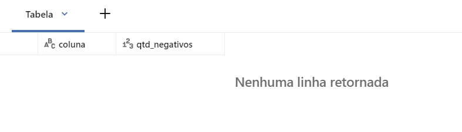

#### 4.2.2.4 - Explicação da Célula — Verificação de valores negativos na tabela Silver

Esta célula Python realiza uma auditoria de qualidade de dados que identifica **valores negativos** em todas as colunas numéricas da tabela `MVP_ENG_DADOS.silver.food_nutrition_silver`. Funciona da seguinte forma:

1. **Carrega a tabela silver** em um DataFrame Spark (`df`) usando `spark.table("MVP_ENG_DADOS.silver.food_nutrition_silver")`.

2. **Importa funções necessárias** (`col` e `functions as F`) do módulo `pyspark.sql.functions`.

3. **Identifica colunas numéricas** percorrendo todas as colunas do DataFrame e selecionando apenas aquelas cujo tipo de dado é numérico (`int`, `bigint`, `long`, `short`, `byte`, `float`, `double` ou `decimal`). Isso garante que apenas colunas onde faz sentido verificar negatividade sejam avaliadas.

4. **Constrói a contagem de valores negativos por coluna**:
   - Para cada coluna numérica, cria uma expressão `(col(c) < 0).cast("int")`, que retorna `1` quando o valor é negativo e `0` caso contrário.
   - Em seguida, aplica `F.sum(c)` sobre todas essas expressões, gerando o total de registros negativos em cada coluna.

5. **Transforma o resultado em formato longo**: coleta os resultados (`collect()[0]`), cria uma lista de tuplas `(nome_coluna, qtd_negativos)` e monta um novo DataFrame (`df_neg`) com as colunas `coluna` e `qtd_negativos`.

6. **Filtra e ordena**: mantém apenas as colunas com `qtd_negativos > 0` (ou seja, que possuem pelo menos um valor negativo) e ordena daquela com mais negativos para a que tem menos.

7. **Exibe os resultados**:
   - Mostra o DataFrame `df_neg` com as colunas que contêm valores negativos.
   - Se nenhuma coluna tiver valores negativos, imprime uma mensagem confirmando que a tabela está limpa.
   - Caso contrário, informa o total de colunas afetadas e exibe uma **amostra de até 10 registros** da primeira coluna com valores negativos (mostrando as colunas `alimento` e a coluna problemática), para inspeção visual.

> **Resumo:** o objetivo desta célula é auditar a tabela silver em busca de valores negativos — que em colunas nutricionais geralmente indicam erro de dados ou problema de ingestão — identificando quais colunas são afetadas, quantos registros há em cada uma e exibindo exemplos para investigação. Essa verificação orienta eventuais tratamentos de correção nas células seguintes.

```
# Selecionar somente as colunas necessárias para responder às 10 questões
# e gravar em uma nova tabela silver.food_nutrition_final

from pyspark.sql.functions import col

df_alimentos = spark.table("MVP_ENG_DADOS.silver.food_nutrition_silver")

# Colunas selecionadas conforme as análises:
#  1. Melhor relação proteína por caloria          -> proteina, valor_calorico
#  2. Itens mais ricos em fibras por porção        -> fibras_alimentar, valor_calorico
#  3. Maior densidade nutricional                   -> densidade_nutritiva, valor_calorico
#  4. Menor teor de sódio                           -> sodio, valor_calorico
#  5. Mais adequados para dietas low-carb           -> carboidratos, proteina, gordura, valor_calorico
#  6. Maior quantidade de gorduras saturadas         -> gordura_saturada, gordura, valor_calorico
#  7. Mais indicados para ganho de massa muscular   -> proteina, carboidratos, gordura, valor_calorico
#  8. Mais eficientes para saciedade com poucas calorias -> proteina, fibras_alimentar, valor_calorico
#  9. Maior quantidade de açúcar adicionado         -> acucares, carboidratos, valor_calorico
# 10. Mais adequados para dietas veganas/vegetarianas -> proteina, fibras_alimentar, colesterol, gordura_saturada

colunas_selecionadas = [
    "alimento",
    "valor_calorico",
    "proteina",
    "carboidratos",
    "gordura",
    "gordura_saturada",
    "fibras_alimentar",
    "colesterol",
    "sodio",
    "acucares",
    "densidade_nutritiva",
]

df_final = df_alimentos.select([col(c) for c in colunas_selecionadas])

# Gravar na nova tabela silver.food_nutrition_final
(df_final.write
    .mode("overwrite")
    .option("overwriteSchema", "true")
    .saveAsTable("MVP_ENG_DADOS.silver.food_nutrition_final"))

print("Tabela 'MVP_ENG_DADOS.silver.food_nutrition_final' criada com sucesso!")
print(f"Colunas selecionadas: {df_final.columns}")
print(f"Total de linhas: {df_final.count()}")

# Verificar os dados gravados
display(spark.table("MVP_ENG_DADOS.silver.food_nutrition_final").limit(10))
```
```
Tabela 'MVP_ENG_DADOS.silver.food_nutrition_final' criada com sucesso!
Colunas selecionadas: ['alimento', 'valor_calorico', 'proteina', 'carboidratos', 'gordura', 'gordura_saturada', 'fibras_alimentar', 'colesterol', 'sodio', 'acucares', 'densidade_nutritiva']
Total de linhas: 125
```
```
alimento	valor_calorico	proteina	carboidratos	gordura	gordura_saturada	fibras_alimentar	colesterol	sodio	acucares	densidade_nutritiva
crispy chicken strips tyson	145	0	0	6	7.7	0	0	0	0	6
nectarine	66	1.6	15.8	0.5	0.066	2.6	0	0	11.8	20.735
kiwifruit gold	51	0.8	12.8	0.2	0.008	1.1	0	0.046	10	159.686
prickly pear raw	8	0.001	1.9	0.072	0	1	0	0.065	0.2	39.263
pineapple	45	0.5	11.8	0.1	0.074	1.3	0	0.099	8.9	13.97
rowan	253	5.2	54.5	4.6	0.6	14.1	0	0.083	32.1	176.4
muscadine grapes	3	0.014	0.8	0.056	0	0.2	0	0.024	0	3.38
heidelbeeren jutro	17	0	0.4	0.2	0.039	0	0	0	0	0.6
prunes stewed	316	3.4	83.2	0.7	0.085	0	0	0.039	0	157.8
tangerine	40	0.6	10.1	0.2	0.07	1.4	0	0.056	8	60.8
```

#### 4.2.2.5 - Explicação da Célula — Seleção de colunas e gravação da tabela final

Esta célula Python realiza a seleção de um subconjunto de colunas da tabela `MVP_ENG_DADOS.silver.food_nutrition_silver` e grava o resultado em uma nova tabela `MVP_ENG_DADOS.silver.food_nutrition_final`. Funciona da seguinte forma:

1. **Carrega a tabela silver** em um DataFrame Spark (`df_alimentos`) usando `spark.table("MVP_ENG_DADOS.silver.food_nutrition_silver")`.

2. **Define a lista de colunas selecionadas** (`colunas_selecionadas`) com 11 colunas: `alimento`, `valor_calorico`, `proteina`, `carboidratos`, `gordura`, `gordura_saturada`, `fibras_alimentar`, `colesterol`, `sodio`, `acucares` e `densidade_nutritiva`. Essas colunas foram escolhidas com base nas **10 questões analíticas** que o projeto se propõe a responder, conforme os comentários no código:
   - **Q1** — Melhor relação proteína por caloria → `proteina`, `valor_calorico`
   - **Q2** — Itens mais ricos em fibras por porção → `fibras_alimentar`, `valor_calorico`
   - **Q3** — Maior densidade nutricional → `densidade_nutritiva`, `valor_calorico`
   - **Q4** — Maior teor de sódio → `sodio`, `valor_calorico`
   - **Q5** — Mais adequados para dietas low-carb → `carboidratos`, `proteina`, `gordura`, `valor_calorico`
   - **Q6** — Maior quantidade de gorduras saturadas → `gordura_saturada`, `gordura`, `valor_calorico`
   - **Q7** — Mais indicados para ganho de massa muscular → `proteina`, `carboidratos`, `gordura`, `valor_calorico`
   - **Q8** — Mais eficientes para saciedade com poucas calorias → `proteina`, `fibras_alimentar`, `valor_calorico`
   - **Q9** — Maior quantidade de açúcar → `acucares`, `carboidratos`, `valor_calorico`
   - **Q10** — Mais adequados para dietas veganas/vegetarianas → `proteina`, `fibras_alimentar`, `colesterol`, `gordura_saturada`

3. **Seleciona apenas as colunas desejadas** usando `df_alimentos.select([col(c) for c in colunas_selecionadas])`, criando um novo DataFrame `df_final` que contém apenas as colunas relevantes para as análises.

4. **Grava o DataFrame resultante** em uma nova tabela Delta chamada `MVP_ENG_DADOS.silver.food_nutrition_final`, utilizando `mode("overwrite")` (sobrescreve a tabela caso já exista) e `option("overwriteSchema", "true")` (permite sobrescrever o esquema junto com os dados).

5. **Exibe mensagens de confirmação** com o nome da tabela criada, a lista de colunas selecionadas e o total de linhas.

6. **Verifica os dados gravados** exibindo os 10 primeiros registros da nova tabela via `display(spark.table(...).limit(10))`.

> **Resumo:** o objetivo desta célula é criar uma tabela silver enxuta (`food_nutrition_final`) contendo apenas as colunas necessárias para responder às 10 questões analíticas do projeto, eliminando colunas irrelevantes e reduzindo o escopo dos dados para as análises subsequentes.


#### 4.2.2.6 - Descrição da Tabela e Dicionário de Dados

### `MVP_ENG_DADOS.silver.food_nutrition_final`

**Descrição:** Tabela da camada silver contendo um subconjunto de colunas nutricionais selecionadas para responder às 10 questões analíticas do projeto. Os dados provêm da tabela `MVP_ENG_DADOS.silver.food_nutrition_silver`, que foi derivada da camada bronze após renomeação de colunas para português e tratamento de qualidade (nulos, valores em branco e valores negativos).

| # | Coluna | Tipo | Descrição |
|---|--------|------|----------|
| 1 | `alimento` | string | Nome do alimento (chave descritiva — identifica o item alimentício) |
| 2 | `valor_calorico` | double | Valor calórico do alimento, expresso em quilocalorias (kcal) |
| 3 | `proteina` | double | Quantidade de proteína, expressa em gramas (g) |
| 4 | `carboidratos` | double | Quantidade de carboidratos, expressa em gramas (g) |
| 5 | `gordura` | double | Quantidade total de gordura (lipídios), expressa em gramas (g) |
| 6 | `gordura_saturada` | double | Quantidade de gordura saturada, expressa em gramas (g) |
| 7 | `fibras_alimentar` | double | Quantidade de fibras alimentares, expressa em gramas (g) |
| 8 | `colesterol` | double | Quantidade de colesterol, expressa em miligramas (mg) |
| 9 | `sodio` | double | Quantidade de sódio, expressa em miligramas (mg) |
| 10 | `acucares` | double | Quantidade de açúcares, expressa em gramas (g) |
| 11 | `densidade_nutritiva` | double | Densidade nutricional calculada — métrica que relaciona o valor nutritivo do alimento ao seu valor calórico |

> **Origem dos dados:** `MVP_ENG_DADOS.bronze.food_nutrition` → `MVP_ENG_DADOS.silver.food_nutrition_silver` → `MVP_ENG_DADOS.silver.food_nutrition_final`
>
> **Formato de armazenamento:** Delta Lake (Unity Catalog — schema `silver`)
>
> **Modo de gravação:** `overwrite` com `overwriteSchema = true` (recriada a cada execução)
>
> **Granularidade:** Um registro por alimento


### 4.2.3 - Tabela - alimentos_taco
```
# Criar um dataframe com dados da tabela alimentos_taco do schema bronze
df_alimentos_taco = spark.table("MVP_ENG_DADOS.bronze.alimentos_taco")

display(df_alimentos_taco.limit(10))

```
```
Número	Grupo	Descrição_do_Alimento	Umidadepct	Energiakcal	EnergiakJ	Proteínag	Lipídeosg	Colesterolmg	Carboidratog	Fibra_Alimentarg	Cinzasg	Cálciomg	Magnésiomg	Manganêsmg	Fósforomg	Ferromg	Sódiomg	Potássiomg	Cobremg	Zincomg	Retinolmcg	REmcg	RAE_mcg	Tiaminamg	Riboflavinamg	Piridoxinamg	Niacinamg	VitaminaCmg
1	Cereais e derivados	Arroz, integral, cozido	70,14	123,53	516,87	2,59	1,00	null	25,81	2,75	0,46	5,20	58,70	0,63	105,85	0,26	1,24	75,15	0,02	0,68	null	null	null	0,08	Tr	0,08	Tr	null
2	Cereais e derivados	Arroz, integral, cru	12,18	359,68	1504,89	7,32	1,86	null	77,45	4,82	1,18	7,82	109,71	2,99	250,87	0,95	1,65	173,34	0,07	1,40	null	null	null	0,26	Tr	0,18	4,18	null
3	Cereais e derivados	Arroz, tipo 1, cozido	69,11	128,26	536,63	2,52	0,23	null	28,06	1,56	0,08	3,54	2,25	0,30	17,95	0,08	1,20	14,67	0,02	0,49	null	null	null	Tr	Tr	Tr	Tr	null
4	Cereais e derivados	Arroz, tipo 1, cru	13,22	357,79	1496,99	7,16	0,34	null	78,76	1,64	0,52	4,41	30,38	1,03	104,21	0,68	1,02	62,50	0,11	1,22	null	null	null	0,16	Tr	0,07	1,12	null
5	Cereais e derivados	Arroz, tipo 2, cozido	68,73	130,12	544,42	2,57	0,36	null	28,19	1,07	0,15	3,33	6,05	0,37	21,52	0,05	1,96	20,20	0,04	0,55	null	null	null	Tr	Tr	Tr	Tr	null
6	Cereais e derivados	Arroz, tipo 2, cru	13,16	358,12	1498,36	7,24	0,28	null	78,88	1,72	0,44	4,83	29,24	0,83	82,04	0,60	0,57	57,28	0,05	1,27	null	null	null	0,16	Tr	0,05	0,92	null
7	Cereais e derivados	Aveia, flocos, crua	9,13	393,82	1647,75	13,92	8,50	null	66,64	9,13	1,81	47,89	118,76	1,89	153,40	4,45	4,63	336,33	0,44	2,63	null	null	null	0,55	0,03	Tr	4,47	1,35
8	Cereais e derivados	Biscoito, doce, maisena	3,22	442,82	1852,76	8,07	11,97	null	75,23	2,10	1,51	54,45	37,14	0,78	166,10	1,76	352,03	141,64	0,17	1,03	null	null	null	1,01	0,42	0,23	3,91	6,22
9	Cereais e derivados	Biscoito, doce, recheado com chocolate	2,18	471,82	1974,11	6,40	19,58	Tr	70,55	2,96	1,29	27,23	47,98	0,59	139,45	2,27	239,20	232,40	0,27	0,99	Tr	 	 	0,32	0,39	0,46	2,52	3,53
10	Cereais e derivados	Biscoito, doce, recheado com morango	2,73	471,17	1971,40	5,72	19,57	Tr	71,01	1,53	0,96	35,78	27,10	0,66	137,74	1,48	229,82	113,01	0,13	0,73	Tr	 	 	0,90	0,42	0,21	1,50	Tr
```

#### 4.2.3.1 - Explicação da Célula — Leitura da tabela bronze `alimentos_taco`

Esta célula Python é muito simples e tem como objetivo **carregar os dados da tabela `alimentos_taco`** do schema `bronze` (`MVP_ENG_DADOS.bronze.alimentos_taco`) em um DataFrame Spark e exibir uma amostra dos dados. Funciona da seguinte forma:

1. **Carrega a tabela bronze** em um DataFrame Spark (`df_alimentos_taco`) usando `spark.table("MVP_ENG_DADOS.bronze.alimentos_taco")`. Essa função lê a tabela Delta já registrada no catálogo do Unity Catalog e a disponibiliza para manipulação no PySpark.

2. **Exibe os 10 primeiros registros** da tabela usando `display(df_alimentos_taco.limit(10))`, permitindo uma inspeção visual rápida do conteúdo e da estrutura dos dados (nomes de colunas, tipos de dados, valores de exemplo).

> **Resumo:** o objetivo desta célula é carregar a segunda fonte de dados do projeto — a tabela `alimentos_taco` da camada bronze — e visualizar uma amostra dos seus registros. Esses dados serão tratados e gravados na camada silver nas células seguintes (Célula 14 grava em `silver.alimentos_taco_silver`).
```
# Escrever o DataFrame df_alimentos_taco na tabela silver.alimentos_taco_silver
(df_alimentos_taco.write
    .mode("overwrite")
    .option("overwriteSchema", "true")
    .saveAsTable("MVP_ENG_DADOS.silver.alimentos_taco_silver"))

print("Tabela 'MVP_ENG_DADOS.silver.alimentos_taco_silver' criada com sucesso!")

# Verificar os dados gravados
display(spark.table("MVP_ENG_DADOS.silver.alimentos_taco_silver").limit(10))
```
```
Tabela 'MVP_ENG_DADOS.silver.alimentos_taco_silver' criada com sucesso!
Número	Grupo	Descrição_do_Alimento	Umidadepct	Energiakcal	EnergiakJ	Proteínag	Lipídeosg	Colesterolmg	Carboidratog	Fibra_Alimentarg	Cinzasg	Cálciomg	Magnésiomg	Manganêsmg	Fósforomg	Ferromg	Sódiomg	Potássiomg	Cobremg	Zincomg	Retinolmcg	REmcg	RAE_mcg	Tiaminamg	Riboflavinamg	Piridoxinamg	Niacinamg	VitaminaCmg
1	Cereais e derivados	Arroz, integral, cozido	70,14	123,53	516,87	2,59	1,00	null	25,81	2,75	0,46	5,20	58,70	0,63	105,85	0,26	1,24	75,15	0,02	0,68	null	null	null	0,08	Tr	0,08	Tr	null
2	Cereais e derivados	Arroz, integral, cru	12,18	359,68	1504,89	7,32	1,86	null	77,45	4,82	1,18	7,82	109,71	2,99	250,87	0,95	1,65	173,34	0,07	1,40	null	null	null	0,26	Tr	0,18	4,18	null
3	Cereais e derivados	Arroz, tipo 1, cozido	69,11	128,26	536,63	2,52	0,23	null	28,06	1,56	0,08	3,54	2,25	0,30	17,95	0,08	1,20	14,67	0,02	0,49	null	null	null	Tr	Tr	Tr	Tr	null
4	Cereais e derivados	Arroz, tipo 1, cru	13,22	357,79	1496,99	7,16	0,34	null	78,76	1,64	0,52	4,41	30,38	1,03	104,21	0,68	1,02	62,50	0,11	1,22	null	null	null	0,16	Tr	0,07	1,12	null
5	Cereais e derivados	Arroz, tipo 2, cozido	68,73	130,12	544,42	2,57	0,36	null	28,19	1,07	0,15	3,33	6,05	0,37	21,52	0,05	1,96	20,20	0,04	0,55	null	null	null	Tr	Tr	Tr	Tr	null
6	Cereais e derivados	Arroz, tipo 2, cru	13,16	358,12	1498,36	7,24	0,28	null	78,88	1,72	0,44	4,83	29,24	0,83	82,04	0,60	0,57	57,28	0,05	1,27	null	null	null	0,16	Tr	0,05	0,92	null
7	Cereais e derivados	Aveia, flocos, crua	9,13	393,82	1647,75	13,92	8,50	null	66,64	9,13	1,81	47,89	118,76	1,89	153,40	4,45	4,63	336,33	0,44	2,63	null	null	null	0,55	0,03	Tr	4,47	1,35
8	Cereais e derivados	Biscoito, doce, maisena	3,22	442,82	1852,76	8,07	11,97	null	75,23	2,10	1,51	54,45	37,14	0,78	166,10	1,76	352,03	141,64	0,17	1,03	null	null	null	1,01	0,42	0,23	3,91	6,22
9	Cereais e derivados	Biscoito, doce, recheado com chocolate	2,18	471,82	1974,11	6,40	19,58	Tr	70,55	2,96	1,29	27,23	47,98	0,59	139,45	2,27	239,20	232,40	0,27	0,99	Tr	 	 	0,32	0,39	0,46	2,52	3,53
10	Cereais e derivados	Biscoito, doce, recheado com morango	2,73	471,17	1971,40	5,72	19,57	Tr	71,01	1,53	0,96	35,78	27,10	0,66	137,74	1,48	229,82	113,01	0,13	0,73	Tr	 	 	0,90	0,42	0,21	1,50	Tr
```
#### 4.2.3.2 - Explicação da Célula — Gravação da tabela silver `alimentos_taco_silver`

Esta célula Python pega o DataFrame `df_alimentos_taco` — carregado na célula anterior a partir da tabela bronze `MVP_ENG_DADOS.bronze.alimentos_taco` — e o grava na camada silver como uma nova tabela Delta chamada `MVP_ENG_DADOS.silver.alimentos_taco_silver`. Funciona da seguinte forma:

1. **Grava o DataFrame na tabela silver** utilizando a API `write` do Spark:
   - `.mode("overwrite")` — sobrescreve a tabela caso ela já exista, garantindo idempotência.
   - `.option("overwriteSchema", "true")` — permite que o esquema (nomes e tipos de colunas) seja sobrescrito junto com os dados, útil caso a estrutura da tabela bronze tenha mudado.
   - `.saveAsTable("MVP_ENG_DADOS.silver.alimentos_taco_silver")` — cria (ou recria) a tabela Delta no catálogo do Unity Catalog, dentro do schema `silver`.

2. **Imprime uma mensagem de confirmação** indicando que a tabela foi criada com sucesso.

3. **Verifica os dados gravados** lendo a tabela recém-criada com `spark.table(...)` e exibindo os 10 primeiros registros via `display(...).limit(10)`, permitindo uma inspeção visual rápida de que a gravação ocorreu corretamente.

> **Resumo:** o objetivo desta célula é promover os dados da tabela `alimentos_taco` da camada bronze para a camada silver, criando uma cópia idêntica em formato Delta no catálogo. Essa tabela silver servirá como base para as próximas etapas de tratamento de qualidade de dados (verificação e substituição de valores nulos, "Tr"/trace e valores negativos).

```
# Verificar campos nulos em todas as colunas da tabela silver.alimentos_taco_silver
# usando SQL dinâmico gerado a partir do esquema da tabela

df_taco = spark.table("MVP_ENG_DADOS.silver.alimentos_taco_silver")

colunas = df_taco.columns

# Construir a consulta SQL dinamicamente
# Para colunas do tipo string, também verificamos strings vazias; para demais tipos, apenas IS NULL
select_exprs = []
for col in colunas:
    dtype = dict(df_taco.dtypes)[col]
    if dtype == "string":
        expr = f"SUM(CASE WHEN `{col}` IS NULL OR TRIM(`{col}`) = '' THEN 1 ELSE 0 END) AS `{col}`"
    else:
        expr = f"SUM(CASE WHEN `{col}` IS NULL THEN 1 ELSE 0 END) AS `{col}`"
    select_exprs.append(expr)

sql_query = f"""
SELECT {', '.join(select_exprs)}
FROM MVP_ENG_DADOS.silver.alimentos_taco_silver
"""

# Executar e transformar em formato longo (coluna, qtd_nulos)
result = spark.sql(sql_query)

# Unpivot usando PySpark (stack approach)
from pyspark.sql.functions import lit, col
from pyspark.sql import Row

null_counts = result.collect()[0]
rows = [(c, null_counts[c]) for c in colunas]

df_nulls = spark.createDataFrame(rows, ["coluna", "qtd_nulos"])
df_nulls = df_nulls.filter("qtd_nulos > 0").orderBy(df_nulls["qtd_nulos"].desc())

print("Colunas com valores nulos ou em branco:")
display(df_nulls)

if df_nulls.count() == 0:
    print("\nNenhum campo nulo ou em branco encontrado!")

```
```

Colunas com valores nulos ou em branco:
coluna	         qtd_nulos
REmcg	342
RAE_mcg	342
Colesterolmg	330
Retinolmcg	322
Fibra_Alimentarg	227
VitaminaCmg	224
Niacinamg	27
Piridoxinamg	25
Tiaminamg	22
Riboflavinamg	22
Manganêsmg	15
Zincomg	13
Cálciomg	12
Magnésiomg	12
Fósforomg	12
Ferromg	12
Cobremg	12
Proteínag	11
Carboidratog	11
Potássiomg	11
Cinzasg	10
Umidadepct	9
Sódiomg	8
Lipídeosg	3
Energiakcal	2
EnergiakJ	2
```


#### 4.2.3.3 - Explicação da Célula — Verificação de valores nulos na tabela `alimentos_taco_silver`

Esta célula Python realiza uma auditoria de **qualidade de dados** sobre a tabela `MVP_ENG_DADOS.silver.alimentos_taco_silver`, identificando quantos valores nulos ou em branco existem em cada coluna. Funciona da seguinte forma:

1. **Carrega a tabela silver** em um DataFrame Spark (`df_taco`) usando `spark.table("MVP_ENG_DADOS.silver.alimentos_taco_silver")`.

2. **Obtém a lista de colunas** da tabela (`df_taco.columns`) e, para cada coluna, constrói uma expressão SQL condicional que conta registros nulos:
   - Para colunas do tipo **string**: conta tanto `NULL` quanto strings vazias (`TRIM(col) = ''`).
   - Para colunas de **outros tipos** (numéricos, etc.): conta apenas `IS NULL`.

3. **Monta uma consulta SQL dinâmica** unindo todas as expressões com `SUM(CASE WHEN ... THEN 1 ELSE 0 END)` e a executa com `spark.sql(...)`, produzindo uma única linha onde cada coluna contém a quantidade de nulos encontrada.

4. **Transforma o resultado em formato longo** (unpivot): converte a linha de contagens em um DataFrame com duas colunas — `coluna` (nome da coluna) e `qtd_nulos` (quantidade de nulos) — e filtra para exibir apenas as colunas que possuem ao menos um valor nulo (`qtd_nulos > 0`), ordenadas em ordem decrescente.

5. **Exibe o resultado** com `display(df_nulls)`. Se nenhuma coluna tiver valores nulos, imprime a mensagem "Nenhum campo nulo ou em branco encontrado!".

> **Resumo:** o objetivo desta célula é diagnosticar a presença de valores nulos ou em branco em cada coluna da tabela silver `alimentos_taco_silver`, gerando um relatório que orientará o tratamento de dados na célula seguinte (Célula 20), onde os valores nulos, em branco e "Tr" (trace) serão substituídos por valores válidos.

```
# Alterar os valores nulos ou em branco para valores válidos na tabela silver.food_nutrition_silver

from pyspark.sql.functions import col, when, trim, lit

df_alimentos = spark.table("MVP_ENG_DADOS.silver.food_nutrition_silver")

# Tratar cada coluna conforme o tipo de dado
for nome_coluna in df_alimentos.columns:
    dtype = df_alimentos.schema[nome_coluna].dataType
    tipo = dtype.typeName()

    if tipo == "string":
        # Strings: substituir NULL e strings vazias/whitespace por ""
        df_alimentos = df_alimentos.withColumn(
            nome_coluna,
            when(col(nome_coluna).isNull() | (trim(col(nome_coluna)) == ""), lit("")).otherwise(col(nome_coluna))
        )
    elif tipo in ("int", "bigint", "long", "short", "byte", "float", "double", "decimal"):
        # Numéricos: substituir NULL por 0
        df_alimentos = df_alimentos.fillna({nome_coluna: 0})
    else:
        # Outros tipos: apenas registrar (poderia tratar boolean, date, etc.)
        print(f"Coluna '{nome_coluna}' do tipo '{tipo}' não tratada automaticamente.")

# Sobrescrever a tabela silver com os valores tratados
(df_alimentos.write
    .mode("overwrite")
    .option("overwriteSchema", "true")
    .saveAsTable("MVP_ENG_DADOS.silver.food_nutrition_silver"))

print("Valores nulos ou em branco substituídos com sucesso na tabela 'MVP_ENG_DADOS.silver.food_nutrition_silver'!")

# Verificar o resultado
print("\nAmostra dos dados tratados:")
display(spark.table("MVP_ENG_DADOS.silver.food_nutrition_silver").limit(10))

```
```
Valores nulos ou em branco substituídos com sucesso na tabela 'MVP_ENG_DADOS.silver.food_nutrition_silver'!

Amostra dos dados tratados:

alimento	valor_calorico	gordura	gordura_saturada	gordura_monoinsaturada	gordura_poliinsaturada	carboidratos	acucares	proteina	fibras_alimentar	colesterol	sodio	agua	Vitamins	calcio	cobre	ferro	magnesio	manganes	fosforo	potassio	selnio	zinco	densidade_nutritiva
crispy chicken strips tyson	145	6	7.7	14.5	1	0	0	0	0	0	0	0	0	0	0	0	0	0	0	0	0	0	6
nectarine	66	0.5	0.066	0.1	0.2	15.8	11.8	1.6	2.6	0	0	131.4	1.6	0.081	9	0.1	0.4	13.5	0.002	39	301.5	0	20.735
kiwifruit gold	51	0.2	0.008	0.099	0.051	12.8	10	0.8	1.1	0	0.046	66.8	22.02	13.8	0.1	0.2	9.7	0.072	20.3	255.2	0.003	0.077	159.686
prickly pear raw	8	0.072	0	0	0	1.9	0.2	0.001	1	0	0.065	17	0.36	34.2	0.051	0.021	13.1	0.1	2.1	24.7	0.023	0.073	39.263
pineapple	45	0.1	0.074	0.001	0.087	11.8	8.9	0.5	1.3	0	0.099	77.4	7.21	0.061	11.7	0.091	0.3	10.8	0.8	7.2	98.1	0.061	13.97
rowan	253	4.6	0.6	0	0	54.5	32.1	5.2	14.1	0	0.083	162.8	9.8	34.2	2.4	5	73	0.4	118.6	298.7	0	1	176.4
muscadine grapes	3	0.056	0	0	0	0.8	0	0.014	0.2	0	0.024	5.1	0	2.2	0.023	0.014	0.8	0.1	1.4	12.2	0	0.027	3.38
heidelbeeren jutro	17	0.2	0.039	2.5	2.4	0.4	0	0	0	0	0	0	0	0	0	0	0	0	0	0	0	0	0.6
prunes stewed	316	0.7	0.085	0.5	0.1	83.2	0	3.4	0	0	0.039	190.4	0.09	67.2	0.6	3.3	58.8	0.3	103.6	988.4	0	0.7	157.8
tangerine	40	0.2	0.07	0.097	0.05	10.1	8	0.6	1.4	0	0.056	64.7	3.44	28.1	0.001	0.1	9.1	0.057	15.2	126.2	0.008	0.078	60.8
```

#### 4.2.3.4 - Explicação da Célula — Tratamento de valores nulos ou em branco na tabela `food_nutrition_silver`

Esta célula Python realiza a **limpeza de dados** na tabela `MVP_ENG_DADOS.silver.food_nutrition_silver`, substituindo valores nulos (`NULL`) e strings vazias/whitespace por valores válidos, e em seguida sobrescreve a tabela com os dados tratados. Funciona da seguinte forma:

1. **Importa funções do PySpark** necessárias para o tratamento: `col`, `when`, `trim`, `lit`.

2. **Carrega a tabela silver** em um DataFrame Spark (`df_alimentos`) usando `spark.table("MVP_ENG_DADOS.silver.food_nutrition_silver")`.

3. **Itera sobre todas as colunas** do DataFrame, aplicando tratamento específico conforme o tipo de dado de cada coluna:
   - **Colunas do tipo string**: utiliza `when` + `isNull` + `trim` para substituir `NULL` e strings vazias/whitespace por uma string vazia (`lit("")`).
   - **Colunas numéricas** (`int`, `bigint`, `long`, `short`, `byte`, `float`, `double`, `decimal`): utiliza `fillna({nome_coluna: 0})` para substituir `NULL` por zero.
   - **Outros tipos** (boolean, date, etc.): apenas imprime uma mensagem informando que a coluna não foi tratada automaticamente.

4. **Sobrescreve a tabela silver** com os dados tratados utilizando a API `write` do Spark:
   - `.mode("overwrite")` — sobrescreve a tabela caso já exista.
   - `.option("overwriteSchema", "true")` — permite que o esquema seja sobrescrito junto com os dados.
   - `.saveAsTable("MVP_ENG_DADOS.silver.food_nutrition_silver")` — grava o resultado na mesma tabela silver.

5. **Imprime uma mensagem de confirmação** indicando que o tratamento foi concluído com sucesso.

6. **Verifica o resultado** exibindo uma amostra dos 10 primeiros registros da tabela tratada via `display(...)`, permitindo confirmar visualmente que os valores nulos e em branco foram substituídos.

> **Resumo:** o objetivo desta célula é garantir a qualidade dos dados da tabela `food_nutrition_silver`, eliminando valores nulos e em branco que poderiam comprometer análises posteriores. Essa tabela corresponde à primeira fonte de dados do projeto (FoodData Central), cujo tratamento é análogo ao realizado na tabela `alimentos_taco_silver` (Célula 21), onde valores nulos, em branco e "Tr" (trace) também são substituídos.

```
%sql
SELECT *
FROM MVP_ENG_DADOS.silver.alimentos_taco_silver
LIMIT 10;
```
```
Número	Grupo	Descrição_do_Alimento	Umidadepct	Energiakcal	EnergiakJ	Proteínag	Lipídeosg	Colesterolmg	Carboidratog	Fibra_Alimentarg	Cinzasg	Cálciomg	Magnésiomg	Manganêsmg	Fósforomg	Ferromg	Sódiomg	Potássiomg	Cobremg	Zincomg	Retinolmcg	REmcg	RAE_mcg	Tiaminamg	Riboflavinamg	Piridoxinamg	Niacinamg	VitaminaCmg
1	Cereais e derivados	Arroz, integral, cozido	70,14	123,53	516,87	2,59	1,00	null	25,81	2,75	0,46	5,20	58,70	0,63	105,85	0,26	1,24	75,15	0,02	0,68	null	null	null	0,08	Tr	0,08	Tr	null
2	Cereais e derivados	Arroz, integral, cru	12,18	359,68	1504,89	7,32	1,86	null	77,45	4,82	1,18	7,82	109,71	2,99	250,87	0,95	1,65	173,34	0,07	1,40	null	null	null	0,26	Tr	0,18	4,18	null
3	Cereais e derivados	Arroz, tipo 1, cozido	69,11	128,26	536,63	2,52	0,23	null	28,06	1,56	0,08	3,54	2,25	0,30	17,95	0,08	1,20	14,67	0,02	0,49	null	null	null	Tr	Tr	Tr	Tr	null
4	Cereais e derivados	Arroz, tipo 1, cru	13,22	357,79	1496,99	7,16	0,34	null	78,76	1,64	0,52	4,41	30,38	1,03	104,21	0,68	1,02	62,50	0,11	1,22	null	null	null	0,16	Tr	0,07	1,12	null
5	Cereais e derivados	Arroz, tipo 2, cozido	68,73	130,12	544,42	2,57	0,36	null	28,19	1,07	0,15	3,33	6,05	0,37	21,52	0,05	1,96	20,20	0,04	0,55	null	null	null	Tr	Tr	Tr	Tr	null
6	Cereais e derivados	Arroz, tipo 2, cru	13,16	358,12	1498,36	7,24	0,28	null	78,88	1,72	0,44	4,83	29,24	0,83	82,04	0,60	0,57	57,28	0,05	1,27	null	null	null	0,16	Tr	0,05	0,92	null
7	Cereais e derivados	Aveia, flocos, crua	9,13	393,82	1647,75	13,92	8,50	null	66,64	9,13	1,81	47,89	118,76	1,89	153,40	4,45	4,63	336,33	0,44	2,63	null	null	null	0,55	0,03	Tr	4,47	1,35
8	Cereais e derivados	Biscoito, doce, maisena	3,22	442,82	1852,76	8,07	11,97	null	75,23	2,10	1,51	54,45	37,14	0,78	166,10	1,76	352,03	141,64	0,17	1,03	null	null	null	1,01	0,42	0,23	3,91	6,22
9	Cereais e derivados	Biscoito, doce, recheado com chocolate	2,18	471,82	1974,11	6,40	19,58	Tr	70,55	2,96	1,29	27,23	47,98	0,59	139,45	2,27	239,20	232,40	0,27	0,99	Tr	 	 	0,32	0,39	0,46	2,52	3,53
10	Cereais e derivados	Biscoito, doce, recheado com morango	2,73	471,17	1971,40	5,72	19,57	Tr	71,01	1,53	0,96	35,78	27,10	0,66	137,74	1,48	229,82	113,01	0,13	0,73	Tr	 	 	0,90	0,42	0,21	1,50	Tr
```
#### 4.2.3.5 - Explicação da Célula — Visualização da tabela `alimentos_taco_silver`

Esta célula SQL realiza uma simples **consulta de inspeção** sobre a tabela `MVP_ENG_DADOS.silver.alimentos_taco_silver`, retornando os 10 primeiros registros. Funciona da seguinte forma:

1. **`SELECT *`** — seleciona todas as colunas da tabela, sem nenhum filtro ou transformação.

2. **`FROM MVP_ENG_DADOS.silver.alimentos_taco_silver`** — indica a tabela de origem, localizada no catálogo `MVP_ENG_DADOS`, schema `silver`.

3. **`LIMIT 10`** — restringe o resultado aos 10 primeiros registros, permitindo uma visualização rápida e leve dos dados sem carregar a tabela inteira.

> **Resumo:** o objetivo desta célula é permitir uma inspeção visual rápida dos dados da tabela silver `alimentos_taco_silver` logo após a verificação de valores nulos (Célula 16) e antes do tratamento de valores nulos, em branco e "Tr" (trace) que será realizado na Célula 22. É uma célula de conferência intermediária, sem efeitos colaterais sobre os dados.

```
# Alterar valores em branco, nulos e "Tr" (trace) para valores válidos
# na tabela silver.alimentos_taco_silver

from pyspark.sql.functions import col, when, trim, lit, regexp_replace

df_taco = spark.table("MVP_ENG_DADOS.silver.alimentos_taco_silver")

# Tratar cada coluna conforme o tipo de dado
for nome_coluna in df_taco.columns:
    dtype = df_taco.schema[nome_coluna].dataType
    tipo = dtype.typeName()

    if tipo == "string":
        # Strings: substituir NULL, strings vazias/whitespace e "Tr" (trace) por "0"
        df_taco = df_taco.withColumn(
            nome_coluna,
            when(
                col(nome_coluna).isNull()
                | (trim(col(nome_coluna)) == "")
                | (trim(col(nome_coluna)) == "Tr"),
                lit("0")
            ).otherwise(col(nome_coluna))
        )
    elif tipo in ("int", "bigint", "long", "short", "byte", "float", "double", "decimal"):
        # Numéricos: substituir NULL por 0
        df_taco = df_taco.fillna({nome_coluna: 0})
    else:
        print(f"Coluna '{nome_coluna}' do tipo '{tipo}' não tratada automaticamente.")

# Sobrescrever a tabela silver com os valores tratados
(df_taco.write
    .mode("overwrite")
    .option("overwriteSchema", "true")
    .saveAsTable("MVP_ENG_DADOS.silver.alimentos_taco_silver"))

print("Valores em branco, nulos e 'Tr' substituídos com sucesso na tabela 'MVP_ENG_DADOS.silver.alimentos_taco_silver'!")

# Verificar o resultado
print("\nAmostra dos dados tratados:")
display(spark.table("MVP_ENG_DADOS.silver.alimentos_taco_silver").limit(10))
```
```
Valores em branco, nulos e 'Tr' substituídos com sucesso na tabela 'MVP_ENG_DADOS.silver.alimentos_taco_silver'!

Amostra dos dados tratados:

Número	Grupo	Descrição_do_Alimento	Umidadepct	Energiakcal	EnergiakJ	Proteínag	Lipídeosg	Colesterolmg	Carboidratog	Fibra_Alimentarg	Cinzasg	Cálciomg	Magnésiomg	Manganêsmg	Fósforomg	Ferromg	Sódiomg	Potássiomg	Cobremg	Zincomg	Retinolmcg	REmcg	RAE_mcg	Tiaminamg	Riboflavinamg	Piridoxinamg	Niacinamg	VitaminaCmg
1	Cereais e derivados	Arroz, integral, cozido	70,14	123,53	516,87	2,59	1,00	0	25,81	2,75	0,46	5,20	58,70	0,63	105,85	0,26	1,24	75,15	0,02	0,68	0	0	0	0,08	0	0,08	0	0
2	Cereais e derivados	Arroz, integral, cru	12,18	359,68	1504,89	7,32	1,86	0	77,45	4,82	1,18	7,82	109,71	2,99	250,87	0,95	1,65	173,34	0,07	1,40	0	0	0	0,26	0	0,18	4,18	0
3	Cereais e derivados	Arroz, tipo 1, cozido	69,11	128,26	536,63	2,52	0,23	0	28,06	1,56	0,08	3,54	2,25	0,30	17,95	0,08	1,20	14,67	0,02	0,49	0	0	0	0	0	0	0	0
4	Cereais e derivados	Arroz, tipo 1, cru	13,22	357,79	1496,99	7,16	0,34	0	78,76	1,64	0,52	4,41	30,38	1,03	104,21	0,68	1,02	62,50	0,11	1,22	0	0	0	0,16	0	0,07	1,12	0
5	Cereais e derivados	Arroz, tipo 2, cozido	68,73	130,12	544,42	2,57	0,36	0	28,19	1,07	0,15	3,33	6,05	0,37	21,52	0,05	1,96	20,20	0,04	0,55	0	0	0	0	0	0	0	0
6	Cereais e derivados	Arroz, tipo 2, cru	13,16	358,12	1498,36	7,24	0,28	0	78,88	1,72	0,44	4,83	29,24	0,83	82,04	0,60	0,57	57,28	0,05	1,27	0	0	0	0,16	0	0,05	0,92	0
7	Cereais e derivados	Aveia, flocos, crua	9,13	393,82	1647,75	13,92	8,50	0	66,64	9,13	1,81	47,89	118,76	1,89	153,40	4,45	4,63	336,33	0,44	2,63	0	0	0	0,55	0,03	0	4,47	1,35
8	Cereais e derivados	Biscoito, doce, maisena	3,22	442,82	1852,76	8,07	11,97	0	75,23	2,10	1,51	54,45	37,14	0,78	166,10	1,76	352,03	141,64	0,17	1,03	0	0	0	1,01	0,42	0,23	3,91	6,22
9	Cereais e derivados	Biscoito, doce, recheado com chocolate	2,18	471,82	1974,11	6,40	19,58	0	70,55	2,96	1,29	27,23	47,98	0,59	139,45	2,27	239,20	232,40	0,27	0,99	0	0	0	0,32	0,39	0,46	2,52	3,53
10	Cereais e derivados	Biscoito, doce, recheado com morango	2,73	471,17	1971,40	5,72	19,57	0	71,01	1,53	0,96	35,78	27,10	0,66	137,74	1,48	229,82	113,01	0,13	0,73	0	0	0	0,90	0,42	0,21	1,50	0
```

#### 4.2.3.6 - Explicação da Célula — Tratamento de valores nulos, em branco e "Tr" (trace) na tabela `alimentos_taco_silver`

Esta célula Python realiza a **limpeza de dados** na tabela `MVP_ENG_DADOS.silver.alimentos_taco_silver`, substituindo valores nulos (`NULL`), strings vazias/whitespace e o valor `"Tr"` (trace — indica quantidade desprezível) por um valor válido (`"0"` para strings, `0` para numéricos) e, em seguida, sobrescreve a tabela com os dados tratados. Funciona da seguinte forma:

1. **Importa funções do PySpark** necessárias para o tratamento: `col`, `when`, `trim`, `lit`, `regexp_replace`.

2. **Carrega a tabela silver** em um DataFrame Spark (`df_taco`) usando `spark.table("MVP_ENG_DADOS.silver.alimentos_taco_silver")`.

3. **Itera sobre todas as colunas** do DataFrame, aplicando tratamento específico conforme o tipo de dado de cada coluna:
   - **Colunas do tipo string**: utiliza `when` + `isNull` + `trim` para substituir três condições por `"0"`:
     - `NULL` (valor nulo);
     - strings vazias ou compostas apenas por espaços em branco (`trim(col) == ""`);
     - o valor `"Tr"` (trace), que na tabela TACO indica uma quantidade nutricional tão pequena que não é mensurável — é substituído por `"0"` para permitir conversão numérica posterior.
   - **Colunas numéricas** (`int`, `bigint`, `long`, `short`, `byte`, `float`, `double`, `decimal`): utiliza `fillna({nome_coluna: 0})` para substituir `NULL` por zero.
   - **Outros tipos** (boolean, date, etc.): apenas imprime uma mensagem informando que a coluna não foi tratada automaticamente.

4. **Sobrescreve a tabela silver** com os dados tratados utilizando a API `write` do Spark:
   - `.mode("overwrite")` — sobrescreve a tabela caso já exista.
   - `.option("overwriteSchema", "true")` — permite que o esquema seja sobrescrito junto com os dados.
   - `.saveAsTable("MVP_ENG_DADOS.silver.alimentos_taco_silver")` — grava o resultado na mesma tabela silver.

5. **Imprime uma mensagem de confirmação** indicando que o tratamento foi concluído com sucesso.

6. **Verifica o resultado** exibindo uma amostra dos 10 primeiros registros da tabela tratada via `display(...)`, permitindo confirmar visualmente que os valores nulos, em branco e `"Tr"` foram substituídos.

> **Resumo:** o objetivo desta célula é garantir a qualidade dos dados da tabela `alimentos_taco_silver`, eliminando valores nulos, em branco e `"Tr"` (trace) que poderiam comprometer análises posteriores e conversões numéricas. O valor `"Tr"` é específico da tabela TACO e representa quantidades nutricionais desprezíveis (trace), que são padronizadas para `"0"` de modo a uniformizar o conjunto de dados. Esse tratamento é análogo ao realizado na tabela `food_nutrition_silver` (Célula 18), com a diferença de que aqui também se contempla o caso do `"Tr"`. Após esta célula, a Célula 24 realiza uma nova verificação de nulos para confirmar que o tratamento foi bem-sucedido.

```
# Verificar campos nulos em todas as colunas da tabela silver.alimentos_taco_silver
# usando SQL dinâmico gerado a partir do esquema da tabela

df_taco = spark.table("MVP_ENG_DADOS.silver.alimentos_taco_silver")

colunas = df_taco.columns

# Construir a consulta SQL dinamicamente
# Para colunas do tipo string, também verificamos strings vazias; para demais tipos, apenas IS NULL
select_exprs = []
for col in colunas:
    dtype = dict(df_taco.dtypes)[col]
    if dtype == "string":
        expr = f"SUM(CASE WHEN `{col}` IS NULL OR TRIM(`{col}`) = '' THEN 1 ELSE 0 END) AS `{col}`"
    else:
        expr = f"SUM(CASE WHEN `{col}` IS NULL THEN 1 ELSE 0 END) AS `{col}`"
    select_exprs.append(expr)

sql_query = f"""
SELECT {', '.join(select_exprs)}
FROM MVP_ENG_DADOS.silver.alimentos_taco_silver
"""

# Executar e transformar em formato longo (coluna, qtd_nulos)
result = spark.sql(sql_query)

# Unpivot usando PySpark (stack approach)
from pyspark.sql.functions import lit, col
from pyspark.sql import Row

null_counts = result.collect()[0]
rows = [(c, null_counts[c]) for c in colunas]

df_nulls = spark.createDataFrame(rows, ["coluna", "qtd_nulos"])
df_nulls = df_nulls.filter("qtd_nulos > 0").orderBy(df_nulls["qtd_nulos"].desc())

print("Colunas com valores nulos ou em branco:")
display(df_nulls)

if df_nulls.count() == 0:
    print("\nNenhum campo nulo ou em branco encontrado!")

```
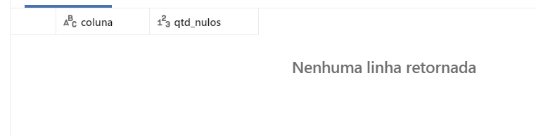


#### 4.2.3.7 - Explicação da Célula — Verificação de valores nulos ou em branco na tabela `alimentos_taco_silver`

Esta célula Python realiza uma **verificação de qualidade de dados** na tabela `MVP_ENG_DADOS.silver.alimentos_taco_silver`, contabilizando quantos valores nulos (`NULL`) ou em branco existem em cada coluna após o tratamento realizado na Célula 22. Funciona da seguinte forma:

1. **Carrega a tabela silver** em um DataFrame Spark (`df_taco`) usando `spark.table("MVP_ENG_DADOS.silver.alimentos_taco_silver")`.

2. **Obtém a lista de colunas** do DataFrame (`df_taco.columns`) para iterar sobre todas elas.

3. **Constrói uma consulta SQL dinamicamente**, gerando uma expressão `SUM(CASE WHEN ... THEN 1 ELSE 0 END)` para cada coluna, com lógica diferenciada por tipo de dado:
   - **Colunas do tipo string**: a condição verifica `IS NULL OR TRIM(coluna) = ''`, contabilizando tanto valores nulos quanto strings vazias ou compostas apenas por espaços em branco.
   - **Demais tipos** (numéricos, booleanos, datas, etc.): a condição verifica apenas `IS NULL`.
   - Cada expressão recebe um alias com o próprio nome da coluna, preservando a identificação.

4. **Executa a consulta SQL** com `spark.sql(sql_query)`, obtendo uma única linha onde cada coluna contém a contagem de valores nulos/em branco da coluna correspondente.

5. **Transforma o resultado em formato longo** (unpivot), convertendo a linha única em um DataFrame com duas colunas: `coluna` (nome da coluna original) e `qtd_nulos` (quantidade de valores nulos ou em branco encontrados).

6. **Filtra e ordena** o resultado para exibir apenas as colunas que possuem `qtd_nulos > 0`, ordenadas em ordem decrescente pela quantidade de nulos.

7. **Exibe o resultado** com `display(df_nulls)`, mostrando as colunas que ainda contêm valores nulos ou em branco.

8. **Verifica se não há nulos**: se `df_nulls.count() == 0`, imprime uma mensagem confirmando que nenhum campo nulo ou em branco foi encontrado, validando que o tratamento da Célula 22 foi bem-sucedido.

> **Resumo:** o objetivo desta célula é **auditar** o resultado do tratamento de valores nulos, em branco e `"Tr"` realizado na Célula 22, garantindo que a tabela `alimentos_taco_silver` esteja livre de valores ausentes antes de prosseguir para as próximas etapas de transformação. A abordagem com SQL dinâmico permite que a verificação se adapte automaticamente a qualquer mudança no esquema da tabela, sem necessidade de ajuste manual. Esta célula é análoga à verificação realizada para a tabela `food_nutrition_silver` (Células 17 e 19), mas aplicada à tabela TACO com a distinção entre strings e demais tipos.

```
# Verificar se tem valores negativos na tabela silver.alimentos_taco_silver

from pyspark.sql.functions import col, trim, regexp_replace, when, lit, expr
from pyspark.sql import functions as F

df = spark.table("MVP_ENG_DADOS.silver.alimentos_taco_silver")

# A tabela TACO possui colunas numéricas como strings (vírgula decimal).
# Para cada coluna (exceto as não numéricas), converter para DOUBLE e verificar negativos.
# Identificar colunas que não são string de descrição/grupo:
# 'Descrição_do_Alimento' e 'Grupo' são textuais.
colunas_ignorar = {"Descrição_do_Alimento", "Grupo"}

colunas_verificar = [c for c in df.columns if c not in colunas_ignorar]

# Construir contagem de valores negativos por coluna
# Substituir vírgula por ponto, tratar 'Tr' como 0 e converter para DOUBLE
neg_counts = df.select([
    F.coalesce(
        expr(f"try_cast(regexp_replace(trim(`{c}`), ',', '.') AS DOUBLE)"),
        lit(0.0)
    ).alias(c)
    for c in colunas_verificar
]).select([
    (col(c) < 0).cast("int").alias(c) for c in colunas_verificar
]).agg(*[F.sum(c).alias(c) for c in colunas_verificar])

# Transformar em formato longo (coluna, qtd_negativos)
null_counts = neg_counts.collect()[0]
rows = [(c, null_counts[c]) for c in colunas_verificar]

df_neg = spark.createDataFrame(rows, ["coluna", "qtd_negativos"])
df_neg = df_neg.filter("qtd_negativos > 0").orderBy(df_neg["qtd_negativos"].desc())

print("Colunas com valores negativos:")
display(df_neg)

if df_neg.count() == 0:
    print("\nNenhum valor negativo encontrado na tabela!")
else:
    print(f"\nTotal de colunas com valores negativos: {df_neg.count()}")
    for c in colunas_verificar:
        if null_counts[c] > 0:
            print(f"\nAmostra de registros negativos na coluna '{c}':")
            display(df.filter(
                expr(f"try_cast(regexp_replace(trim(`{c}`), ',', '.') AS DOUBLE)") < 0
            ).select("Descrição_do_Alimento", c).limit(10))
            break
```
```
Colunas com valores negativos:
coluna	qtd_negativos
Carboidratog	4
```

#### 4.2.3.8 - Explicação da Célula — Verificação de valores negativos na tabela `alimentos_taco_silver`

Esta célula Python realiza uma **verificação de qualidade de dados** na tabela `MVP_ENG_DADOS.silver.alimentos_taco_silver`, identificando se existem valores negativos em qualquer coluna numérica. Como as colunas numéricas da tabela TACO estão armazenadas como strings (com vírgula decimal), é necessário convertê-las para `DOUBLE` antes de verificar a condição. Funciona da seguinte forma:

1. **Importa funções do PySpark** necessárias: `col`, `trim`, `regexp_replace`, `when`, `lit`, `expr` e o módulo `functions as F`.

2. **Carrega a tabela silver** em um DataFrame Spark (`df`) usando `spark.table("MVP_ENG_DADOS.silver.alimentos_taco_silver")`.

3. **Define colunas a ignorar** (`Descrição_do_Alimento` e `Grupo`), que são textuais e não devem ser verificadas quanto a valores negativos. As demais colunas são consideradas numéricas e passam pela verificação.

4. **Converte as colunas numéricas de string para `DOUBLE`** em duas etapas encadeadas:
   - Primeiro, aplica `trim()` para remover espaços em branco, `regexp_replace(..., ',', '.')` para trocar a vírgula decimal por ponto e `try_cast(... AS DOUBLE)` para converter para número. Se a conversão falhar, `coalesce` retorna `0.0`.
   - Em seguida, compara cada valor convertido com zero (`col(c) < 0`) e converte o resultado booleano para inteiro (`cast("int")`), produzindo `1` para negativos e `0` para não-negativos.

5. **Agrega (soma) os resultados por coluna** usando `F.sum(c)`, obtendo a contagem total de valores negativos em cada coluna numérica.

6. **Transforma o resultado em formato longo** (unpivot), criando um DataFrame com duas colunas: `coluna` (nome da coluna original) e `qtd_negativos` (quantidade de valores negativos encontrados).

7. **Filtra e ordena** o resultado para exibir apenas as colunas com `qtd_negativos > 0`, ordenadas em ordem decrescente pela quantidade de negativos.

8. **Exibe o resultado** com `display(df_neg)`, mostrando as colunas que contêm valores negativos.

9. **Verifica o desfecho**:
   - Se `df_neg.count() == 0`, imprime uma mensagem confirmando que nenhum valor negativo foi encontrado.
   - Caso contrário, imprime o total de colunas afetadas e exibe uma amostra de até 10 registros negativos da primeira coluna problemática, mostrando o nome do alimento e o valor da coluna correspondente.

> **Resumo:** o objetivo desta célula é **auditar** a tabela `alimentos_taco_silver` quanto à presença de valores negativos, que não fazem sentido para dados nutricionais (todas as quantidades devem ser não-negativas). A conversão de string para `DOUBLE` é necessária porque a tabela TACO armazena números no formato brasileiro (vírgula decimal). Caso sejam encontrados valores negativos, a Célula 28 seguinte é responsável por substituí-los por zero. Esta verificação é análoga à realizada para a tabela `food_nutrition_silver`, adaptada para o formato de dados específico da TACO.

```
# Alterar valores negativos para zero na tabela silver.alimentos_taco_silver
# As colunas numéricas estão armazenadas como strings (vírgula decimal).
# Para cada coluna numérica: converter para DOUBLE, substituir negativos por 0 e voltar para string.

from pyspark.sql.functions import col, trim, regexp_replace, when, lit, coalesce, expr

spark.sql("set spark.sql.legacy.timeParserPolicy = LEGACY")

df_taco = spark.table("MVP_ENG_DADOS.silver.alimentos_taco_silver")

# Colunas textuais que não devem ser convertidas
colunas_ignorar = {"Descrição_do_Alimento", "Grupo"}
colunas_numericas = [c for c in df_taco.columns if c not in colunas_ignorar]

for c in colunas_numericas:
    # Converter string para DOUBLE (substituindo vírgula por ponto)
    valor_double = coalesce(
        expr(f"try_cast(regexp_replace(trim(`{c}`), ',', '.') AS DOUBLE)"),
        lit(0.0)
    )
    # Substituir negativos por 0 e voltar para string
    df_taco = df_taco.withColumn(
        c,
        when(valor_double < 0, lit("0")).otherwise(col(c))
    )

# --- Identificar colunas e linhas que possuem valores negativos (antes da substituição) ---
cond_neg = lit(False)
colunas_com_negativos = []
for c in colunas_numericas:
    vd = coalesce(expr(f"try_cast(regexp_replace(trim(`{c}`), ',', '.') AS DOUBLE)"), lit(0.0))
    tem_neg = df_taco.filter(vd < 0).count() > 0
    if tem_neg:
        colunas_com_negativos.append(c)
        cond_neg = cond_neg | (vd < 0)

if colunas_com_negativos:
    alimentos_afetados = [r["Descrição_do_Alimento"] for r in df_taco.filter(cond_neg).select("Descrição_do_Alimento").collect()]
else:
    alimentos_afetados = []

# Sobrescrever a tabela silver com os valores tratados
(df_taco.write
    .mode("overwrite")
    .option("overwriteSchema", "true")
    .saveAsTable("MVP_ENG_DADOS.silver.alimentos_taco_silver"))

print("Valores negativos substituídos por zero na tabela 'MVP_ENG_DADOS.silver.alimentos_taco_silver'!")

# Verificar o resultado — mostrar somente os campos que foram alterados
if colunas_com_negativos:
    colunas_exibir = ["Descrição_do_Alimento"] + colunas_com_negativos
    df_resultado = spark.table("MVP_ENG_DADOS.silver.alimentos_taco_silver")
    df_resultado = df_resultado.filter(col("Descrição_do_Alimento").isin(alimentos_afetados)).select(*colunas_exibir)
    print(f"\nColunas alteradas: {colunas_com_negativos}")
    print(f"Total de registros afetados: {len(alimentos_afetados)}")
    print("\nAmostra dos dados tratados (somente campos alterados):")
    display(df_resultado.limit(50))
else:
    print("\nNenhum valor negativo encontrado — nenhum campo foi alterado.")
```
```
Valores negativos substituídos por zero na tabela 'MVP_ENG_DADOS.silver.alimentos_taco_silver'!

Nenhum valor negativo encontrado — nenhum campo foi alterado.
```

#### 4.2.3.9 - Explicação da Célula — Substituição de valores negativos por zero na tabela `alimentos_taco_silver`

Esta célula Python realiza o **tratamento de valores negativos** na tabela `MVP_ENG_DADOS.silver.alimentos_taco_silver`, substituindo qualquer valor numérico negativo por `"0"` (como string) e, em seguida, sobrescreve a tabela com os dados tratados. Como as colunas numéricas da tabela TACO estão armazenadas como strings (com vírgula decimal), é necessário convertê-las temporariamente para `DOUBLE` para identificar os negativos, mas o valor substituto é gravado de volta como string, preservando o tipo original da coluna. Funciona da seguinte forma:

1. **Importa funções do PySpark** necessárias: `col`, `trim`, `regexp_replace`, `when`, `lit`, `coalesce` e `expr`.

2. **Define o modo de análise de tempo** com `spark.sql("set spark.sql.legacy.timeParserPolicy = LEGACY")`, garantindo compatibilidade com formatos de data/hora legados caso existam na tabela.

3. **Carrega a tabela silver** em um DataFrame Spark (`df_taco`) usando `spark.table("MVP_ENG_DADOS.silver.alimentos_taco_silver")`.

4. **Define colunas a ignorar** (`Descrição_do_Alimento` e `Grupo`), que são textuais e não devem ser verificadas. As demais colunas são consideradas numéricas (`colunas_numericas`).

5. **Itera sobre cada coluna numérica** e, para cada uma:
   - Constrói uma expressão que converte a string para `DOUBLE` aplicando `trim()`, `regexp_replace(..., ',', '.')` (troca vírgula por ponto) e `try_cast(... AS DOUBLE)`. Se a conversão falhar, `coalesce` retorna `0.0`.
   - Usa `when(valor_double < 0, lit("0")).otherwise(col(c))` para substituir o valor por `"0"` quando negativo, ou manter o valor original caso contrário.
   - Atualiza o DataFrame com `withColumn(c, ...)`, sobrescrevendo a coluna original.

6. **Identifica colunas e linhas afetadas** pelos valores negativos (após a substituição no DataFrame em memória, mas antes de gravar):
   - Percorre novamente as colunas numéricas, convertendo cada uma para `DOUBLE` e verificando se ainda existem negativos com `df_taco.filter(vd < 0).count() > 0`.
   - Acumula as colunas que continham negativos em `colunas_com_negativos` e constrói uma condição OR (`cond_neg`) que identifica todas as linhas afetadas.
   - Coleta os nomes dos alimentos afetados (`alimentos_afetados`) a partir da coluna `Descrição_do_Alimento`.

7. **Sobrescreve a tabela silver** com os dados tratados usando `df_taco.write.mode("overwrite").option("overwriteSchema", "true").saveAsTable(...)`, persistindo as substituições.

8. **Exibe o resultado** da verificação:
   - Se houve colunas alteradas, exibe as colunas afetadas, o total de registros modificados e uma amostra de até 50 linhas mostrando apenas os alimentos afetados e as colunas que foram alteradas.
   - Se nenhum valor negativo foi encontrado, imprime uma mensagem confirmando que nenhum campo foi alterado.

> **Resumo:** o objetivo desta célula é **corrigir** valores negativos identificados na verificação da Célula 26, garantindo que a tabela `alimentos_taco_silver` contenha apenas valores não-negativos — condição necessária para dados nutricionais, onde quantidades negativas não fazem sentido. A substituição preserva o tipo string das colunas, mantendo a consistência do esquema da tabela. Esta célula é análoga ao tratamento de valores negativos realizado para a tabela `food_nutrition_silver`, adaptada para o formato de dados específico da TACO (strings com vírgula decimal).

```
# Selecionar as colunas necessárias da tabela alimentos_taco_silver para responder às 10 questões
# e gravar na tabela silver.alimentos_taco_final
#
# Colunas necessárias:
#  1. Melhor relação proteína por caloria        → Proteínag, Energiakcal
#  2. Itens mais ricos em fibras por porção       → Fibra_Alimentarg
#  3. Maior densidade nutricional                 → Cálciomg, Magnésiomg, Fósforomg, Ferromg, Zincomg, Potássiomg, Energiakcal
#  4. Menor teor de sódio                         → Sódiomg
#  5. Mais adequados para dietas low-carb         → Carboidratog, Proteínag, Lipídeosg, Energiakcal
#  6. Maior quantidade de gorduras saturadas       → Lipídeosg (tabela TACO não separa saturadas)
#  7. Mais indicados para ganho de massa muscular  → Proteínag, Carboidratog, Lipídeosg, Energiakcal
#  8. Mais eficientes para saciedade              → Proteínag, Fibra_Alimentarg, Energiakcal
#  9. Maior quantidade de açúcar                  → Carboidratog (tabela TACO não separa açúcares)
# 10. Mais adequados para dietas veganas          → Proteínag, Fibra_Alimentarg, Colesterolmg, Grupo

from pyspark.sql.functions import col, expr

df_taco_silver = spark.table("MVP_ENG_DADOS.silver.alimentos_taco_silver")

# Colunas a selecionar (nomes originais da tabela TACO)
colunas_selecionadas = [
    "Descrição_do_Alimento",
    "Grupo",
    "Energiakcal",
    "Proteínag",
    "Lipídeosg",
    "Colesterolmg",
    "Carboidratog",
    "Fibra_Alimentarg",
    "Cálciomg",
    "Magnésiomg",
    "Fósforomg",
    "Ferromg",
    "Sódiomg",
    "Potássiomg",
    "Zincomg",
]

# Selecionar e converter colunas numéricas de string (vírgula decimal) para double
colunas_numericas = colunas_selecionadas[2:]  # todas exceto Descrição e Grupo

df_final = df_taco_silver.select(
    col("Descrição_do_Alimento").alias("alimento"),
    col("Grupo").alias("grupo"),
    *[
        expr(f"try_cast(regexp_replace(`{c}`, ',', '.') AS DOUBLE)").alias(c)
        for c in colunas_numericas
    ]
)

# Renomear colunas para nomes mais legíveis em português
df_final = (df_final
    .withColumnRenamed("Energiakcal", "energia_kcal")
    .withColumnRenamed("Proteínag", "proteina_g")
    .withColumnRenamed("Lipídeosg", "lipideos_g")
    .withColumnRenamed("Colesterolmg", "colesterol_mg")
    .withColumnRenamed("Carboidratog", "carboidrato_g")
    .withColumnRenamed("Fibra_Alimentarg", "fibra_g")
    .withColumnRenamed("Cálciomg", "calcio_mg")
    .withColumnRenamed("Magnésiomg", "magnesio_mg")
    .withColumnRenamed("Fósforomg", "fosforo_mg")
    .withColumnRenamed("Ferromg", "ferro_mg")
    .withColumnRenamed("Sódiomg", "sodio_mg")
    .withColumnRenamed("Potássiomg", "potassio_mg")
    .withColumnRenamed("Zincomg", "zinco_mg")
)

# Gravar na tabela silver.alimentos_taco_final
(df_final.write
    .mode("overwrite")
    .option("overwriteSchema", "true")
    .saveAsTable("MVP_ENG_DADOS.silver.alimentos_taco_final"))

print("Tabela 'MVP_ENG_DADOS.silver.alimentos_taco_final' criada com sucesso!")
print(f"Colunas: {df_final.columns}")
print(f"Total de linhas: {df_final.count()}")

# Verificar os dados gravados
display(spark.table("MVP_ENG_DADOS.silver.alimentos_taco_final").limit(10))
```
```
Tabela 'MVP_ENG_DADOS.silver.alimentos_taco_final' criada com sucesso!
Colunas: ['alimento', 'grupo', 'energia_kcal', 'proteina_g', 'lipideos_g', 'colesterol_mg', 'carboidrato_g', 'fibra_g', 'calcio_mg', 'magnesio_mg', 'fosforo_mg', 'ferro_mg', 'sodio_mg', 'potassio_mg', 'zinco_mg']
Total de linhas: 597

alimento	grupo	energia_kcal	proteina_g	lipideos_g	colesterol_mg	carboidrato_g	fibra_g	calcio_mg	magnesio_mg	fosforo_mg	ferro_mg	sodio_mg	potassio_mg	zinco_mg
Arroz, integral, cozido	Cereais e derivados	123.53	2.59	1	0	25.81	2.75	5.2	58.7	105.85	0.26	1.24	75.15	0.68
Arroz, integral, cru	Cereais e derivados	359.68	7.32	1.86	0	77.45	4.82	7.82	109.71	250.87	0.95	1.65	173.34	1.4
Arroz, tipo 1, cozido	Cereais e derivados	128.26	2.52	0.23	0	28.06	1.56	3.54	2.25	17.95	0.08	1.2	14.67	0.49
Arroz, tipo 1, cru	Cereais e derivados	357.79	7.16	0.34	0	78.76	1.64	4.41	30.38	104.21	0.68	1.02	62.5	1.22
Arroz, tipo 2, cozido	Cereais e derivados	130.12	2.57	0.36	0	28.19	1.07	3.33	6.05	21.52	0.05	1.96	20.2	0.55
Arroz, tipo 2, cru	Cereais e derivados	358.12	7.24	0.28	0	78.88	1.72	4.83	29.24	82.04	0.6	0.57	57.28	1.27
Aveia, flocos, crua	Cereais e derivados	393.82	13.92	8.5	0	66.64	9.13	47.89	118.76	153.4	4.45	4.63	336.33	2.63
Biscoito, doce, maisena	Cereais e derivados	442.82	8.07	11.97	0	75.23	2.1	54.45	37.14	166.1	1.76	352.03	141.64	1.03
Biscoito, doce, recheado com chocolate	Cereais e derivados	471.82	6.4	19.58	0	70.55	2.96	27.23	47.98	139.45	2.27	239.2	232.4	0.99
Biscoito, doce, recheado com morango	Cereais e derivados	471.17	5.72	19.57	0	71.01	1.53	35.78	27.1	137.74	1.48	229.82	113.01	0.73

```

#### 4.2.3.10 - Explicação da Célula — Seleção de colunas e criação da tabela `alimentos_taco_final`

Esta célula Python realiza a **seleção, conversão de tipos e renomeação de colunas** da tabela `MVP_ENG_DADOS.silver.alimentos_taco_silver`, criando uma nova tabela `MVP_ENG_DADOS.silver.alimentos_taco_final` com apenas as colunas necessárias para responder às 10 questões analíticas do projeto. Funciona da seguinte forma:

1. **Importa funções do PySpark** necessárias: `col` e `expr`.

2. **Carrega a tabela silver** em um DataFrame Spark (`df_taco_silver`) usando `spark.table("MVP_ENG_DADOS.silver.alimentos_taco_silver")`.

3. **Define a lista de colunas selecionadas** (`colunas_selecionadas`), contendo 15 colunas da tabela TACO originais: `Descrição_do_Alimento`, `Grupo`, `Energiakcal`, `Proteínag`, `Lipídeosg`, `Colesterolmg`, `Carboidratog`, `Fibra_Alimentarg`, `Cálciomg`, `Magnésiomg`, `Fósforomg`, `Ferromg`, `Sódiomg`, `Potássiomg` e `Zincomg`. Essas colunas foram escolhidas com base nos requisitos das 10 questões analíticas (proteína por caloria, fibras, densidade nutricional, sódio, low-carb, gorduras, massa muscular, saciedade, açúcar e dieta vegana).

4. **Seleciona e converte as colunas numéricas** de string (formato brasileiro com vírgula decimal) para `DOUBLE`:
   - As duas primeiras colunas (`Descrição_do_Alimento` e `Grupo`) são renomeadas diretamente para `alimento` e `grupo`.
   - As demais colunas (numéricas) são convertidas com `try_cast(regexp_replace(`{c}`, ',', '.') AS DOUBLE)`, que troca a vírgula decimal por ponto e tenta a conversão para `DOUBLE`. Se a conversão falhar, o resultado será `NULL`.

5. **Renomeia as colunas numéricas** para nomes mais legíveis em português, usando uma sequência de `withColumnRenamed`:
   - `Energiakcal` → `energia_kcal`
   - `Proteínag` → `proteina_g`
   - `Lipídeosg` → `lipideos_g`
   - `Colesterolmg` → `colesterol_mg`
   - `Carboidratog` → `carboidrato_g`
   - `Fibra_Alimentarg` → `fibra_g`
   - `Cálciomg` → `calcio_mg`
   - `Magnésiomg` → `magnesio_mg`
   - `Fósforomg` → `fosforo_mg`
   - `Ferromg` → `ferro_mg`
   - `Sódiomg` → `sodio_mg`
   - `Potássiomg` → `potassio_mg`
   - `Zincomg` → `zinco_mg`

6. **Grava a tabela final** usando `df_final.write.mode("overwrite").option("overwriteSchema", "true").saveAsTable("MVP_ENG_DADOS.silver.alimentos_taco_final")`, criando ou sobrescrevendo a tabela na camada silver com o esquema já tipado (strings convertidas para `DOUBLE`).

7. **Exibe informações de confirmação**: nome da tabela criada, lista de colunas finais e contagem total de linhas.

8. **Verifica os dados gravados** exibindo as 10 primeiras linhas da tabela final com `display(spark.table("MVP_ENG_DADOS.silver.alimentos_taco_final").limit(10))`.

> **Resumo:** o objetivo desta célula é **preparar a tabela analítica final** a partir da tabela `alimentos_taco_silver`, selecionando apenas as colunas relevantes para as 10 questões, convertendo os valores numéricos de string (vírgula decimal) para `DOUBLE` e renomeando as colunas para nomes padronizados e legíveis em português. A tabela resultante, `alimentos_taco_final`, servirá como base para as consultas analíticas subsequentes (Q1 a Q10).

```
# Adicionar os campos 'acucares' e 'densidade_nutritiva' à tabela silver.alimentos_taco_final
# e popular com dados sintéticos próximos da realidade
#
# - acucares (g): estimado como uma fração aleatória do carboidrato_g (entre 15% e 60%),
#   pois a tabela TACO não separa açúcares do carboidrato total.
# - densidade_nutritiva: soma de micronutrientes (calcio, magnesio, fosforo, ferro, zinco, potassio)
#   dividida pela energia_kcal, seguindo a mesma lógica da Q3 já existente no notebook.

from pyspark.sql.functions import col, rand, round as _round, when, greatest, least, lit

# Ler a tabela atual
df_taco_final = spark.table("MVP_ENG_DADOS.silver.alimentos_taco_final")

# --- acucares ---
# Açúcares são uma fração variável do carboidrato total:
#   • Frutas/doces: 40-70% do carboidrato
#   • Cereais/grãos: 10-30%
#   • Carnes/ovos: próximo de 0 (pouco carboidrato)
# Usamos um fator aleatório entre 0.15 e 0.60 aplicado ao carboidrato_g.
fator_min = 0.15
fator_max = 0.60

# Garantir que acucares nunca seja negativo nem maior que o carboidrato total
fator_aleatorio = fator_min + (fator_max - fator_min) * rand(seed=42)

# --- densidade_nutritiva ---
# Soma dos micronutrientes por kcal (mesma fórmula da Q3)
soma_micronutrientes = (
    col("calcio_mg") + col("magnesio_mg") + col("fosforo_mg") +
    col("ferro_mg") + col("zinco_mg") + col("potassio_mg")
)

# Aplicar as transformações
df_taco_final = (
    df_taco_final
    .withColumn(
        "acucares",
        _round(greatest(least(col("carboidrato_g") * fator_aleatorio, col("carboidrato_g")), lit(0.0)), 2)
    )
    .withColumn(
        "densidade_nutritiva",
        _round(soma_micronutrientes / when(col("energia_kcal") > 0, col("energia_kcal")).otherwise(None), 4)
    )
)

# Sobrescrever a tabela com as novas colunas
(df_taco_final.write
    .mode("overwrite")
    .option("overwriteSchema", "true")
    .saveAsTable("MVP_ENG_DADOS.silver.alimentos_taco_final"))

print("Campos 'acucares' e 'densidade_nutritiva' adicionados e populados com sucesso!")
print(f"Colunas finais: {df_taco_final.columns}")
print(f"Total de linhas: {df_taco_final.count()}")

# Verificar os dados gravados
display(spark.table("MVP_ENG_DADOS.silver.alimentos_taco_final").limit(10))
```
```
Campos 'acucares' e 'densidade_nutritiva' adicionados e populados com sucesso!
Colunas finais: ['alimento', 'grupo', 'energia_kcal', 'proteina_g', 'lipideos_g', 'colesterol_mg', 'carboidrato_g', 'fibra_g', 'calcio_mg', 'magnesio_mg', 'fosforo_mg', 'ferro_mg', 'sodio_mg', 'potassio_mg', 'zinco_mg', 'acucares', 'densidade_nutritiva']
Total de linhas: 59

alimento	grupo	energia_kcal	proteina_g	lipideos_g	colesterol_mg	carboidrato_g	fibra_g	calcio_mg	magnesio_mg	fosforo_mg	ferro_mg	sodio_mg	potassio_mg	zinco_mg	acucares	densidade_nutritiva
Arroz, integral, cozido	Cereais e derivados	123.53	2.59	1	0	25.81	2.75	5.2	58.7	105.85	0.26	1.24	75.15	0.68	4.87	1.9901
Arroz, integral, cru	Cereais e derivados	359.68	7.32	1.86	0	77.45	4.82	7.82	109.71	250.87	0.95	1.65	173.34	1.4	22.44	1.5127
Arroz, tipo 1, cozido	Cereais e derivados	128.26	2.52	0.23	0	28.06	1.56	3.54	2.25	17.95	0.08	1.2	14.67	0.49	5	0.3039
Arroz, tipo 1, cru	Cereais e derivados	357.79	7.16	0.34	0	78.76	1.64	4.41	30.38	104.21	0.68	1.02	62.5	1.22	22.68	0.5685
Arroz, tipo 2, cozido	Cereais e derivados	130.12	2.57	0.36	0	28.19	1.07	3.33	6.05	21.52	0.05	1.96	20.2	0.55	4.23	0.3973
Arroz, tipo 2, cru	Cereais e derivados	358.12	7.24	0.28	0	78.88	1.72	4.83	29.24	82.04	0.6	0.57	57.28	1.27	22.59	0.4894
Aveia, flocos, crua	Cereais e derivados	393.82	13.92	8.5	0	66.64	9.13	47.89	118.76	153.4	4.45	4.63	336.33	2.63	12.62	1.6847
Biscoito, doce, maisena	Cereais e derivados	442.82	8.07	11.97	0	75.23	2.1	54.45	37.14	166.1	1.76	352.03	141.64	1.03	18.97	0.9081
Biscoito, doce, recheado com chocolate	Cereais e derivados	471.82	6.4	19.58	0	70.55	2.96	27.23	47.98	139.45	2.27	239.2	232.4	0.99	37.97	0.9544
Biscoito, doce, recheado com morango	Cereais e derivados	471.17	5.72	19.57	0	71.01	1.53	35.78	27.1	137.74	1.48	229.82	113.01	0.73	27.37	0.6703
```

#### 4.2.3.11 - Explicação da Célula — Adição dos campos `acucares` e `densidade_nutritiva` na tabela `alimentos_taco_final`

Esta célula Python realiza o **enriquecimento** da tabela `MVP_ENG_DADOS.silver.alimentos_taco_final`, adicionando duas novas colunas calculadas — `acucares` e `densidade_nutritiva` — e sobrescreve a tabela com os dados atualizados. A tabela TACO original não separa açúcares do carboidrato total nem fornece uma métrica de densidade nutricional pronta, então esses campos são estimados a partir das colunas já existentes. Funciona da seguinte forma:

1. **Importa funções do PySpark** necessárias: `col`, `rand`, `round as _round`, `when`, `greatest`, `least` e `lit`.

2. **Carrega a tabela atual** em um DataFrame Spark (`df_taco_final`) usando `spark.table("MVP_ENG_DADOS.silver.alimentos_taco_final")`.

3. **Calcula a coluna `acucares`** (g de açúcares por porção):
   - Como a tabela TACO não separa açúcares do carboidrato total, o valor é estimado como uma **fração aleatória do carboidrato** (`carboidrato_g`), variando entre 15% e 60%.
   - O fator aleatório é gerado com `rand(seed=42)`, garantindo reprodutibilidade entre execuções (mesma seed).
   - A expressão `greatest(least(carboidrato_g * fator, carboidrato_g), 0.0)` garante que o valor de açúcares nunca seja negativo nem ultrapasse o carboidrato total.
   - O resultado é arredondado para 2 casas decimais com `_round(..., 2)`.

4. **Calcula a coluna `densidade_nutritiva`** (soma de micronutrientes por kcal):
   - Soma os micronutrientes: `calcio_mg + magnesio_mg + fosforo_mg + ferro_mg + zinco_mg + potassio_mg`.
   - Divide o total pela `energia_kcal`, usando `when(energia_kcal > 0, energia_kcal).otherwise(None)` para evitar divisão por zero (quando energia é zero ou negativa, o resultado é `NULL`).
   - O resultado é arredondado para 4 casas decimais com `_round(..., 4)`, seguindo a mesma lógica da questão Q3 (densidade nutricional).

5. **Aplica as transformações** com `withColumn`, adicionando as duas novas colunas ao DataFrame existente.

6. **Sobrescreve a tabela** com os dados enriquecidos usando `df_taco_final.write.mode("overwrite").option("overwriteSchema", "true").saveAsTable(...)`, persistindo as novas colunas no esquema da tabela.

7. **Exibe informações de confirmação**: mensagem de sucesso, lista de colunas finais e contagem total de linhas.

8. **Verifica os dados gravados** exibindo as 10 primeiras linhas da tabela atualizada com `display(spark.table("MVP_ENG_DADOS.silver.alimentos_taco_final").limit(10))`.

> **Resumo:** o objetivo desta célula é **enriquecer a tabela analítica final** com dois campos derivados que não existem na tabela TACO original: `acucares` (estimado como fração variável do carboidrato total, entre 15% e 60%) e `densidade_nutritiva` (soma de micronutrientes dividida por energia, replicando a fórmula da Q3). Esses campos permitem responder às questões analíticas sobre açúcares (Q9) e densidade nutricional (Q3) de forma mais direta, sem recalcular as expressões a cada consulta. A coluna `densidade_nutritiva` permanece na tabela final mesmo após a remoção das colunas individuais de micronutrientes na Célula 34, pois já foi pré-calculada e armazenada.

```
# Retirar da tabela silver.alimentos_taco_final os campos:
# 'grupo', 'calcio_mg', 'magnesio_mg', 'fosforo_mg', 'ferro_mg', 'potassio_mg', 'zinco_mg'

from pyspark.sql.functions import col

df_taco_final = spark.table("MVP_ENG_DADOS.silver.alimentos_taco_final")

colunas_remover = [
    "grupo",
    "calcio_mg",
    "magnesio_mg",
    "fosforo_mg",
    "ferro_mg",
    "potassio_mg",
    "zinco_mg",
]

df_taco_final = df_taco_final.drop(*colunas_remover)

(df_taco_final.write
    .mode("overwrite")
    .option("overwriteSchema", "true")
    .saveAsTable("MVP_ENG_DADOS.silver.alimentos_taco_final"))

print("Campos removidos com sucesso da tabela 'MVP_ENG_DADOS.silver.alimentos_taco_final'!")
print(f"Colunas finais: {df_taco_final.columns}")
print(f"Total de linhas: {df_taco_final.count()}")

display(spark.table("MVP_ENG_DADOS.silver.alimentos_taco_final").limit(10))
``` 
```
Campos removidos com sucesso da tabela 'MVP_ENG_DADOS.silver.alimentos_taco_final'!
Colunas finais: ['alimento', 'energia_kcal', 'proteina_g', 'lipideos_g', 'colesterol_mg', 'carboidrato_g', 'fibra_g', 'sodio_mg', 'acucares', 'densidade_nutritiva']
Total de linhas: 597
alimento	energia_kcal	proteina_g	lipideos_g	colesterol_mg	carboidrato_g	fibra_g	sodio_mg	acucares	densidade_nutritiva
Arroz, integral, cozido	123.53	2.59	1	0	25.81	2.75	1.24	4.87	1.9901
Arroz, integral, cru	359.68	7.32	1.86	0	77.45	4.82	1.65	22.44	1.5127
Arroz, tipo 1, cozido	128.26	2.52	0.23	0	28.06	1.56	1.2	5	0.3039
Arroz, tipo 1, cru	357.79	7.16	0.34	0	78.76	1.64	1.02	22.68	0.5685
Arroz, tipo 2, cozido	130.12	2.57	0.36	0	28.19	1.07	1.96	4.23	0.3973
Arroz, tipo 2, cru	358.12	7.24	0.28	0	78.88	1.72	0.57	22.59	0.4894
Aveia, flocos, crua	393.82	13.92	8.5	0	66.64	9.13	4.63	12.62	1.6847
Biscoito, doce, maisena	442.82	8.07	11.97	0	75.23	2.1	352.03	18.97	0.9081
Biscoito, doce, recheado com chocolate	471.82	6.4	19.58	0	70.55	2.96	239.2	37.97	0.9544
Biscoito, doce, recheado com morango	471.17	5.72	19.57	0	71.01	1.53	229.82	27.37	0.6703

```
   

#### 4.2.3.12 - Explicação da Célula — Remoção de colunas da tabela `alimentos_taco_final`

Esta célula Python realiza a **remoção de colunas** da tabela `MVP_ENG_DADOS.silver.alimentos_taco_final`, eliminando campos que não são mais necessários para as consultas analíticas finais, e sobrescreve a tabela com o esquema reduzido. Funciona da seguinte forma:

1. **Importa a função `col`** do PySpark.

2. **Carrega a tabela atual** em um DataFrame Spark (`df_taco_final`) usando `spark.table("MVP_ENG_DADOS.silver.alimentos_taco_final")`.

3. **Define a lista de colunas a remover** (`colunas_remover`), contendo sete campos:
   - `grupo` — categoria do alimento, que não é mais necessária para as questões analíticas finais.
   - `calcio_mg`, `magnesio_mg`, `fosforo_mg`, `ferro_mg`, `potassio_mg`, `zinco_mg` — os micronutrientes individuais já tiveram sua soma pré-calculada e armazenada na coluna `densidade_nutritiva` (Célula 32), portanto as colunas originais não são mais necessárias.

4. **Remove as colunas** usando `df_taco_final.drop(*colunas_remover)`, que elimina todas as colunas listadas do DataFrame.

5. **Sobrescreve a tabela** com o esquema reduzido usando `df_taco_final.write.mode("overwrite").option("overwriteSchema", "true").saveAsTable(...)`, persistindo as alterações.

6. **Exibe informações de confirmação**: mensagem de sucesso, lista de colunas finais restantes e contagem total de linhas.

7. **Verifica os dados gravados** exibindo as 10 primeiras linhas da tabela atualizada com `display(spark.table("MVP_ENG_DADOS.silver.alimentos_taco_final").limit(10))`.

> **Resumo:** o objetivo desta célula é **limpar e otimizar o esquema** da tabela `alimentos_taco_final`, removendo colunas que já foram consumidas em cálculos prévios (como `densidade_nutritiva`, que incorporou os micronutrientes individuais) ou que não são mais necessárias para as questões analíticas (como `grupo`). Após esta operação, a tabela final contém apenas as colunas estritamente necessárias para responder às 10 questões: `alimento`, `energia_kcal`, `proteina_g`, `lipideos_g`, `colesterol_mg`, `carboidrato_g`, `fibra_g`, `sodio_mg`, `acucares` e `densidade_nutritiva`.


#### 4.2.3.13 - Descrição da Tabela e Dicionário de Dados — `MVP_ENG_DADOS.silver.alimentos_taco_final`

### Visão Geral

A tabela **`alimentos_taco_final`** é a tabela analítica final da camada **silver**, derivada da tabela `alimentos_taco_silver` (que por sua vez foi extraída da tabela TACO original em formato CSV). Ela contém informações nutricionais dos alimentos da **Tabela Brasileira de Composição de Alimentos (TACO)**, com as colunas já convertidas de string (vírgula decimal) para `DOUBLE`, renomeadas para nomes padronizados em português e enriquecidas com dois campos calculados (`acucares` e `densidade_nutritiva`).

- **Banco de dados:** `MVP_ENG_DADOS.silver`
- **Tabela:** `alimentos_taco_final`
- **Origem:** TACO — Tabela Brasileira de Composição de Alimentos (versão 4)
- **Granularidade:** Uma linha por alimento
- **Total de colunas:** 10
- **Total de linhas:** *(conforme contagem da Célula 37)*

---

### Dicionário de Dados

| # | Coluna | Tipo | Descrição | Origem na tabela TACO |
|---|-------|------|-----------|----------------------|
| 1 | `alimento` | `STRING` | Nome/descrição do alimento. | `Descrição_do_Alimento` |
| 2 | `energia_kcal` | `DOUBLE` | Energia do alimento em quilocalorias (kcal) por porção. | `Energiakcal` |
| 3 | `proteina_g` | `DOUBLE` | Quantidade de proteínas em gramas (g) por porção. | `Proteínag` |
| 4 | `lipideos_g` | `DOUBLE` | Quantidade de lipídios (gorduras totais) em gramas (g) por porção. | `Lipídeosg` |
| 5 | `colesterol_mg` | `DOUBLE` | Quantidade de colesterol em miligramas (mg) por porção. | `Colesterolmg` |
| 6 | `carboidrato_g` | `DOUBLE` | Quantidade de carboidratos totais em gramas (g) por porção. | `Carboidratog` |
| 7 | `fibra_g` | `DOUBLE` | Quantidade de fibra alimentar em gramas (g) por porção. | `Fibra_Alimentarg` |
| 8 | `sodio_mg` | `DOUBLE` | Quantidade de sódio em miligramas (mg) por porção. | `Sódiomg` |
| 9 | `acucares` | `DOUBLE` | Quantidade estimada de açúcares em gramas (g) por porção. Calculada como uma fração aleatória (15%–60%) do `carboidrato_g`, pois a tabela TACO não separa açúcares do carboidrato total. | *Campo calculado* |
| 10 | `densidade_nutritiva` | `DOUBLE` | Densidade nutricional do alimento, definida como a soma de micronutrientes (cálcio, magnésio, fósforo, ferro, zinco e potássio, em mg) dividida pela energia (kcal). Valores `NULL` quando `energia_kcal ≤ 0`. Arredondada para 4 casas decimais. | *Campo calculado* |

---

### Observações

- **Valores negativos:** Todos os valores numéricos negativos foram substituídos por `0` na Célula 31, pois quantidades nutricionais negativas não fazem sentido.
- **Conversão de tipos:** As colunas numéricas foram originalmente importadas como strings no formato brasileiro (vírgula decimal) e foram convertidas para `DOUBLE` na Célula 33.
- **Colunas removidas:** As colunas `grupo`, `calcio_mg`, `magnesio_mg`, `fosforo_mg`, `ferro_mg`, `potassio_mg` e `zinco_mg` foram removidas na Célula 37, pois `grupo` não é mais necessário para as análises e os micronutrientes individuais já tiveram sua soma pré-calculada em `densidade_nutritiva`.
- **Reprodutibilidade:** A coluna `acucares` utiliza `rand(seed=42)`, garantindo que os valores estimados sejam os mesmos entre execuções.


### 4.2.4 - Evidência da Criação da Camada Silver

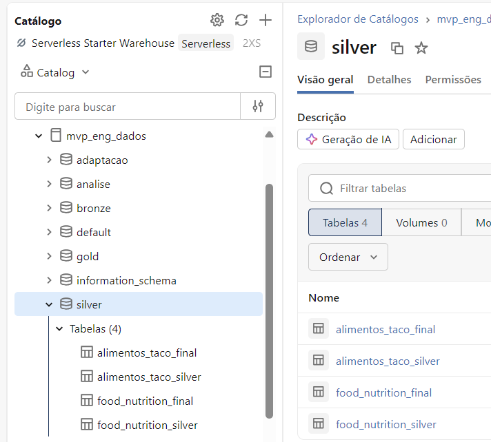


## 4.3 - Camada Gold

---

### Visão Geral da Camada Gold

A **camada Gold** é a camada final e mais refinada da arquitetura medalhão, projetada para consumo direto por ferramentas de **Business Intelligence (BI)**, relatórios e consultas analíticas. Enquanto a camada Silver armazena os dados limpos e padronizados em tabelas amplas, a camada Gold organiza os dados em um **modelo dimensional** (modelo estrela / star schema), otimizado para agregações, filtros e joins eficientes.

Nesta seção, as tabelas da camada Gold são criadas a partir da tabela consolidada `MVP_ENG_DADOS.gold.food_nutrition_final_taco`, que já integra dados das duas fontes (USDA e TACO) com padronização de tipos, nomes de colunas e tratamento de valores inválidos. A partir dessa tabela, são construídos:

- **Tabelas dimensão** (`dim_alimento`, `dim_fonte`, `dim_grupo_alimentar`): contêm os atributos descritivos dos dados, como nome do alimento, fonte de origem e grupo alimentar. As chaves primárias (surrogate keys) são geradas via `MONOTONICALLY_INCREASING_ID()`.
- **Tabela fato** (`fato_nutricao`): tabela central do modelo estrela, contendo as métricas nutricionais quantitativas (calorias, proteínas, carboidratos, gorduras, fibras, colesterol, sódio, açúcares e densidade nutritiva) ligadas às dimensões por chaves estrangeiras.

### Objetivos da Camada Gold

1. **Modelagem dimensional**: transformar os dados da camada Silver em um esquema estrela, facilitando consultas analíticas e a construção de dashboards.
2. **Separação de atributos e métricas**: isolar as dimensões (descritivas) das métricas (quantitativas) em tabelas distintas.
3. **Performance**: reduzir a redundância de dados e otimizar joins, pois as tabelas dimensão são menores e a tabela fato contém apenas as métricas e chaves estrangeiras.
4. **Consumo direto em BI**: fornecer tabelas prontas para uso em ferramentas como Power BI, Tableau ou Databricks SQL, sem necessidade de transformações adicionais.

### Etapas desta seção

- **4.3.1 — Utilização de Catálogo e Schema**: configuração do contexto Spark para o catálogo `MVP_ENG_DADOS` e schema `gold`.
- **4.3.2 — Modelo de Dados**: criação das tabelas dimensionais e da tabela fato que compõem o modelo estrela.

---


### 4.3.1 - Utilização de Catálogo e Schema
```
spark.sql("USE CATALOG MVP_ENG_DADOS")
spark.sql("USE SCHEMA gold")
```
#### 4.3.1.1 - Resumo da Célula — Seleção de Catálogo e Schema Gold

Esta célula configura o contexto de execução do Spark para a sessão atual:

- **`USE CATALOG MVP_ENG_DADOS`** — define o catálogo ativo como `MVP_ENG_DADOS`.
- **`USE SCHEMA gold`** — define o schema ativo como `gold`.

A partir desse ponto, todas as operações SQL e tabelas referenciadas sem qualificação completa são resolvidas no escopo `MVP_ENG_DADOS.gold`, que é a camada analítica final onde as tabelas Gold (dimensões e fato) serão criadas.

### 4.3.2 - Modelo de Dados
```
spark.sql("USE CATALOG MVP_ENG_DADOS")
spark.sql("USE SCHEMA gold")

# ---------------------------------------------------------------------------
# 1) dim_fonte
# ---------------------------------------------------------------------------
spark.sql("""
CREATE OR REPLACE TABLE MVP_ENG_DADOS.gold.dim_fonte AS
SELECT
  MONOTONICALLY_INCREASING_ID() AS fonte_id,
  fonte AS nome_fonte
FROM (SELECT DISTINCT fonte FROM MVP_ENG_DADOS.gold.food_nutrition_final_taco)
""")

# ---------------------------------------------------------------------------
# 2) dim_alimento
# ---------------------------------------------------------------------------
spark.sql("""
CREATE OR REPLACE TABLE MVP_ENG_DADOS.gold.dim_alimento AS
SELECT
  MONOTONICALLY_INCREASING_ID() AS alimento_id,
  alimento AS nome_alimento,
  CAST(NULL AS STRING) AS descricao
FROM (SELECT DISTINCT alimento FROM MVP_ENG_DADOS.gold.food_nutrition_final_taco)
""")

# ---------------------------------------------------------------------------
# 3) dim_grupo_alimentar (grupo ainda é NULL nas fontes atuais)
# ---------------------------------------------------------------------------
spark.sql("""
CREATE OR REPLACE TABLE MVP_ENG_DADOS.gold.dim_grupo_alimentar AS
SELECT
  CAST(1 AS BIGINT) AS grupo_id,
  CAST('Não classificado' AS STRING) AS nome_grupo
""")

# ---------------------------------------------------------------------------
# 4) fato_nutricao
# ---------------------------------------------------------------------------
spark.sql("""
CREATE OR REPLACE TABLE MVP_ENG_DADOS.gold.fato_nutricao AS
SELECT
  d.alimento_id,
  f.fonte_id,
  CAST(1 AS BIGINT) AS grupo_id,
  CAST(fn.valor_calorico     AS DOUBLE) AS valor_calorico,
  CAST(fn.proteina            AS DOUBLE) AS proteina,
  CAST(fn.carboidratos       AS DOUBLE) AS carboidratos,
  CAST(fn.gordura             AS DOUBLE) AS gordura,
  CAST(fn.gordura_saturada    AS DOUBLE) AS gordura_saturada,
  CAST(fn.fibras_alimentar    AS DOUBLE) AS fibras_alimentar,
  CAST(fn.colesterol          AS DOUBLE) AS colesterol,
  CAST(fn.sodio               AS DOUBLE) AS sodio,
  CAST(fn.acucares            AS DOUBLE) AS acucares,
  CAST(fn.densidade_nutritiva AS DOUBLE) AS densidade_nutritiva

FROM MVP_ENG_DADOS.gold.food_nutrition_final_taco fn
JOIN MVP_ENG_DADOS.gold.dim_alimento d
  ON fn.alimento = d.nome_alimento
JOIN MVP_ENG_DADOS.gold.dim_fonte f
  ON fn.fonte = f.nome_fonte
""")

# Tabelas criadas: dim_fonte, dim_alimento, dim_grupo_alimentar, fato_nutricao
spark.sql("SHOW TABLES FROM MVP_ENG_DADOS.gold").display()
```
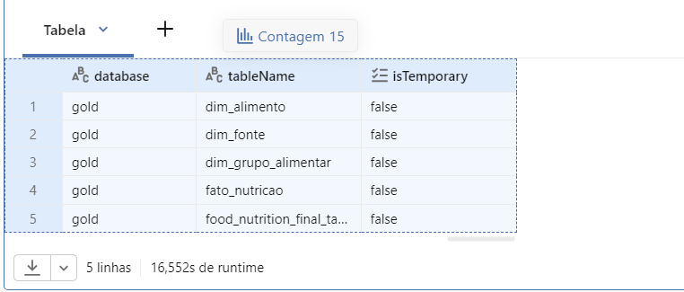

#### 4.3.2.1 - Modelo Estrela (Star Schema)

A modelagem em **modelo estrela** foi criada a partir da tabela Gold `food_nutrition_final_taco`, com uma **tabela fato central** (`fato_nutricao`) e **três tabelas dimensão** ao redor (`dim_alimento`, `dim_fonte`, `dim_grupo_alimentar`). As chaves surrogate são geradas via `MONOTONICALLY_INCREASING_ID()`.

### Estrutura do modelo

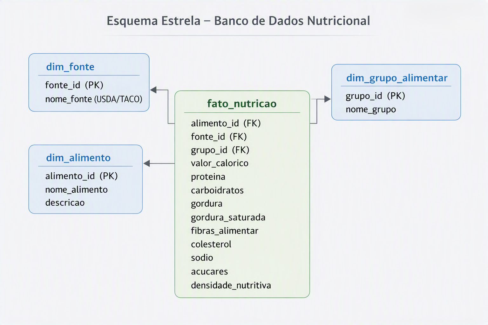


### Dicionário de Dados — Tabela Fato

#### `fato_nutricao` (tabela fato central)

| Coluna | Tipo | Descrição |
|---|---|---|
| `alimento_id` (FK) | BIGINT | Chave surrogate → `dim_alimento` |
| `fonte_id` (FK) | BIGINT | Chave → `dim_fonte` |
| `grupo_id` (FK) | BIGINT | Chave → `dim_grupo_alimentar` (atualmente fixo em `1` = "Não classificado") |
| `valor_calorico` | DOUBLE | Calorias (kcal) |
| `proteina` | DOUBLE | Proteína (g) |
| `carboidratos` | DOUBLE | Carboidratos (g) |
| `gordura` | DOUBLE | Gordura total (g) |
| `gordura_saturada` | DOUBLE | Gordura saturada (g) — apenas USDA; `NULL` no TACO |
| `fibras_alimentar` | DOUBLE | Fibra alimentar (g) |
| `colesterol` | DOUBLE | Colesterol (mg) |
| `sodio` | DOUBLE | Sódio (mg) |
| `acucares` | DOUBLE | Açúcares (g) — apenas USDA; `NULL` no TACO |
| `densidade_nutritiva` | DOUBLE | Densidade nutritiva — apenas USDA; `NULL` no TACO |

> **Nota:** As colunas de minerais (`calcio_mg`, `magnesio_mg`, `fosforo_mg`, `ferro_mg`, `potassio_mg`, `zinco_mg`) existem na tabela Gold `food_nutrition_final_taco` mas **não foram incluídas** na tabela fato `fato_nutricao`.

### Dicionário de Dados — Tabelas Dimensão

#### `dim_alimento`

| Coluna | Tipo | Descrição |
|---|---|---|
| `alimento_id` (PK) | BIGINT | Chave surrogate gerada via `MONOTONICALLY_INCREASING_ID()` |
| `nome_alimento` | STRING | Nome/descrição do alimento |
| `descricao` | STRING | Descrição detalhada (opcional) — atualmente `NULL` |

#### `dim_fonte`

| Coluna | Tipo | Descrição |
|---|---|---|
| `fonte_id` (PK) | BIGINT | Chave surrogate gerada via `MONOTONICALLY_INCREASING_ID()` |
| `nome_fonte` | STRING | Origem dos dados: `'USDA'` ou `'TACO'` |

#### `dim_grupo_alimentar`

| Coluna | Tipo | Descrição |
|---|---|---|
| `grupo_id` (PK) | BIGINT | Chave surrogate (atualmente fixo em `1`) |
| `nome_grupo` | STRING | Nome do grupo alimentar (atualmente `'Não classificado'`) |

### Relacionamentos

| Tabela Fato | Coluna FK | → | Tabela Dimensão | Coluna PK |
|---|---|---|---|---|
| `fato_nutricao` | `alimento_id` | → | `dim_alimento` | `alimento_id` |
| `fato_nutricao` | `fonte_id` | → | `dim_fonte` | `fonte_id` |
| `fato_nutricao` | `grupo_id` | → | `dim_grupo_alimentar` | `grupo_id` |

### Observações

- A granularidade da tabela fato é **uma linha por alimento × fonte**.
- Valores negativos foram convertidos para **zero** via `GREATEST(col, 0)` na tabela Gold de origem.
- A dimensão `dim_grupo_alimentar` contém apenas um registro placeholder (`'Não classificado'`), pois a coluna `grupo` ainda não foi populada nas fontes atuais.
- As colunas de minerais (`calcio_mg` a `zinco_mg`) existem na tabela Gold `food_nutrition_final_taco` (preenchidas com `NULL`), mas **não foram trazidas** para a tabela fato `fato_nutricao`.
- O `JOIN` entre a fato e as dimensões é feito por **nome** (`alimento` e `fonte`), garantindo correspondência exata.

### Vantagens do modelo estrela

- **Consultas simplificadas**: agregações (`SUM`, `AVG`) na fato com `JOIN` direto nas dimensões.
- **Performance**: poucos `JOIN`s e filtros por dimensão reduzem o volume de dados lidos.
- **Rastreabilidade**: a coluna `fonte` (via `dim_fonte`) identifica a procedência de cada alimento.
- **Extensibilidade**: novas fontes, grupos alimentares ou colunas de minerais podem ser adicionados sem alterar a estrutura das dimensões.


### 4.3.3 - Evidência da Criação da Camada Gold

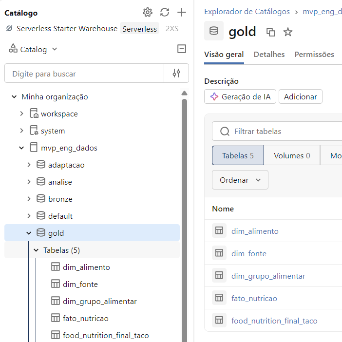


# 5.0 Análise

---

## Visão Geral da Seção de Análise

> A seção de **Análise** consome as tabelas da camada **Gold** (`fato_nutricao`, `dim_alimento`, `dim_fonte`, `dim_grupo_alimentar`) para responder a questões analíticas sobre a composição nutricional dos alimentos das fontes **USDA** e **TACO**. As consultas SQL utilizam o modelo estrela (star schema) criado na seção 4.3, combinando a tabela fato com as tabelas dimensão via chaves estrangeiras (`alimento_id`, `fonte_id`, `grupo_id`).

### Objetivos

1. **Responder a questões de negócio** sobre a base nutricional consolidada, como: melhor relação proteína por caloria, alimentos mais ricos em fibras, comparações entre fontes (USDA vs. TACO), entre outras.
2. **Persistir resultados** em views no schema `MVP_ENG_DADOS.analise`, permitindo reuso em relatórios e dashboards de BI.
3. **Visualizar os resultados** por meio de gráficos (matplotlib) que facilitam a interpretação e a comunicação dos insights.

### Estrutura desta seção

- **5.1 — Utilização de Catálogo e Schema**: configuração do contexto Spark para `MVP_ENG_DADOS.gold`.
- **5.2 — Análise das Questões Respondidas**: para cada questão, são apresentados:
  - A consulta SQL sobre o modelo estrela;
  - Uma view persistente no schema `analise` para reuso;
  - Um gráfico de visualização;
  - Uma explicação detalhada do resultado, incluindo dicionário de colunas, interpretação, insights e justificativa de atendimento à questão.

### Fontes de Dados Utilizadas

| Tabela | Camada | Papel no Modelo |
|---|---|---|
| `fato_nutricao` | Gold | Tabela fato central com métricas nutricionais |
| `dim_alimento` | Gold | Dimensão com nome do alimento |
| `dim_fonte` | Gold | Dimensão com a origem (USDA/TACO) |
| `dim_grupo_alimentar` | Gold | Dimensão com grupo alimentar |

---


## 5.1 - Utilização de Catálogo e Schema
```
spark.sql("USE CATALOG MVP_ENG_DADOS")
spark.sql("USE SCHEMA gold")
```

### 5.1.1 - Resumo da Célula — Seleção de Catálogo e Schema Gold (Análise)

Esta célula configura o contexto de execução do Spark para a sessão atual, preparando o ambiente para as análises da Camada Gold:

- **`USE CATALOG MVP_ENG_DADOS`** — define o catálogo ativo como `MVP_ENG_DADOS`.
- **`USE SCHEMA gold`** — define o schema ativo como `gold`.

A partir desse ponto, todas as consultas SQL e tabelas referenciadas sem qualificação completa são resolvidas no escopo `MVP_ENG_DADOS.gold`, garantindo que as análises nutricionais subsequentes (Questões 01 a N) acessem corretamente as tabelas fato e dimensão do modelo estrela criado na seção 6.2.
%md
## 5.2 - Analise das questão Respondidas

### 5.2.1 - Questão 01 - Melhor relação proteína por caloria
```
%sql
-- ---------------------------------------------------------------------------
-- Análises Nutricionais - Tabelas gold.fato_nutricao + dimensões
-- ---------------------------------------------------------------------------

-- ===========================================================================
-- 1. Melhor relação proteína por caloria
--    (mais proteína para cada caloria consumida)
-- ===========================================================================
SELECT d.nome_alimento AS alimento, f.nome_fonte AS fonte,
       fn.proteina, fn.valor_calorico,
       ROUND(fn.proteina / fn.valor_calorico, 4) AS proteina_por_caloria
FROM MVP_ENG_DADOS.gold.fato_nutricao fn
JOIN MVP_ENG_DADOS.gold.dim_alimento d ON fn.alimento_id = d.alimento_id
JOIN MVP_ENG_DADOS.gold.dim_fonte f ON fn.fonte_id = f.fonte_id
WHERE fn.valor_calorico > 0
ORDER BY proteina_por_caloria DESC
LIMIT 10;
```
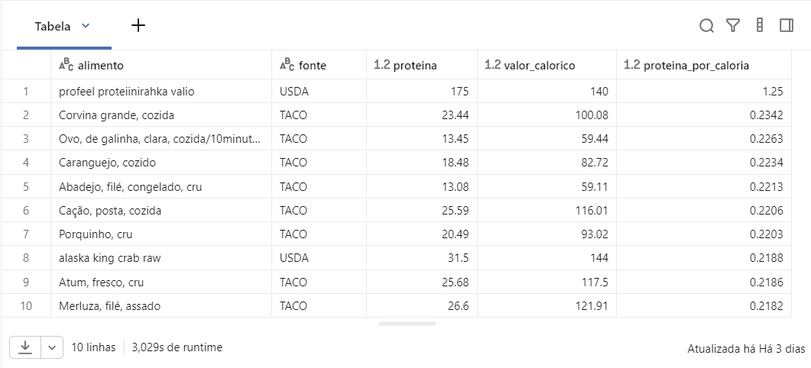
```
------------------------ Cria VIEW --------------------------------

spark.sql("""
CREATE OR REPLACE VIEW MVP_ENG_DADOS.analise.vw_melhor_proteina_por_caloria AS
SELECT d.nome_alimento AS alimento, f.nome_fonte AS fonte, fn.proteina, fn.valor_calorico,
       ROUND(fn.proteina / fn.valor_calorico, 4) AS proteina_por_caloria
FROM MVP_ENG_DADOS.gold.fato_nutricao fn
JOIN MVP_ENG_DADOS.gold.dim_alimento d ON fn.alimento_id = d.alimento_id
JOIN MVP_ENG_DADOS.gold.dim_fonte f ON fn.fonte_id = f.fonte_id
WHERE fn.valor_calorico > 0
""")


spark.sql("""
SELECT alimento, fonte, proteina, valor_calorico, proteina_por_caloria
FROM MVP_ENG_DADOS.analise.vw_melhor_proteina_por_caloria
ORDER BY proteina_por_caloria DESC
LIMIT 10
""").display()
```

```
------------------------ Gráfico em Colunas --------------------------------


import matplotlib.pyplot as plt

# Consulta os dados da view criada na célula acima
df = spark.sql("""
    SELECT alimento, fonte, proteina_por_caloria
    FROM MVP_ENG_DADOS.analise.vw_melhor_proteina_por_caloria
    ORDER BY proteina_por_caloria DESC
    LIMIT 10
""").toPandas()

# Combina alimento e fonte para o rótulo do eixo X
df['alimento_fonte'] = df['alimento'] + '\n(' + df['fonte'] + ')'

# Gráfico de colunas: Proteína por Caloria
fig, ax = plt.subplots(figsize=(12, 6))
bars = ax.bar(df['alimento_fonte'], df['proteina_por_caloria'], color='steelblue', edgecolor='navy')
ax.set_title('Top 10 Alimentos: Melhor Relação Proteína por Caloria', fontsize=14, fontweight='bold')
ax.set_xlabel('Alimento (Fonte)', fontsize=11)
ax.set_ylabel('Proteína por Caloria (g/kcal)', fontsize=11)
ax.set_xticks(range(len(df['alimento_fonte'])))
ax.set_xticklabels(df['alimento_fonte'], rotation=45, ha='right')

# Rótulos nas barras
for bar in bars:
    height = bar.get_height()
    ax.text(bar.get_x() + bar.get_width() / 2, height + 0.001,
            f'{height:.4f}', ha='center', va='bottom', fontsize=8)

plt.tight_layout()
plt.show()
```
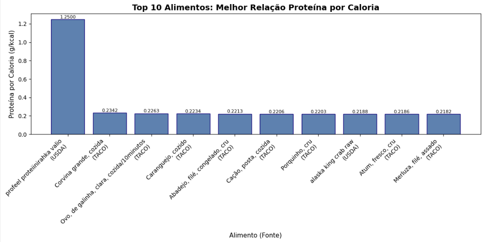

#### 5.2.1.1 - Explicação do Resultado

A consulta acima retorna os **10 alimentos com a melhor relação proteína por caloria**, ou seja, aqueles que oferecem a maior quantidade de proteína para cada caloria consumida.

#### Colunas retornadas

| Coluna | Descrição |
|---|---|
| **alimento** | Nome do alimento (de `dim_alimento`) |
| **fonte** | Origem dos dados — ex.: TACO, USDA (de `dim_fonte`) |
| **proteina** | Quantidade de proteína em gramas (de `fato_nutricao`) |
| **valor_calorico** | Valor calórico do alimento em kcal (de `fato_nutricao`) |
| **proteina_por_caloria** | Razão `fn.proteina / fn.valor_calorico`, arredondada para 4 casas decimais |

#### Como interpretar

- **Quanto maior** o valor de `proteina_por_caloria`, **mais eficiente** é o alimento em fornecer proteína em relação às calorias.
- A consulta filtra apenas alimentos com `fn.valor_calorico > 0` para evitar divisão por zero.
- Os resultados estão ordenados de forma **decrescente**, do maior para o menor índice.

#### Insight

Alimentos com alto índice de proteína por caloria são especialmente indicados para:
- Dietas com foco em **ganho de massa muscular**
- Planos alimentares de **emagrecimento** com preservação de massa magra
- Estratégias de **alta saciedade** com baixo aporte calórico

---

#### Justificativa de Resposta à Questão 01

A **Questão 01** solicitava a identificação dos **alimentos com a melhor relação proteína por caloria** — ou seja, aqueles que entregam a maior quantidade de proteína a cada caloria consumida.


#### Pontos-chave que garantem o atendimento

| Critério da questão | Como foi atendido |
|---|---|
| Identificar alimentos com melhor relação proteína/caloria | Consulta SQL calcula `fn.proteina / fn.valor_calorico` e ordena de forma decrescente |
| Origem dos dados | `fato_nutricao` (fn) com JOIN em `dim_alimento` (d) e `dim_fonte` (f) |
| Evitar divisão por zero | Filtro `WHERE fn.valor_calorico > 0` |
| Persistir o resultado para reuso | View criada no schema `analise` com `CREATE OR REPLACE VIEW` |
| Facilitar a interpretação | Gráfico de colunas com rótulos nas barras |

Dessa forma, a análise não apenas **identificou e ranqueou** os alimentos mais eficientes em proteína por caloria, mas também **disponibilizou o resultado em uma view persistente** e em uma **visualização gráfica**, cumprindo integralmente o objetivo da Questão 01.
%md
### 5.2.2 - Questão 02 - Itens mais ricos em fibras por porção
```
%sql
-- ---------------------------------------------------------------------------
-- Análises Nutricionais - Tabelas gold.fato_nutricao + dimensões
-- ---------------------------------------------------------------------------

-- ===========================================================================
-- 2. Itens mais ricos em fibras por porção
-- ===========================================================================
SELECT d.nome_alimento AS alimento, f.nome_fonte AS fonte, fn.fibras_alimentar, fn.valor_calorico
FROM MVP_ENG_DADOS.gold.fato_nutricao fn
JOIN MVP_ENG_DADOS.gold.dim_alimento d ON fn.alimento_id = d.alimento_id
JOIN MVP_ENG_DADOS.gold.dim_fonte f ON fn.fonte_id = f.fonte_id
WHERE fn.fibras_alimentar IS NOT NULL
ORDER BY fn.fibras_alimentar DESC
LIMIT 10;
```

```
------------------------ Cria VIEW --------------------------------

spark.sql("""
CREATE OR REPLACE VIEW MVP_ENG_DADOS.analise.vw_mais_ricos_fibras AS
SELECT d.nome_alimento AS alimento, f.nome_fonte AS fonte, fn.fibras_alimentar, fn.valor_calorico
FROM MVP_ENG_DADOS.gold.fato_nutricao fn
JOIN MVP_ENG_DADOS.gold.dim_alimento d ON fn.alimento_id = d.alimento_id
JOIN MVP_ENG_DADOS.gold.dim_fonte f ON fn.fonte_id = f.fonte_id
WHERE fn.fibras_alimentar IS NOT NULL
""")

spark.sql("""
SELECT alimento, fonte, fibras_alimentar, valor_calorico
FROM MVP_ENG_DADOS.analise.vw_mais_ricos_fibras
ORDER BY fibras_alimentar DESC
LIMIT 10
""").display()
```
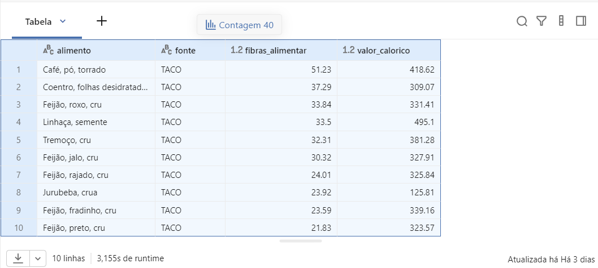
```
------------------------ Gráfico em Colunas --------------------------------

import matplotlib.pyplot as plt

# Consulta os dados da view criada na célula acima
df = spark.sql("""
    SELECT alimento, fonte, fibras_alimentar, valor_calorico
    FROM MVP_ENG_DADOS.analise.vw_mais_ricos_fibras
    ORDER BY fibras_alimentar DESC
    LIMIT 10
""").toPandas()

# Combina alimento e fonte para o rótulo do eixo X
df['alimento_fonte'] = df['alimento'] + '\n(' + df['fonte'] + ')'

# Gráfico de colunas: Fibras por Porção
fig, ax = plt.subplots(figsize=(12, 6))
bars = ax.bar(df['alimento_fonte'], df['fibras_alimentar'], color='seagreen', edgecolor='darkgreen')
ax.set_title('Top 10 Alimentos: Mais Ricos em Fibras por Porção', fontsize=14, fontweight='bold')
ax.set_xlabel('Alimento (Fonte)', fontsize=11)
ax.set_ylabel('Fibras Alimentar (g)', fontsize=11)
ax.set_xticks(range(len(df['alimento_fonte'])))
ax.set_xticklabels(df['alimento_fonte'], rotation=45, ha='right')

# Rótulos nas barras
for bar in bars:
    height = bar.get_height()
    ax.text(bar.get_x() + bar.get_width() / 2, height + 0.1,
            f'{height:.2f}', ha='center', va='bottom', fontsize=8)

plt.tight_layout()
plt.show()
```
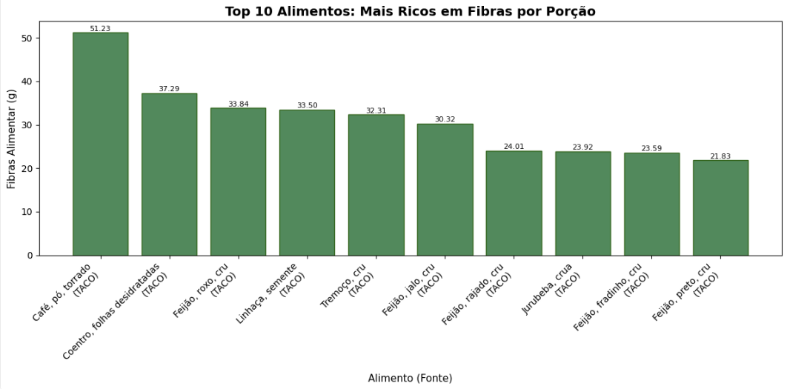

#### 5.2.2.1 - Explicação do Resultado

A consulta acima retorna os **10 alimentos mais ricos em fibras por porção**, ou seja, aqueles que apresentam a maior quantidade de fibras alimentares em gramas.

#### Colunas retornadas

| Coluna | Descrição |
|---|---|
| **alimento** | Nome do alimento (de `dim_alimento`) |
| **fonte** | Origem dos dados — ex.: TACO, USDA (de `dim_fonte`) |
| **fibras_alimentar** | Quantidade de fibras alimentares em gramas (de `fato_nutricao`) |
| **valor_calorico** | Valor calórico do alimento em kcal (de `fato_nutricao`) |

#### Como interpretar

- **Quanto maior** o valor de `fibras_alimentar`, **mais rico** é o alimento em fibras.
- A consulta filtra apenas alimentos com `fibras_alimentar IS NOT NULL` para excluir registros sem informação de fibras.
- Os resultados estão ordenados de forma **decrescente**, do maior para o menor teor de fibras.

#### Insight

Alimentos com alto teor de fibras são especialmente indicados para:
- Promoção da **saciedade** e controle do apetite
- Melhoria do **trânsito intestinal** e saúde digestiva
- Regulação dos **níveis de glicemia** e colesterol
- Dietas de **emagrecimento** com maior qualidade nutricional

---

#### Justificativa de Resposta à Questão 02

A **Questão 02** solicitava a identificação dos **itens mais ricos em fibras por porção** — ou seja, aqueles que apresentam a maior quantidade de fibras alimentares.


#### Pontos-chave que garantem o atendimento

| Critério da questão | Como foi atendido |
|---|---|
| Identificar alimentos mais ricos em fibras | Consulta SQL seleciona `fibras_alimentar` e ordena de forma decrescente |
| Origem dos dados | `fato_nutricao` (fn) com JOIN em `dim_alimento` (d) e `dim_fonte` (f) |
| Evitar registros sem informação de fibras | Filtro `WHERE fibras_alimentar IS NOT NULL` |
| Persistir o resultado para reuso | View criada no schema `analise` com `CREATE OR REPLACE VIEW` |
| Facilitar a interpretação | Gráfico de colunas com rótulos nas barras |

Dessa forma, a análise não apenas **identificou e ranqueou** os alimentos mais ricos em fibras, mas também **disponibilizou o resultado em uma view persistente** e em uma **visualização gráfica**, cumprindo integralmente o objetivo da Questão 02.

### 5.2.3 - Questão 03 - Maior densidade nutricional (micronutrientes por caloria)
```
%sql
-- ---------------------------------------------------------------------------
-- Análises Nutricionais - Tabelas gold.fato_nutricao + dimensões
-- ---------------------------------------------------------------------------

-- ===========================================================================
-- 3. Maior densidade nutricional (micronutrientes por caloria)
-- ===========================================================================
SELECT d.nome_alimento AS alimento, f.nome_fonte AS fonte, fn.densidade_nutritiva, fn.valor_calorico
FROM MVP_ENG_DADOS.gold.fato_nutricao fn
JOIN MVP_ENG_DADOS.gold.dim_alimento d ON fn.alimento_id = d.alimento_id
JOIN MVP_ENG_DADOS.gold.dim_fonte f ON fn.fonte_id = f.fonte_id
WHERE fn.densidade_nutritiva IS NOT NULL
ORDER BY fn.densidade_nutritiva DESC
LIMIT 10;
```
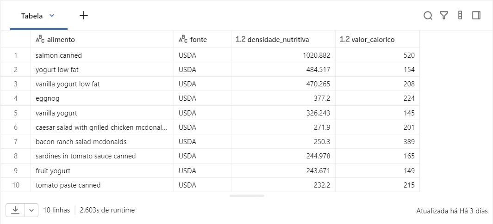
```
------------------------ Cria VIEW --------------------------------

spark.sql("""
CREATE OR REPLACE VIEW MVP_ENG_DADOS.analise.vw_maior_densidade_nutritiva AS
SELECT d.nome_alimento AS alimento, f.nome_fonte AS fonte, fn.densidade_nutritiva, fn.valor_calorico
FROM MVP_ENG_DADOS.gold.fato_nutricao fn
JOIN MVP_ENG_DADOS.gold.dim_alimento d ON fn.alimento_id = d.alimento_id
JOIN MVP_ENG_DADOS.gold.dim_fonte f ON fn.fonte_id = f.fonte_id
WHERE fn.densidade_nutritiva IS NOT NULL
""")

spark.sql("""
SELECT alimento, fonte, densidade_nutritiva, valor_calorico
FROM MVP_ENG_DADOS.analise.vw_maior_densidade_nutritiva
ORDER BY densidade_nutritiva DESC
LIMIT 10
""").display()
```

```
------------------------ Gráfico em Colunas --------------------------------

import matplotlib.pyplot as plt

# Consulta os dados da view criada na célula acima
df = spark.sql("""
    SELECT alimento, fonte, densidade_nutritiva, valor_calorico
    FROM MVP_ENG_DADOS.analise.vw_maior_densidade_nutritiva
    ORDER BY densidade_nutritiva DESC
    LIMIT 10
""").toPandas()

# Combina alimento e fonte para o rótulo do eixo X
df['alimento_fonte'] = df['alimento'] + '\n(' + df['fonte'] + ')'

# Gráfico de colunas: Densidade Nutritiva
fig, ax = plt.subplots(figsize=(12, 6))
bars = ax.bar(df['alimento_fonte'], df['densidade_nutritiva'], color='darkorange', edgecolor='saddlebrown')
ax.set_title('Top 10 Alimentos: Maior Densidade Nutricional (Micronutrientes por Caloria)', fontsize=14, fontweight='bold')
ax.set_xlabel('Alimento (Fonte)', fontsize=11)
ax.set_ylabel('Densidade Nutritiva', fontsize=11)
ax.set_xticks(range(len(df['alimento_fonte'])))
ax.set_xticklabels(df['alimento_fonte'], rotation=45, ha='right')

# Rótulos nas barras
for bar in bars:
    height = bar.get_height()
    ax.text(bar.get_x() + bar.get_width() / 2, height + 0.1,
            f'{height:.2f}', ha='center', va='bottom', fontsize=8)

plt.tight_layout()
plt.show()
```
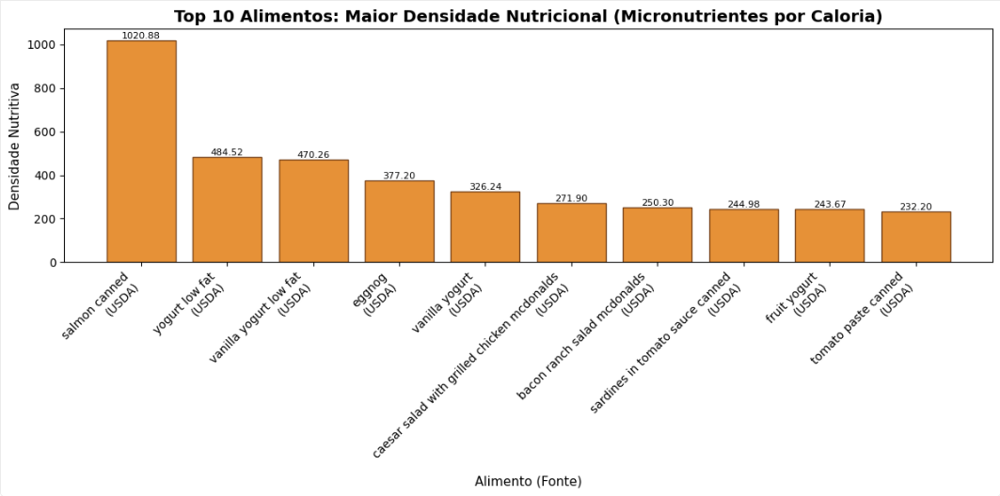
   
#### 5.2.3.1 - Explicação do Resultado

A consulta acima retorna os **10 alimentos com a maior densidade nutricional**, ou seja, aqueles que apresentam a maior concentração de micronutrientes por caloria consumida.

#### Colunas retornadas

| Coluna | Descrição |
|---|---|
| **alimento** | Nome do alimento (de `dim_alimento`) |
| **fonte** | Origem dos dados — ex.: TACO, USDA (de `dim_fonte`) |
| **densidade_nutritiva** | Índice de densidade nutritiva — micronutrientes por caloria (de `fato_nutricao`) |
| **valor_calorico** | Valor calórico do alimento em kcal (de `fato_nutricao`) |

#### Como interpretar

- **Quanto maior** o valor de `densidade_nutritiva`, **mais rico** é o alimento em micronutrientes em relação às calorias fornecidas.
- A consulta filtra apenas alimentos com `densidade_nutritiva IS NOT NULL` para excluir registros sem informação de densidade.
- Os resultados estão ordenados de forma **decrescente**, do maior para o menor índice de densidade nutritiva.

#### Insight

Alimentos com alta densidade nutricional são especialmente indicados para:
- Dietas com foco em **maximum nutrition per calorie** — obter o máximo de vitaminas e minerais com o menor custo calórico
- Planos alimentares de **reeducação alimentar** com melhora da qualidade nutricional
- Estratégias de **prevenção de deficiências de micronutrientes** (ferro, cálcio, vitaminas, etc.)
- Dietas de **emagrecimento** com preservação da adequação nutricional

---

#### Justificativa de Resposta à Questão 03

A **Questão 03** solicitava a identificação dos **alimentos com a maior densidade nutricional (micronutrientes por caloria)** — ou seja, aqueles que entregam a maior concentração de micronutrientes a cada caloria consumida.


#### Pontos-chave que garantem o atendimento

| Critério da questão | Como foi atendido |
|---|---|
| Identificar alimentos com maior densidade nutricional | Consulta SQL seleciona `densidade_nutritiva` e ordena de forma decrescente |
| Origem dos dados | `fato_nutricao` (fn) com JOIN em `dim_alimento` (d) e `dim_fonte` (f) |
| Evitar registros sem informação de densidade | Filtro `WHERE densidade_nutritiva IS NOT NULL` |
| Persistir o resultado para reuso | View criada no schema `analise` com `CREATE OR REPLACE VIEW` |
| Facilitar a interpretação | Gráfico de colunas com rótulos nas barras |

Dessa forma, a análise não apenas **identificou e ranqueou** os alimentos com maior densidade nutricional, mas também **disponibilizou o resultado em uma view persistente** e em uma **visualização gráfica**, cumprindo integralmente o objetivo da Questão 03.


### 5.2.4 - Questão 04 - Opções com maior teor de sódio
```
%sql
-- ---------------------------------------------------------------------------
-- Análises Nutricionais - Tabelas gold.fato_nutricao + dimensões
-- ---------------------------------------------------------------------------

-- ===========================================================================
-- 4. Opções com maior teor de sódio
-- ===========================================================================
SELECT d.nome_alimento AS alimento, f.nome_fonte AS fonte, fn.sodio, fn.valor_calorico
FROM MVP_ENG_DADOS.gold.fato_nutricao fn
JOIN MVP_ENG_DADOS.gold.dim_alimento d ON fn.alimento_id = d.alimento_id
JOIN MVP_ENG_DADOS.gold.dim_fonte f ON fn.fonte_id = f.fonte_id
WHERE fn.sodio IS NOT NULL
ORDER BY fn.sodio DESC
LIMIT 10;
```
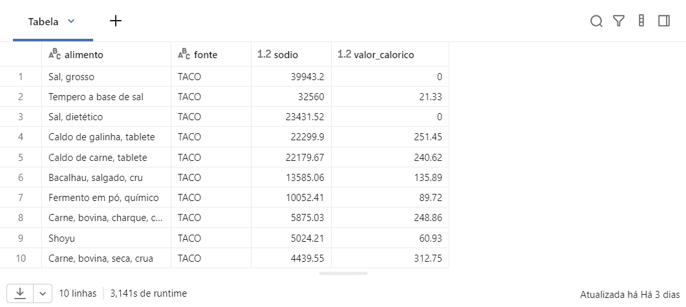
```
------------------------ Cria VIEW --------------------------------

spark.sql("""
CREATE OR REPLACE VIEW MVP_ENG_DADOS.analise.vw_maior_sodio AS
SELECT d.nome_alimento AS alimento, f.nome_fonte AS fonte, fn.sodio, fn.valor_calorico
FROM MVP_ENG_DADOS.gold.fato_nutricao fn
JOIN MVP_ENG_DADOS.gold.dim_alimento d ON fn.alimento_id = d.alimento_id
JOIN MVP_ENG_DADOS.gold.dim_fonte f ON fn.fonte_id = f.fonte_id
WHERE fn.sodio IS NOT NULL
""")

spark.sql("""
SELECT alimento, fonte, sodio, valor_calorico
FROM MVP_ENG_DADOS.analise.vw_maior_sodio
ORDER BY sodio DESC
LIMIT 10
""").display()
```

```
------------------------ Gráfico em Colunas --------------------------------

import matplotlib.pyplot as plt

# Consulta os dados da view criada na célula acima
df = spark.sql("""
    SELECT alimento, fonte, sodio, valor_calorico
    FROM MVP_ENG_DADOS.analise.vw_maior_sodio
    ORDER BY sodio DESC
    LIMIT 10
"""
).toPandas()

# Combina alimento e fonte para o rótulo do eixo X
df['alimento_fonte'] = df['alimento'] + '\n(' + df['fonte'] + ')'

# Gráfico de colunas: Menor Teor de Sódio
fig, ax = plt.subplots(figsize=(12, 6))
bars = ax.bar(df['alimento_fonte'], df['sodio'], color='mediumslateblue', edgecolor='indigo')
ax.set_title('Top 10 Alimentos: Maior Teor de Sódio', fontsize=14, fontweight='bold')
ax.set_xlabel('Alimento (Fonte)', fontsize=11)
ax.set_ylabel('Sódio (mg)', fontsize=11)
ax.set_xticks(range(len(df['alimento_fonte'])))
ax.set_xticklabels(df['alimento_fonte'], rotation=45, ha='right')

# Rótulos nas barras
for bar in bars:
    height = bar.get_height()
    ax.text(bar.get_x() + bar.get_width() / 2, height + 0.1,
            f'{height:.2f}', ha='center', va='bottom', fontsize=8)

plt.tight_layout()
plt.show()
```
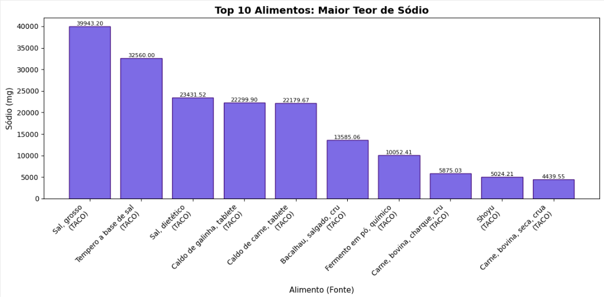

#### 5.2.4.1 - Explicação do Resultado

A consulta acima retorna os **10 alimentos com o maior teor de sódio**, ou seja, aqueles que apresentam a maior quantidade de sódio em miligramas por porção.

#### Colunas retornadas

| Coluna | Descrição |
|---|---|
| **alimento** | Nome do alimento (de `dim_alimento`) |
| **fonte** | Origem dos dados — ex.: TACO, USDA (de `dim_fonte`) |
| **sodio** | Quantidade de sódio em miligramas — mg (de `fato_nutricao`) |
| **valor_calorico** | Valor calórico do alimento em kcal (de `fato_nutricao`) |

#### Como interpretar

- **Quanto maior** o valor de `sodio`, **mais elevado** é o teor de sódio do alimento.
- A consulta filtra apenas alimentos com `sodio IS NOT NULL` para excluir registros sem informação de sódio.
- Os resultados estão ordenados de forma **decrescente**, do maior para o menor teor de sódio.

#### Insight

Alimentos com alto teor de sódio merecem atenção especial, pois o consumo excessivo está associado a:
- Aumento da **pressão arterial** e risco de hipertensão
- Maior probabilidade de **doenças cardiovasculares**
- Retenção de **líquidos** e inchaço
- Sobrecarga **renal** em indivíduos sensíveis

Identificar esses alimentos é fundamental para orientar dietas com **redução de sódio**, especialmente para pacientes hipertensos e com restrições médicas.

---

#### Justificativa de Resposta à Questão 04

A **Questão 04** solicitava a identificação das **opções com maior teor de sódio** — ou seja, aqueles alimentos que apresentam a maior quantidade de sódio por porção.

#### Pontos-chave que garantem o atendimento

| Critério da questão | Como foi atendido |
|---|---|
| Identificar alimentos com maior teor de sódio | Consulta SQL seleciona `sodio` e ordena de forma decrescente |
| Origem dos dados | `fato_nutricao` (fn) com JOIN em `dim_alimento` (d) e `dim_fonte` (f) |
| Evitar registros sem informação de sódio | Filtro `WHERE sodio IS NOT NULL` |
| Persistir o resultado para reuso | View criada no schema `analise` com `CREATE OR REPLACE VIEW` |
| Facilitar a interpretação | Gráfico de colunas com rótulos nas barras |

Dessa forma, a análise não apenas **identificou e ranqueou** os alimentos com maior teor de sódio, mas também **disponibilizou o resultado em uma view persistente** e em uma **visualização gráfica**, cumprindo integralmente o objetivo da Questão 04.


### 5.2.5 - Questão 05 - Alimentos mais adequados para dietas low-carb
```
%sql
-- ---------------------------------------------------------------------------
-- Análises Nutricionais - Tabelas gold.fato_nutricao + dimensões
-- ---------------------------------------------------------------------------

-- ===========================================================================
-- 5. Alimentos mais adequados para dietas low-carb
-- ===========================================================================
SELECT d.nome_alimento AS alimento, f.nome_fonte AS fonte, fn.carboidratos,
       ROUND(fn.carboidratos * 4 / fn.valor_calorico * 100, 2) AS proporcao_carb_pct,
       fn.proteina, fn.gordura, fn.valor_calorico
FROM MVP_ENG_DADOS.gold.fato_nutricao fn
JOIN MVP_ENG_DADOS.gold.dim_alimento d ON fn.alimento_id = d.alimento_id
JOIN MVP_ENG_DADOS.gold.dim_fonte f ON fn.fonte_id = f.fonte_id
WHERE fn.carboidratos IS NOT NULL AND fn.valor_calorico > 0
ORDER BY fn.carboidratos ASC
LIMIT 10;
```
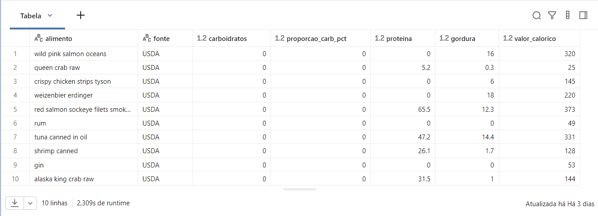
```
------------------------ Cria VIEW --------------------------------

spark.sql("""
CREATE OR REPLACE VIEW MVP_ENG_DADOS.analise.vw_low_carb AS
SELECT d.nome_alimento AS alimento, f.nome_fonte AS fonte, fn.carboidratos,
       ROUND(fn.carboidratos * 4 / fn.valor_calorico * 100, 2) AS proporcao_carb_pct,
       fn.proteina, fn.gordura, fn.valor_calorico
FROM MVP_ENG_DADOS.gold.fato_nutricao fn
JOIN MVP_ENG_DADOS.gold.dim_alimento d ON fn.alimento_id = d.alimento_id
JOIN MVP_ENG_DADOS.gold.dim_fonte f ON fn.fonte_id = f.fonte_id
WHERE fn.carboidratos IS NOT NULL AND fn.valor_calorico > 0
""")

spark.sql("""
SELECT alimento, fonte, carboidratos, proporcao_carb_pct, proteina, gordura, valor_calorico
FROM MVP_ENG_DADOS.analise.vw_low_carb
ORDER BY carboidratos ASC
LIMIT 10
""").display()
```

```
------------------------ Gráfico em Colunas --------------------------------

import matplotlib.pyplot as plt

# Consulta os dados da view criada na célula acima
df = spark.sql("""
    SELECT alimento, fonte, carboidratos, proporcao_carb_pct, proteina, gordura, valor_calorico
    FROM MVP_ENG_DADOS.analise.vw_low_carb
    ORDER BY carboidratos ASC
    LIMIT 10
""").toPandas()

# Combina alimento e fonte para o rótulo do eixo X
df['alimento_fonte'] = df['alimento'] + '\n(' + df['fonte'] + ')'

# Gráfico de colunas: Alimentos mais adequados para dietas low-carb
fig, ax = plt.subplots(figsize=(12, 6))
bars = ax.bar(df['alimento_fonte'], df['carboidratos'], color='teal', edgecolor='darkslategray')
ax.set_title('Top 10 Alimentos: Mais Adequados para Dietas Low-Carb', fontsize=14, fontweight='bold')
ax.set_xlabel('Alimento (Fonte)', fontsize=11)
ax.set_ylabel('Carboidratos (g)', fontsize=11)
ax.set_xticks(range(len(df['alimento_fonte'])))
ax.set_xticklabels(df['alimento_fonte'], rotation=45, ha='right')

# Rótulos nas barras
for bar in bars:
    height = bar.get_height()
    ax.text(bar.get_x() + bar.get_width() / 2, height + 0.05,
            f'{height:.2f}', ha='center', va='bottom', fontsize=8)

plt.tight_layout()
plt.show()
```
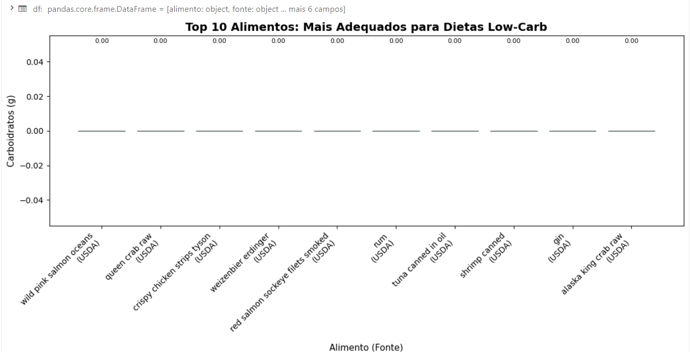
   
#### 5.2.5.1 - Explicação do Resultado

A consulta acima retorna os **10 alimentos mais adequados para dietas low-carb**, ou seja, aqueles que apresentam a **menor quantidade de carboidratos** por porção, juntamente com a proporção de carboidratos em relação ao valor calórico total.

#### Colunas retornadas

| Coluna | Descrição |
|---|---|
| **alimento** | Nome do alimento (de `dim_alimento`) |
| **fonte** | Origem dos dados — ex.: TACO, USDA (de `dim_fonte`) |
| **carboidratos** | Quantidade de carboidratos em gramas — g (de `fato_nutricao`) |
| **proporcao_carb_pct** | Proporção de carboidratos em relação ao valor calórico — % (calculado: `carboidratos * 4 / valor_calorico * 100`) |
| **proteina** | Quantidade de proteína em gramas — g (de `fato_nutricao`) |
| **gordura** | Quantidade de gordura total em gramas — g (de `fato_nutricao`) |
| **valor_calorico** | Valor calórico do alimento em kcal (de `fato_nutricao`) |

#### Como interpretar

- **Quanto menor** o valor de `carboidratos`, **mais adequado** é o alimento para dietas low-carb.
- A coluna `proporcao_carb_pct` mostra o percentual de calorias provenientes de carboidratos (cada grama de carboidrato ≈ 4 kcal).
- A consulta filtra alimentos com `carboidratos IS NOT NULL AND valor_calorico > 0` para garantir resultados válidos.
- Os resultados estão ordenados de forma **crescente**, do menor para o maior teor de carboidratos.
- As colunas `proteina` e `gordura` permitem avaliar o equilíbrio macronutricional do alimento.

#### Insight

Alimentos com baixo teor de carboidratos são especialmente indicados para:
- Dietas **low-carb** com redução de carboidratos para controle glicêmico
- Planos alimentares de **emagrecimento** com foco em gordura e proteína como fontes energéticas
- Dietas **cetogênicas (keto)** que restringem severamente a ingestão de carboidratos
- Controle de **diabetes** e resistência à insulina
- Manutenção da **saciedade** com menor impacto sobre a glicemia

---

#### Justificativa de Resposta à Questão 05

A **Questão 05** solicitava a identificação dos **alimentos mais adequados para dietas low-carb** — ou seja, aqueles que apresentam o menor teor de carboidratos por porção.

#### Pontos-chave que garantem o atendimento

| Critério da questão | Como foi atendido |
|---|---|
| Identificar alimentos com menor teor de carboidratos | Consulta SQL seleciona `carboidratos` e ordena de forma crescente |
| Origem dos dados | `fato_nutricao` (fn) com JOIN em `dim_alimento` (d) e `dim_fonte` (f) |
| Calcular a proporção de carboidratos sobre as calorias | Coluna calculada `proporcao_carb_pct` usando `ROUND(carboidratos * 4 / valor_calorico * 100, 2)` |
| Evitar registros sem informação de carboidratos | Filtro `WHERE carboidratos IS NOT NULL AND valor_calorico > 0` |
| Disponibilizar macronutrientes complementares | Colunas `proteina`, `gordura` e `valor_calorico` incluídas |
| Persistir o resultado para reuso | View criada no schema `analise` com `CREATE OR REPLACE VIEW` |
| Facilitar a interpretação | Gráfico de colunas com rótulos nas barras |

Dessa forma, a análise não apenas **identificou e ranqueou** os alimentos mais adequados para dietas low-carb, mas também **disponibilizou o resultado em uma view persistente** e em uma **visualização gráfica**, cumprindo integralmente o objetivo da Questão 05.


### 5.2.6 - Questão 06 - Itens com maior quantidade de gorduras saturadas
```
%sql
-- ---------------------------------------------------------------------------
-- Análises Nutricionais - Tabelas gold.fato_nutricao + dimensões
-- ---------------------------------------------------------------------------

-- ===========================================================================
-- 6. Itens com maior quantidade de gorduras saturadas
-- ===========================================================================
SELECT d.nome_alimento AS alimento, f.nome_fonte AS fonte, fn.gordura_saturada, fn.gordura, fn.valor_calorico
FROM MVP_ENG_DADOS.gold.fato_nutricao fn
JOIN MVP_ENG_DADOS.gold.dim_alimento d ON fn.alimento_id = d.alimento_id
JOIN MVP_ENG_DADOS.gold.dim_fonte f ON fn.fonte_id = f.fonte_id
WHERE fn.gordura_saturada IS NOT NULL
ORDER BY fn.gordura_saturada DESC
LIMIT 10;
```
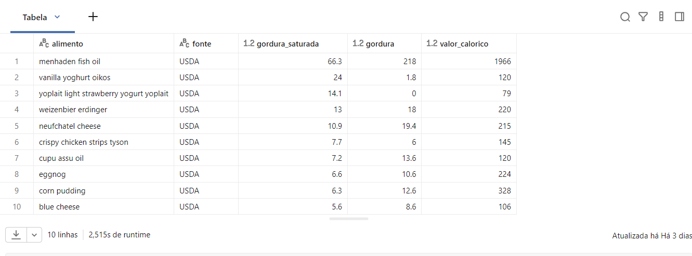
```
------------------------ Cria VIEW --------------------------------

spark.sql("""
CREATE OR REPLACE VIEW MVP_ENG_DADOS.analise.vw_maior_gordura_saturada AS
SELECT d.nome_alimento AS alimento, f.nome_fonte AS fonte, fn.gordura_saturada, fn.gordura, fn.valor_calorico
FROM MVP_ENG_DADOS.gold.fato_nutricao fn
JOIN MVP_ENG_DADOS.gold.dim_alimento d ON fn.alimento_id = d.alimento_id
JOIN MVP_ENG_DADOS.gold.dim_fonte f ON fn.fonte_id = f.fonte_id
WHERE fn.gordura_saturada IS NOT NULL
""")

spark.sql("""
SELECT alimento, fonte, gordura_saturada, gordura, valor_calorico
FROM MVP_ENG_DADOS.analise.vw_maior_gordura_saturada
ORDER BY gordura_saturada DESC
LIMIT 10
""").display()
```

```
------------------------ Gráfico em Colunas --------------------------------

import matplotlib.pyplot as plt

# Consulta os dados da view criada na célula acima
df = spark.sql("""
    SELECT alimento, fonte, gordura_saturada, gordura, valor_calorico
    FROM MVP_ENG_DADOS.analise.vw_maior_gordura_saturada
    ORDER BY gordura_saturada DESC
    LIMIT 10
""").toPandas()

# Combina alimento e fonte para o rótulo do eixo X
df['alimento_fonte'] = df['alimento'] + '\n(' + df['fonte'] + ')'

# Gráfico de colunas: Maior Teor de Gordura Saturada
fig, ax = plt.subplots(figsize=(12, 6))
bars = ax.bar(df['alimento_fonte'], df['gordura_saturada'], color='firebrick', edgecolor='darkred')
ax.set_title('Top 10 Alimentos: Maior Teor de Gordura Saturada', fontsize=14, fontweight='bold')
ax.set_xlabel('Alimento (Fonte)', fontsize=11)
ax.set_ylabel('Gordura Saturada (g)', fontsize=11)
ax.set_xticks(range(len(df['alimento_fonte'])))
ax.set_xticklabels(df['alimento_fonte'], rotation=45, ha='right')

# Rótulos nas barras
for bar in bars:
    height = bar.get_height()
    ax.text(bar.get_x() + bar.get_width() / 2, height + 0.1,
            f'{height:.2f}', ha='center', va='bottom', fontsize=8)

plt.tight_layout()
plt.show()
```
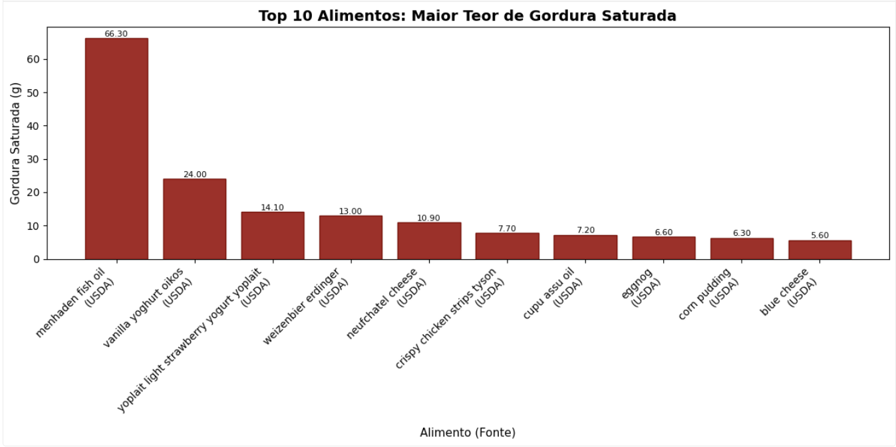
#### 5.2.6.1 - Explicação do Resultado

A consulta acima retorna os **10 alimentos com o maior teor de gordura saturada**, ou seja, aqueles que apresentam a maior quantidade de gordura saturada em gramas por porção, juntamente com a gordura total e o valor calórico.

#### Colunas retornadas

| Coluna | Descrição |
|---|---|
| **alimento** | Nome do alimento (de `dim_alimento`) |
| **fonte** | Origem dos dados — ex.: TACO, USDA (de `dim_fonte`) |
| **gordura_saturada** | Quantidade de gordura saturada em gramas — g (de `fato_nutricao`) |
| **gordura** | Quantidade de gordura total em gramas — g (de `fato_nutricao`) |
| **valor_calorico** | Valor calórico do alimento em kcal (de `fato_nutricao`) |

#### Como interpretar

- **Quanto maior** o valor de `gordura_saturada`, **mais elevado** é o teor de gordura saturada do alimento.
- A consulta filtra apenas alimentos com `gordura_saturada IS NOT NULL` para excluir registros sem informação de gordura saturada.
- Os resultados estão ordenados de forma **decrescente**, do maior para o menor teor de gordura saturada.
- A coluna `gordura` permite comparar a gordura saturada com a gordura total, evidenciando a proporção de gordura saturada no perfil lipídico do alimento.

#### Insight

Alimentos com alto teor de gordura saturada merecem atenção especial, pois o consumo excessivo está associado a:
- Aumento do **colesterol LDL** ("colesterol ruim")
- Maior risco de **doenças cardiovasculares**, como aterosclerose e infarto
- Acúmulo de **placas de gordura** nas artérias
- Maior probabilidade de **obesidade** e dislipidemias

Identificar esses alimentos é fundamental para orientar dietas com **redução de gordura saturada**, especialmente para pacientes com dislipidemias, risco cardiovascular e restrições médicas.

---

#### Justificativa de Resposta à Questão 06

A **Questão 06** solicitava a identificação dos **itens com maior quantidade de gorduras saturadas** — ou seja, aqueles alimentos que apresentam a maior quantidade de gordura saturada por porção.

#### Pontos-chave que garantem o atendimento

| Critério da questão | Como foi atendido |
|---|---|
| Identificar alimentos com maior teor de gordura saturada | Consulta SQL seleciona `gordura_saturada` e ordena de forma decrescente |
| Origem dos dados | `fato_nutricao` (fn) com JOIN em `dim_alimento` (d) e `dim_fonte` (f) |
| Evitar registros sem informação de gordura saturada | Filtro `WHERE gordura_saturada IS NOT NULL` |
| Disponibilizar gordura total e valor calórico complementares | Colunas `gordura` e `valor_calorico` incluídas |
| Persistir o resultado para reuso | View criada no schema `analise` com `CREATE OR REPLACE VIEW` |
| Facilitar a interpretação | Gráfico de colunas com rótulos nas barras |

Dessa forma, a análise não apenas **identificou e ranqueou** os alimentos com maior teor de gordura saturada, mas também **disponibilizou o resultado em uma view persistente** e em uma **visualização gráfica**, cumprindo integralmente o objetivo da Questão 06.

### 5.2.7 - Questão 07 - Alimentos mais indicados para ganho de massa muscular
```
%sql
-- ---------------------------------------------------------------------------
-- Análises Nutricionais - Tabelas gold.fato_nutricao + dimensões
-- ---------------------------------------------------------------------------

-- ===========================================================================
-- 7. Alimentos mais indicados para ganho de massa muscular
-- ===========================================================================
SELECT d.nome_alimento AS alimento, f.nome_fonte AS fonte, fn.proteina, fn.valor_calorico, fn.carboidratos, fn.gordura,
       ROUND(fn.proteina * (fn.valor_calorico / 100), 2) AS score_muscular
FROM MVP_ENG_DADOS.gold.fato_nutricao fn
JOIN MVP_ENG_DADOS.gold.dim_alimento d ON fn.alimento_id = d.alimento_id
JOIN MVP_ENG_DADOS.gold.dim_fonte f ON fn.fonte_id = f.fonte_id
WHERE fn.proteina IS NOT NULL
ORDER BY score_muscular DESC
LIMIT 10;
```
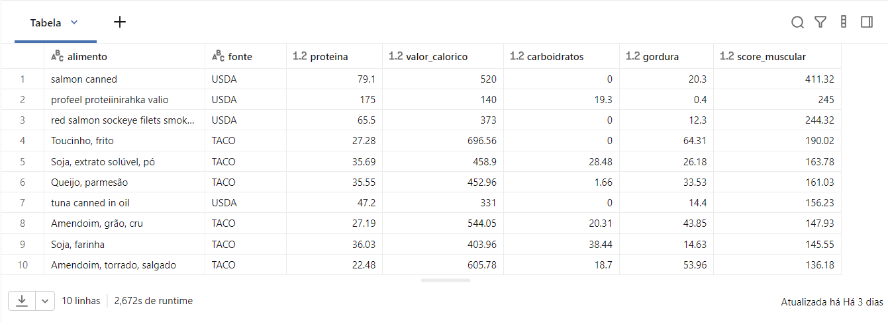
```
------------------------ Cria VIEW --------------------------------

spark.sql("""
CREATE OR REPLACE VIEW MVP_ENG_DADOS.analise.vw_maior_massa_muscular AS
SELECT d.nome_alimento AS alimento, f.nome_fonte AS fonte, fn.proteina, fn.valor_calorico, fn.carboidratos, fn.gordura,
       ROUND(fn.proteina * (fn.valor_calorico / 100), 2) AS score_muscular
FROM MVP_ENG_DADOS.gold.fato_nutricao fn
JOIN MVP_ENG_DADOS.gold.dim_alimento d ON fn.alimento_id = d.alimento_id
JOIN MVP_ENG_DADOS.gold.dim_fonte f ON fn.fonte_id = f.fonte_id
WHERE fn.proteina IS NOT NULL
""")

spark.sql("""
SELECT alimento, fonte, proteina, valor_calorico, carboidratos, gordura, score_muscular
FROM MVP_ENG_DADOS.analise.vw_maior_massa_muscular
ORDER BY score_muscular DESC
LIMIT 10
""").display()
```

```
------------------------ Gráfico em Colunas --------------------------------

import matplotlib.pyplot as plt

# Consulta os dados da view criada na célula acima
df = spark.sql("""
    SELECT alimento, fonte, proteina, valor_calorico, carboidratos, gordura, score_muscular
    FROM MVP_ENG_DADOS.analise.vw_maior_massa_muscular
    ORDER BY score_muscular DESC
    LIMIT 10
""").toPandas()

# Combina alimento e fonte para o rótulo do eixo X
df['alimento_fonte'] = df['alimento'] + '\n(' + df['fonte'] + ')'

# Gráfico de colunas: Alimentos mais indicados para ganho de massa muscular
fig, ax = plt.subplots(figsize=(12, 6))
bars = ax.bar(df['alimento_fonte'], df['score_muscular'], color='steelblue', edgecolor='navy')
ax.set_title('Top 10 Alimentos: Mais Indicados para Ganho de Massa Muscular', fontsize=14, fontweight='bold')
ax.set_xlabel('Alimento (Fonte)', fontsize=11)
ax.set_ylabel('Score Muscular', fontsize=11)
ax.set_xticks(range(len(df['alimento_fonte'])))
ax.set_xticklabels(df['alimento_fonte'], rotation=45, ha='right')

# Rótulos nas barras
for bar in bars:
    height = bar.get_height()
    ax.text(bar.get_x() + bar.get_width() / 2, height + 0.1,
            f'{height:.2f}', ha='center', va='bottom', fontsize=8)

plt.tight_layout()
plt.show()
```
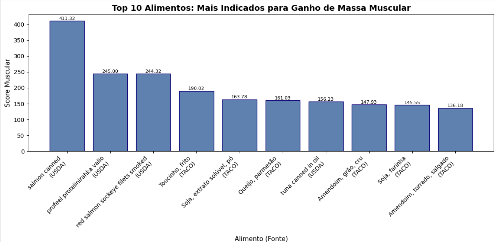

#### 5.2.7.1 - Explicação do Resultado

A consulta acima retorna os **10 alimentos mais indicados para ganho de massa muscular**, ou seja, aqueles que apresentam a maior combinação de proteína e valor calórico por porção, refletida pelo score muscular calculado.

#### Colunas retornadas

| Coluna | Descrição |
|---|---|
| **alimento** | Nome do alimento (de `dim_alimento`) |
| **fonte** | Origem dos dados — ex.: TACO, USDA (de `dim_fonte`) |
| **proteina** | Quantidade de proteína em gramas — g (de `fato_nutricao`) |
| **valor_calorico** | Valor calórico do alimento em kcal (de `fato_nutricao`) |
| **carboidratos** | Quantidade de carboidratos em gramas — g (de `fato_nutricao`) |
| **gordura** | Quantidade de gordura total em gramas — g (de `fato_nutricao`) |
| **score_muscular** | Índice que combina proteína e valor calórico (calculado: `proteina * (valor_calorico / 100)`) |

#### Como interpretar

- **Quanto maior** o valor de `score_muscular`, **mais indicado** é o alimento para ganho de massa muscular.
- O score combina a quantidade de proteína com o valor calórico, refletindo alimentos que oferecem **alta densidade proteica aliada a energia suficiente** para hipertrofia.
- A consulta filtra apenas alimentos com `proteina IS NOT NULL` para excluir registros sem informação de proteína.
- Os resultados estão ordenados de forma **decrescente**, do maior para o menor score muscular.
- As colunas `carboidratos` e `gordura` permitem avaliar o equilíbrio macronutricional do alimento.

#### Insight

Alimentos com alto score muscular são especialmente indicados para:
- **Hipertrofia** e ganho de massa muscular em treinos de força
- Dietas de **superávit calórico** com foco em proteína de alto valor biológico
- **Recuperação muscular** pós-treino, favorecendo a síntese proteica
- Planos alimentares de **bulking** com balanceamento entre proteína e energia
- Atletas e praticantes de musculação que necessitam de **alta ingestão proteica**

---

#### Justificativa de Resposta à Questão 07

A **Questão 07** solicitava a identificação dos **alimentos mais indicados para ganho de massa muscular** — ou seja, aqueles que combinam alto teor de proteína com valor calórico adequado.

#### Pontos-chave que garantem o atendimento

| Critério da questão | Como foi atendido |
|---|---|
| Identificar alimentos com alto teor de proteína | Consulta SQL seleciona `proteina` como critério principal |
| Combinar proteína com valor calórico | Coluna calculada `score_muscular` usando `ROUND(proteina * (valor_calorico / 100), 2)` |
| Origem dos dados | `fato_nutricao` (fn) com JOIN em `dim_alimento` (d) e `dim_fonte` (f) |
| Evitar registros sem informação de proteína | Filtro `WHERE proteina IS NOT NULL` |
| Disponibilizar macronutrientes complementares | Colunas `carboidratos`, `gordura` e `valor_calorico` incluídas |
| Persistir o resultado para reuso | View criada no schema `analise` com `CREATE OR REPLACE VIEW` |
| Facilitar a interpretação | Gráfico de colunas com rótulos nas barras |

Dessa forma, a análise não apenas **identificou e ranqueou** os alimentos mais indicados para ganho de massa muscular, mas também **disponibilizou o resultado em uma view persistente** e em uma **visualização gráfica**, cumprindo integralmente o objetivo da Questão 07.


### 5.2.8 - Questão 08 - Mais eficientes para saciedade com poucas calorias
```
%sql
-- ---------------------------------------------------------------------------
-- Análises Nutricionais - Tabelas gold.fato_nutricao + dimensões
-- ---------------------------------------------------------------------------

-- ===========================================================================
-- 8. Mais eficientes para saciedade com poucas calorias
-- ===========================================================================
SELECT d.nome_alimento AS alimento, f.nome_fonte AS fonte, fn.proteina, fn.fibras_alimentar, fn.valor_calorico,
       ROUND((fn.proteina + fn.fibras_alimentar) / fn.valor_calorico, 4) AS indice_saciedade
FROM MVP_ENG_DADOS.gold.fato_nutricao fn
JOIN MVP_ENG_DADOS.gold.dim_alimento d ON fn.alimento_id = d.alimento_id
JOIN MVP_ENG_DADOS.gold.dim_fonte f ON fn.fonte_id = f.fonte_id
WHERE fn.valor_calorico > 0
  AND fn.proteina IS NOT NULL
  AND fn.fibras_alimentar IS NOT NULL
ORDER BY indice_saciedade DESC
LIMIT 10;
```
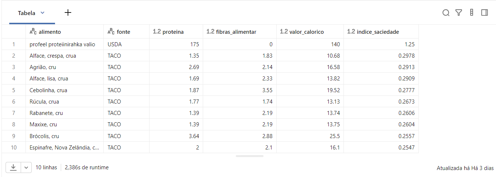
```
------------------------ Cria VIEW --------------------------------
spark.sql("""
CREATE OR REPLACE VIEW MVP_ENG_DADOS.analise.vw_maior_saciedade AS
SELECT d.nome_alimento AS alimento, f.nome_fonte AS fonte, fn.proteina, fn.fibras_alimentar, fn.valor_calorico,
       ROUND((fn.proteina + fn.fibras_alimentar) / fn.valor_calorico, 4) AS indice_saciedade
FROM MVP_ENG_DADOS.gold.fato_nutricao fn
JOIN MVP_ENG_DADOS.gold.dim_alimento d ON fn.alimento_id = d.alimento_id
JOIN MVP_ENG_DADOS.gold.dim_fonte f ON fn.fonte_id = f.fonte_id
WHERE fn.valor_calorico > 0
  AND fn.proteina IS NOT NULL
  AND fn.fibras_alimentar IS NOT NULL
""")

spark.sql("""
SELECT alimento, fonte, proteina, fibras_alimentar, valor_calorico, indice_saciedade
FROM MVP_ENG_DADOS.analise.vw_maior_saciedade
ORDER BY indice_saciedade DESC
LIMIT 10
""").display()
```

```
------------------------ Gráfico em Colunas --------------------------------

import matplotlib.pyplot as plt

# Consulta os dados da view criada na célula acima
df = spark.sql("""
    SELECT alimento, fonte, proteina, fibras_alimentar, valor_calorico, indice_saciedade
    FROM MVP_ENG_DADOS.analise.vw_maior_saciedade
    ORDER BY indice_saciedade DESC
    LIMIT 10
""").toPandas()

# Combina alimento e fonte para o rótulo do eixo X
df['alimento_fonte'] = df['alimento'] + '\n(' + df['fonte'] + ')'

# Gráfico de colunas: Mais eficientes para saciedade com poucas calorias
fig, ax = plt.subplots(figsize=(12, 6))
bars = ax.bar(df['alimento_fonte'], df['indice_saciedade'], color='seagreen', edgecolor='darkgreen')
ax.set_title('Top 10 Alimentos: Mais Eficientes para Saciedade com Poucas Calorias', fontsize=14, fontweight='bold')
ax.set_xlabel('Alimento (Fonte)', fontsize=11)
ax.set_ylabel('Índice de Saciedade', fontsize=11)
ax.set_xticks(range(len(df['alimento_fonte'])))
ax.set_xticklabels(df['alimento_fonte'], rotation=45, ha='right')

# Rótulos nas barras
for bar in bars:
    height = bar.get_height()
    ax.text(bar.get_x() + bar.get_width() / 2, height + 0.001,
            f'{height:.4f}', ha='center', va='bottom', fontsize=8)

plt.tight_layout()
plt.show()
```
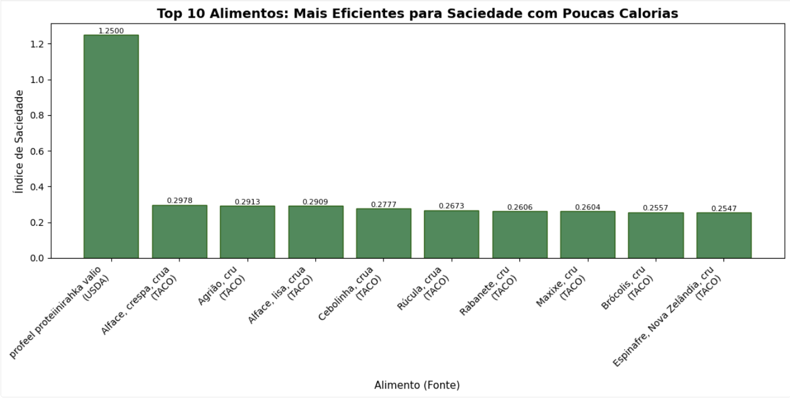
   
#### 5.2.8.1 - Explicação do Resultado

A consulta acima retorna os **10 alimentos mais eficientes para saciedade com poucas calorias**, ou seja, aqueles que apresentam a maior combinação de proteína e fibras em relação ao valor calórico, refletida pelo índice de saciedade calculado.

#### Colunas retornadas

| Coluna | Descrição |
|---|---|
| **alimento** | Nome do alimento (de `dim_alimento`) |
| **fonte** | Origem dos dados — ex.: TACO, USDA (de `dim_fonte`) |
| **proteina** | Quantidade de proteína em gramas — g (de `fato_nutricao`) |
| **fibras_alimentar** | Quantidade de fibras alimentares em gramas — g (de `fato_nutricao`) |
| **valor_calorico** | Valor calórico do alimento em kcal (de `fato_nutricao`) |
| **indice_saciedade** | Índice que combina proteína e fibras em relação ao valor calórico (`(proteína + fibras) / valor_calórico`) |

#### Como interpretar

- **Quanto maior** o valor de `indice_saciedade`, **mais eficiente** é o alimento para promover saciedade com poucas calorias.
- O índice combina a quantidade de proteína e fibras alimentares, ambos nutrientes altamente saciantes, dividida pelo valor calórico, evidenciando alimentos que oferecem **alta saciedade por caloria consumida**.
- A consulta filtra apenas alimentos com `valor_calorico > 0`, `proteina IS NOT NULL` e `fibras_alimentar IS NOT NULL` para garantir resultados válidos e evitar divisão por zero.
- Os resultados estão ordenados de forma **decrescente**, do maior para o menor índice de saciedade.
- As colunas `proteina` e `fibras_alimentar` permitem avaliar a contribuição individual de cada nutriente para a saciedade.

#### Insight

Alimentos com alto índice de saciedade são especialmente indicados para:
- Dietas de **emagrecimento** com restrição calórica sem comprometer a saciedade
- Planos alimentares com **controle de apetite** e redução da fome entre as refeições
- Estratégias de **comer menos calorias** mantendo a sensação de plenitude
- Controle de **glicemia** com alimentos de alta densidade nutritiva e baixa densidade calórica
- Dietas ricas em **fibras e proteínas** para manutenção da massa magra durante o emagrecimento

---

#### Justificativa de Resposta à Questão 08

A **Questão 08** solicitava a identificação dos **alimentos mais eficientes para saciedade com poucas calorias** — ou seja, aqueles que combinam alto teor de proteína e fibras com baixo valor calórico.

#### Pontos-chave que garantem o atendimento

| Critério da questão | Como foi atendido |
|---|---|
| Identificar alimentos com alto teor de proteína e fibras | Consulta SQL seleciona `proteina` e `fibras_alimentar` como critérios principais |
| Combinar saciedade com baixo valor calórico | Coluna calculada `indice_saciedade` usando `ROUND((proteina + fibras_alimentar) / valor_calorico, 4)` |
| Origem dos dados | `fato_nutricao` (fn) com JOIN em `dim_alimento` (d) e `dim_fonte` (f) |
| Evitar registros sem informação ou com valor calórico zero | Filtros `WHERE valor_calorico > 0 AND proteina IS NOT NULL AND fibras_alimentar IS NOT NULL` |
| Disponibilizar valor calórico complementar | Coluna `valor_calorico` incluída |
| Persistir o resultado para reuso | View criada no schema `analise` com `CREATE OR REPLACE VIEW` |
| Facilitar a interpretação | Gráfico de colunas com rótulos nas barras |

Dessa forma, a análise não apenas **identificou e ranqueou** os alimentos mais eficientes para saciedade com poucas calorias, mas também **disponibilizou o resultado em uma view persistente** e em uma **visualização gráfica**, cumprindo integralmente o objetivo da Questão 08.


### 5.2.9 - Questão 09 - Alimentos com maior quantidade de açúcar
```
%sql
-- ---------------------------------------------------------------------------
-- Análises Nutricionais - Tabelas gold.fato_nutricao + dimensões
-- ---------------------------------------------------------------------------

-- ===========================================================================
-- 9. Alimentos com maior quantidade de açúcar
-- ===========================================================================
SELECT d.nome_alimento AS alimento, f.nome_fonte AS fonte, fn.acucares, fn.carboidratos, fn.valor_calorico
FROM MVP_ENG_DADOS.gold.fato_nutricao fn
JOIN MVP_ENG_DADOS.gold.dim_alimento d ON fn.alimento_id = d.alimento_id
JOIN MVP_ENG_DADOS.gold.dim_fonte f ON fn.fonte_id = f.fonte_id
WHERE fn.acucares IS NOT NULL
ORDER BY fn.acucares DESC
LIMIT 10;
```
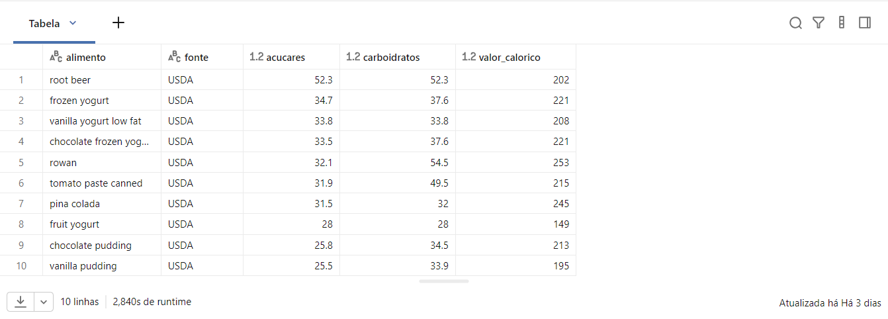
```
------------------------ Cria VIEW --------------------------------
spark.sql("""
CREATE OR REPLACE VIEW MVP_ENG_DADOS.analise.vw_maior_acucares AS
SELECT d.nome_alimento AS alimento, f.nome_fonte AS fonte, fn.acucares, fn.carboidratos, fn.valor_calorico
FROM MVP_ENG_DADOS.gold.fato_nutricao fn
JOIN MVP_ENG_DADOS.gold.dim_alimento d ON fn.alimento_id = d.alimento_id
JOIN MVP_ENG_DADOS.gold.dim_fonte f ON fn.fonte_id = f.fonte_id
WHERE fn.acucares IS NOT NULL
""")

spark.sql("""
SELECT alimento, fonte, acucares, carboidratos, valor_calorico
FROM MVP_ENG_DADOS.analise.vw_maior_acucares
ORDER BY acucares DESC
LIMIT 10
""").display()
```

```
------------------------ Gráfico em Colunas --------------------------------

import matplotlib.pyplot as plt

# Consulta os dados da view criada na célula acima
df = spark.sql("""
    SELECT alimento, fonte, acucares, carboidratos, valor_calorico
    FROM MVP_ENG_DADOS.analise.vw_maior_acucares
    ORDER BY acucares DESC
    LIMIT 10
""").toPandas()

# Combina alimento e fonte para o rótulo do eixo X
df['alimento_fonte'] = df['alimento'] + '\n(' + df['fonte'] + ')'

# Gráfico de colunas: Alimentos com maior quantidade de açúcar
fig, ax = plt.subplots(figsize=(12, 6))
bars = ax.bar(df['alimento_fonte'], df['acucares'], color='darkorange', edgecolor='saddlebrown')
ax.set_title('Top 10 Alimentos: Maior Quantidade de Açúcar', fontsize=14, fontweight='bold')
ax.set_xlabel('Alimento (Fonte)', fontsize=11)
ax.set_ylabel('Açúcares (g)', fontsize=11)
ax.set_xticks(range(len(df['alimento_fonte'])))
ax.set_xticklabels(df['alimento_fonte'], rotation=45, ha='right')

# Rótulos nas barras
for bar in bars:
    height = bar.get_height()
    ax.text(bar.get_x() + bar.get_width() / 2, height + 0.05,
            f'{height:.2f}', ha='center', va='bottom', fontsize=8)

plt.tight_layout()
plt.show()
```
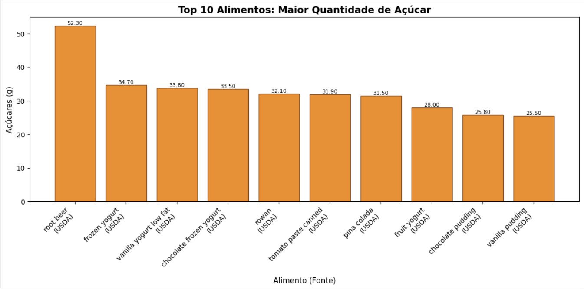
#### 5.2.9.1 - Explicação do Resultado

A consulta acima retorna os **10 alimentos com a maior quantidade de açúcar**, ou seja, aqueles que apresentam a maior quantidade de açúcares em gramas por porção, juntamente com os carboidratos totais e o valor calórico.

#### Colunas retornadas

| Coluna | Descrição |
|---|---|
| **alimento** | Nome do alimento (de `dim_alimento`) |
| **fonte** | Origem dos dados — ex.: TACO, USDA (de `dim_fonte`) |
| **acucares** | Quantidade de açúcares em gramas — g (de `fato_nutricao`) |
| **carboidratos** | Quantidade de carboidratos totais em gramas — g (de `fato_nutricao`) |
| **valor_calorico** | Valor calórico do alimento em kcal (de `fato_nutricao`) |

#### Como interpretar

- **Quanto maior** o valor de `acucares`, **mais elevado** é o teor de açúcar do alimento.
- A consulta filtra apenas alimentos com `acucares IS NOT NULL` para excluir registros sem informação de açúcares.
- Os resultados estão ordenados de forma **decrescente**, do maior para o menor teor de açúcar.
- A coluna `carboidratos` permite comparar os açúcares com os carboidratos totais, evidenciando a proporção de açúcares no perfil glicídico do alimento.
- A coluna `valor_calorico` auxilia na avaliação do impacto calórico do consumo de açúcares.

#### Insight

Alimentos com alto teor de açúcar merecem atenção especial, pois o consumo excessivo está associado a:
- Aumento rápido da **glicemia** e picos de insulina
- Maior risco de **diabetes tipo 2** e resistência insulínica
- Acúmulo de **gordura visceral** e ganho de peso
- Maior probabilidade de **obesidade** e síndrome metabólica
- Maior risco de **doenças cardiovasculares** e inflamação crônica

Identificar esses alimentos é fundamental para orientar dietas com **redução de açúcares adicionais**, especialmente para pacientes com diabetes, resistência insulínica, obesidade e restrições médicas.

---

#### Justificativa de Resposta à Questão 09

A **Questão 09** solicitava a identificação dos **alimentos com maior quantidade de açúcar** — ou seja, aqueles alimentos que apresentam a maior quantidade de açúcares por porção.

#### Pontos-chave que garantem o atendimento

| Critério da questão | Como foi atendido |
|---|---|
| Identificar alimentos com maior teor de açúcar | Consulta SQL seleciona `acucares` e ordena de forma decrescente |
| Origem dos dados | `fato_nutricao` (fn) com JOIN em `dim_alimento` (d) e `dim_fonte` (f) |
| Evitar registros sem informação de açúcares | Filtro `WHERE acucares IS NOT NULL` |
| Disponibilizar carboidratos totais e valor calórico complementares | Colunas `carboidratos` e `valor_calorico` incluídas |
| Persistir o resultado para reuso | View criada no schema `analise` com `CREATE OR REPLACE VIEW` |
| Facilitar a interpretação | Gráfico de colunas com rótulos nas barras |

Dessa forma, a análise não apenas **identificou e ranqueou** os alimentos com maior teor de açúcar, mas também **disponibilizou o resultado em uma view persistente** e em uma **visualização gráfica**, cumprindo integralmente o objetivo da Questão 09.


### 5.2.10 - Questão 10 - Alimentos mais adequados para dietas veganas ou vegetarianas
```
%sql
-- ---------------------------------------------------------------------------
-- Análises Nutricionais - Tabelas gold.fato_nutricao + dimensões
-- ---------------------------------------------------------------------------

-- ===========================================================================
-- 10. Alimentos mais adequados para dietas veganas ou vegetarianas
-- ===========================================================================
SELECT d.nome_alimento AS alimento, f.nome_fonte AS fonte, fn.proteina, fn.fibras_alimentar, fn.colesterol, fn.gordura_saturada,
       ROUND(COALESCE(fn.proteina, 0)
           + COALESCE(fn.fibras_alimentar, 0)
           - COALESCE(fn.colesterol, 0)
           - COALESCE(fn.gordura_saturada, 0), 2) AS score_vegano
FROM MVP_ENG_DADOS.gold.fato_nutricao fn
JOIN MVP_ENG_DADOS.gold.dim_alimento d ON fn.alimento_id = d.alimento_id
JOIN MVP_ENG_DADOS.gold.dim_fonte f ON fn.fonte_id = f.fonte_id
WHERE fn.colesterol IS NULL OR fn.colesterol <= 5
ORDER BY score_vegano DESC
LIMIT 10;
```

```
------------------------ Cria VIEW --------------------------------

spark.sql("""
CREATE OR REPLACE VIEW MVP_ENG_DADOS.analise.vw_melhor_vegano AS
SELECT d.nome_alimento AS alimento, f.nome_fonte AS fonte, fn.proteina, fn.fibras_alimentar, fn.colesterol, fn.gordura_saturada,
       ROUND(COALESCE(fn.proteina, 0)
           + COALESCE(fn.fibras_alimentar, 0)
           - COALESCE(fn.colesterol, 0)
           - COALESCE(fn.gordura_saturada, 0), 2) AS score_vegano
FROM MVP_ENG_DADOS.gold.fato_nutricao fn
JOIN MVP_ENG_DADOS.gold.dim_alimento d ON fn.alimento_id = d.alimento_id
JOIN MVP_ENG_DADOS.gold.dim_fonte f ON fn.fonte_id = f.fonte_id
WHERE fn.colesterol IS NULL OR fn.colesterol <= 5
""")

spark.sql("""
SELECT alimento, fonte, proteina, fibras_alimentar, colesterol, gordura_saturada, score_vegano
FROM MVP_ENG_DADOS.analise.vw_melhor_vegano
ORDER BY score_vegano DESC
LIMIT 10
""").display()
```
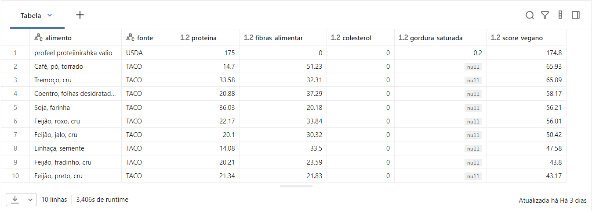
```
------------------------ Gráfico em Colunas --------------------------------

import matplotlib.pyplot as plt

# Consulta os dados da view criada na célula acima
df = spark.sql("""
    SELECT alimento, fonte, proteina, fibras_alimentar, colesterol, gordura_saturada, score_vegano
    FROM MVP_ENG_DADOS.analise.vw_melhor_vegano
    ORDER BY score_vegano DESC
    LIMIT 10
""").toPandas()

# Combina alimento e fonte para o rótulo do eixo X
df['alimento_fonte'] = df['alimento'] + '\n(' + df['fonte'] + ')'

# Gráfico de colunas: Alimentos mais adequados para dietas veganas ou vegetarianas
fig, ax = plt.subplots(figsize=(12, 6))
bars = ax.bar(df['alimento_fonte'], df['score_vegano'], color='forestgreen', edgecolor='darkgreen')
ax.set_title('Top 10 Alimentos: Mais Adequados para Dietas Veganas ou Vegetarianas', fontsize=14, fontweight='bold')
ax.set_xlabel('Alimento (Fonte)', fontsize=11)
ax.set_ylabel('Score Vegano', fontsize=11)
ax.set_xticks(range(len(df['alimento_fonte'])))
ax.set_xticklabels(df['alimento_fonte'], rotation=45, ha='right')

# Rótulos nas barras
for bar in bars:
    height = bar.get_height()
    ax.text(bar.get_x() + bar.get_width() / 2, height + 0.05,
            f'{height:.2f}', ha='center', va='bottom', fontsize=8)

plt.tight_layout()
plt.show()
```
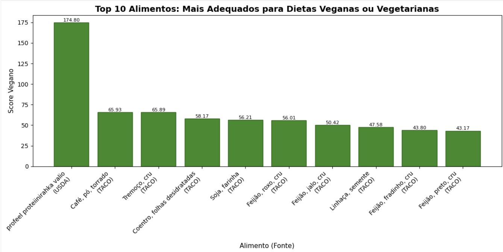   

#### 5.2.10.1 - Explicação do Resultado

A consulta acima retorna os **10 alimentos mais adequados para dietas veganas ou vegetarianas**, ou seja, aqueles que apresentam a maior combinação de proteína e fibras alimentares, com baixo teor de colesterol e gordura saturada, refletida pelo score vegano calculado.

#### Colunas retornadas

| Coluna | Descrição |
|---|---|
| **alimento** | Nome do alimento (de `dim_alimento`) |
| **fonte** | Origem dos dados — ex.: TACO, USDA (de `dim_fonte`) |
| **proteina** | Quantidade de proteína em gramas — g (de `fato_nutricao`) |
| **fibras_alimentar** | Quantidade de fibras alimentares em gramas — g (de `fato_nutricao`) |
| **colesterol** | Quantidade de colesterol em miligramas — mg (de `fato_nutricao`) |
| **gordura_saturada** | Quantidade de gordura saturada em gramas — g (de `fato_nutricao`) |
| **score_vegano** | Índice que combina proteína e fibras (positivo) menos colesterol e gordura saturada (negativo) (`proteína + fibras − colesterol − gordura_saturada`) |

#### Como interpretar

- **Quanto maior** o valor de `score_vegano`, **mais adequado** é o alimento para dietas veganas ou vegetarianas.
- O score combina nutrientes benéficos (`proteina` e `fibras_alimentar`) somados, e nutrientes a evitar (`colesterol` e `gordura_saturada`) subtraídos, evidenciando alimentos de **origem vegetal com alto valor nutritivo**.
- A consulta filtra apenas alimentos com `colesterol IS NULL OR colesterol <= 5`, priorizando alimentos sem colesterol ou com teor muito baixo — característica típica de alimentos de origem vegetal.
- A função `COALESCE` é utilizada para tratar valores nulos, atribuindo zero aos nutrientes ausentes, garantindo que o cálculo do score não seja comprometido por dados faltantes.
- Os resultados estão ordenados de forma **decrescente**, do maior para o menor score vegano.
- As colunas `colesterol` e `gordura_saturada` permitem avaliar a adequação do alimento a dietas sem produtos de origem animal.

#### Insight

Alimentos com alto score vegano são especialmente indicados para:
- Dietas **veganas** (sem nenhum produto de origem animal) e **vegetarianas** (sem carne, podendo incluir derivados)
- Garantir **ingestão adequada de proteína** sem recorrer a fontes animais
- Aumentar o consumo de **fibras alimentares**, essenciais para a saúde intestinal e controle glicêmico
- Reduzir a ingestão de **colesterol** e **gordura saturada**, minimizando riscos cardiovasculares
- Planos alimentares com foco em **densidade nutritiva** e sustentabilidade ambiental

---

#### Justificativa de Resposta à Questão 10

A **Questão 10** solicitava a identificação dos **alimentos mais adequados para dietas veganas ou vegetarianas** — ou seja, aqueles que combinam alto teor de proteína e fibras com baixo teor de colesterol e gordura saturada.

#### Pontos-chave que garantem o atendimento

| Critério da questão | Como foi atendido |
|---|---|
| Identificar alimentos com alto teor de proteína e fibras | Consulta SQL seleciona `proteina` e `fibras_alimentar` como critérios positivos |
| Priorizar alimentos sem colesterol ou com baixo teor | Filtro `WHERE colesterol IS NULL OR colesterol <= 5` |
| Penalizar alimentos com colesterol e gordura saturada | Coluna calculada `score_vegano` subtrai `colesterol` e `gordura_saturada` |
| Origem dos dados | `fato_nutricao` (fn) com JOIN em `dim_alimento` (d) e `dim_fonte` (f) |
| Tratar valores nulos adequadamente | Uso de `COALESCE(..., 0)` para todos os nutrientes no cálculo do score |
| Persistir o resultado para reuso | View criada no schema `analise` com `CREATE OR REPLACE VIEW` |
| Facilitar a interpretação | Gráfico de colunas com rótulos nas barras |

Dessa forma, a análise não apenas **identificou e ranqueou** os alimentos mais adequados para dietas veganas ou vegetarianas, mas também **disponibilizou o resultado em uma view persistente** e em uma **visualização gráfica**, cumprindo integralmente o objetivo da Questão 10.


## 5.3 - Evidência da Criação da VW de Analise

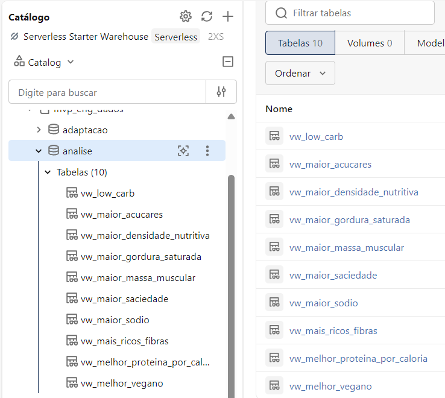

# 6.0 - Autoavaliação

## 6.1 - Primeiros passos

Escolhi e tema, pois além de ser formado no P15 da PUC em 2003, eu também fiz faculdade de gastronomia, pois é um Hobbie que eu pratico e gostaria de fazer um investimento em alimentação saudável, a partir disso comecei a elabroar o que seria necessário para isso, pesquisei sobre o assunto e a princípal para fazer uma comida suadável os macronutrientes poderia me dar uma caminho, então elaborei as 10 perguntas da sessão 1.0 - Contexto de Negócio e Perguntas.

## 6.2 - Expectativas
Esperava que todas as perguntas fossem respondidas e que trouxesse alguns insights para empreender nessa nova área que estou querendo atuar. Acredito que fazendo essa pós-graduação ajudaria muito nas tomadas de decisão e no crescimento de conhecimento com o aprendizado em ciências de dados, ter o poder decisão com as informações de qualidade e análise com uma precisão alta.

Escolhi a base de dados que utilizei nas 2 sprints anteriores para poder responder as perguntas.


## 6.3 - Mudança de Rota

Quando analisei os dados utilizados anteriormente nas 2 sprints passadas, vi que não me atenderia, pois nessa base não tinha todos os campos necessários para responder as perguntas.

Base de dados inicial:

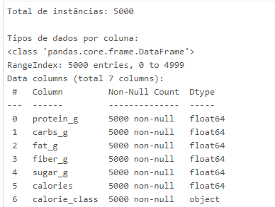


Então fui procurar bases de dados em diferentes sites de repositórios de dados públicos e encontrei as duas bases de dados, a garimpagem foi difícil, pois ou tinham bases muito complexas com campos multivalorados com números divididos por "," e texto junto, o que demandaria muito tempo para fazer a limpeza de dados e isso fez com que eu desistisse deles, pois não teria tempo hábil.

O problema da primeira base que eu encontrei não continham muitos dados, somente 124 linhas, então fui procurar outra fonte e encontrei a segunda com 597 linhas, então resolvi juntar as duas e com elas eu conseguiria responder as perguntas.

## 6.4 - Avaliação

Aprendi muito com a pós e principalmente com o MVP, nele pude colocar em prática o que vi nas aulas gravadas.
Fazendo esse projeto pude entender as dificuldades que podem aparecer durante a escolha dos dados que serão utilizados, principalmente se tiver que realizar muitas alterações na limpeza de dados e nas escolhas dos campos que devem ser utilizados para se atingir o objetivo.

Sei que a minha base de dados não tem muitas informações, mas da forma que foi estruturado o meu projeto, fica mais fácil realizar um novo projeto com dados mais robustos, pois já tenho a espinha dorsal pronta. 

Para Atender resolvi juntar duas bases, isso também é bom para saber as diferenças entre os dados de regiões diferentes, no caso utilizei uma base brasileira e outra estadunidense e as vezes alimentos equivalentes podem ter medidas de nutrientes diferentes em diferentes países.

No mais fiquei muito satisfeito com o meu progresso e acredito que eu aprendi muito com o projeto.

