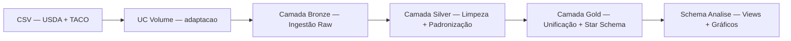

# MVP Engenharia de Dados — Análise Nutricional de Alimentos

Pipeline de engenharia de dados que integra, padroniza e analisa informações nutricionais de duas fontes distintas (USDA e TACO), respondendo 10 perguntas de negócio sobre composição nutricional, densidade, qualidade dos alimentos e padrões alimentares.

## 📋 Sumário

- Sobre o Projeto
- Visualização completa do Projeto
- Funcionalidades
- Tecnologias
- Arquitetura
- Pré-requisitos
- Uso
- Estrutura do Projeto
- Artefatos Gerados
- Modelagem de Dados
- Análises
- Contribuição
- Licença
- Contato

## Sobre o Projeto

O projeto transforma dados nutricionais brutos em respostas claras, comparáveis e úteis sobre alimentos. A análise segue uma metodologia robusta, desde a exploração inicial dos dados até a modelagem em estrela (star schema), culminando na validação de hipóteses sobre padrões alimentares.

## Visualização completa do Projeto
- Aqui você consegue acessar o Projeto completo, com todos códigos e analises e evidências.
  1. [MVP Engenharia de Dados - Completo](https://github.com/MGuidolini/PUC-MVP/blob/Sprint03---Engenharia-de-dados/MVP%20Engenharia%20de%20Dados%20-%20Completo.ipynb)
     
### Fontes de Dados

| Fonte | Descrição | Registros | Origem |
|---|---|---|---|
| **USDA** | Este conjunto de dados provém do Laboratório de Métodos e Aplicações de Composição de Alimentos (Methods and Application of Food Composition Laboratory) | 125 | [Kaggle — USDA National Nutrient Database](https://www.kaggle.com/datasets/haithemhermessi/usda-national-nutrient-database) |
| **TACO** | Tabela Brasileira de Composição de Alimentos | 597 | [Kaggle — Composição Nutricional TACO](https://www.kaggle.com/datasets/ispangler/composio-nutricional-de-alimentos-taco) |

> Ambas as fontes são domínio público (CC0), permitindo uso livre em projetos acadêmicos, comerciais ou pessoais.

## Funcionalidades

- ✅ Ingestão de dados CSV de duas fontes nutricionais (USDA + TACO)
- ✅ Arquitetura de medalhão (Bronze → Silver → Gold) no Unity Catalog
- ✅ Padronização de colunas para português e normalização de tipos
- ✅ Unificação das fontes em uma tabela Gold consolidada (722 alimentos)
- ✅ Modelagem em star schema (1 tabela fato + 3 dimensões)
- ✅ 10 análises nutricionais com SQL, views persistidas e visualizações gráficas
- ✅ Validação de qualidade de dados (campos nulos, valores negativos)

## Tecnologias

| Categoria       | Tecnologia                          |
|-----------------|-------------------------------------|
| Plataforma      | Databricks (AWS)                    |
| Linguagem       | Python / SQL                        |
| Processamento   | Apache Spark / Delta Lake           |
| Governança      | Unity Catalog                       |
| Armazenamento   | UC Volumes                          |
| Visualização    | Matplotlib                          |

## Arquitetura

O pipeline segue a arquitetura de medalhão (Medallion Architecture) com três camadas principais e duas auxiliares:



### Catálogo e Schemas

| Catálogo | Schema | Finalidade |
|---|---|---|
| `MVP_ENG_DADOS` | `bronze` | Dados brutos ingeridos dos arquivos CSV |
| `MVP_ENG_DADOS` | `silver` | Dados limpos, padronizados e com colunas em português |
| `MVP_ENG_DADOS` | `gold` | Tabela unificada USDA + TACO + modelo estrela |
| `MVP_ENG_DADOS` | `adaptacao` | Volume para armazenamento de arquivos CSV |
| `MVP_ENG_DADOS` | `analise` | Views analíticas persistidas e resultados das 10 questões |

## Pré-requisitos

- Conta no Databricks com permissões de Unity Catalog
- Acesso para criar catálogos, schemas, volumes e tabelas
- Compute Serverless ou Standard com Spark
- Arquivos `Food_Nutrition.csv` (USDA) e `Taco.csv` (TACO) disponíveis

## Uso

### Executar o pipeline completo

Execute os notebooks em sequência:

| Ordem | Notebook | Descrição |
|---|---|---|
| 001 | Objetivo | Define hipóteses e perguntas de análise |
| 002 | Preparação | Cria catálogo `MVP_ENG_DADOS` e schemas no Unity Catalog |
| 003 | Download | Copia arquivos CSV para UC Volume |
| 004 | Bronze | Ingestão raw das tabelas `Alimentos_Taco` e `Alimentos_Food_Nutrition` |
| 005 | Silver | Limpeza, padronização de colunas e validação de qualidade |
| 006 | Gold | Unificação USDA + TACO + modelagem star schema |
| 007 | Análise | 10 questões analíticas com SQL, views e gráficos |
| 008 | Autoavaliação | Avaliação do autor sobre o seu Projeto |


### Exemplo de consulta

```sql
SELECT d.nome_alimento AS alimento, f.nome_fonte AS fonte,
       fn.proteina, fn.valor_calorico,
       ROUND(fn.proteina / fn.valor_calorico, 4) AS proteina_por_caloria
FROM MVP_ENG_DADOS.gold.fato_nutricao fn
JOIN MVP_ENG_DADOS.gold.dim_alimento d ON fn.alimento_id = d.alimento_id
JOIN MVP_ENG_DADOS.gold.dim_fonte f ON fn.fonte_id = f.fonte_id
WHERE fn.valor_calorico > 0
ORDER BY proteina_por_caloria DESC
LIMIT 10;
```

## Estrutura do Projeto

```
Engenharia de Dados/
├── 000 - Engenharia de Dados - Redame    # README do projeto
├── 001 - Engenharia de Dados - Objetivo   # Hipóteses e perguntas de análise
├── 002 - Engenharia de Dados - Preparação # Criação de catálogo e schemas
├── 003 - Engenharia de Dados - Download   # Cópia de CSVs para UC Volume
├── 004 - Engenharia de Dados - Bronze     # Ingestão raw (TACO + USDA)
├── 005 - Engenharia de Dados - Silver     # Limpeza e padronização
├── 006 - Engenharia de Dados - Gold       # Unificação + star schema
├── 007 - Engenharia de Dados - Analise    # 10 análises nutricionais
├── 008 - Engenharia de Dados - Autoavaliação # Avaliação do autor sobre o seu Projeto
├── Food_Nutrition.csv                     # Dataset USDA (125 registros)
└── Taco.csv                               # Dataset TACO (597 registros)
```

## Artefatos Gerados

| Artefato | Descrição | Localização |
|---|---|---|
| **Notebook único** | Notebook consolidado com 157 células dos 7 notebooks originais |  [MVP Engenharia de Dados - Completo](https://github.com/MGuidolini/PUC-MVP/blob/Sprint03---Engenharia-de-dados/MVP%20Engenharia%20de%20Dados%20-%20Completo.ipynb) |
| **Imagem 01** | Evidência da Célula - Preparação|  [Imagem 01](image_1790215534934.png) |
| **Imagem 02** | Evidência da Célula - Download|  [Imagem 02](image_1790215716497.png) |
| **Imagem 03** | Evidência da Célula - Bronze|  [Imagem 03](image_1790215863984.png) |
| **Imagem 04** | Evidência da Célula - Silver|  [Imagem 04](image_1790216453904.png) |
| **Imagem 05** | Evidência da Célula - Gold|  [Imagem 05](image_1790216137494.png) |
| **Imagem 06** | Evidência da Célula - Analise|  [Imagem 06](image_1790216300539.png) |


## Modelagem de Dados

A camada Gold utiliza um **modelo estrela (star schema)** com uma tabela fato central e três dimensões:

```
                     ┌────────────────────────┐
                     │   dim_fonte            │
                     │  fonte_id (PK)         │
                     │  nome_fonte (USDA/TACO)│
                     └────────┬───────────────┘
                              │
┌──────────────────┐    ┌─────┴──────────────────────┐    ┌──────────────────────┐
│   dim_alimento   │    │      fato_nutricao         │    │ dim_grupo_alimentar  │
│  alimento_id (PK)│◄───│  alimento_id (FK)          │───►│  grupo_id (PK)       │
│  nome_alimento   │    │  fonte_id (FK)             │    │  nome_grupo          │
│  descricao       │    │  grupo_id (FK)             │    └──────────────────────┘
└──────────────────┘    │  valor_calorico            │
                        │  proteina                  │
                        │  carboidratos              │
                        │  gordura                   │
                        │  gordura_saturada          │
                        │  fibras_alimentar          │
                        │  colesterol                │
                        │  sodio                     │
                        │  acucares                  │
                        │  densidade_nutritiva       │
                        └────────────────────────────┘
```

### Tabelas Gold

| Tabela | Tipo | Descrição |
|---|---|---|
| `fato_nutricao` | Fato | Dados nutricionais por alimento × fonte (722 registros) |
| `dim_alimento` | Dimensão | Catálogo de alimentos com nome e descrição |
| `dim_fonte` | Dimensão | Origem dos dados: USDA ou TACO |
| `dim_grupo_alimentar` | Dimensão | Grupo alimentar (placeholder — "Não classificado") |
| `food_nutrition_final_taco` | Tabela base | Unificação raw USDA + TACO (origem do star schema) |

## Análises

O notebook 007 responde 10 perguntas de negócio, cada uma com consulta SQL, view persistida no schema `analise` e visualização gráfica:

| # | Pergunta | View criada |
|---|---|---|
| 01 | Melhor relação proteína por caloria | `vw_melhor_proteina_caloria` |
| 02 | Alimentos mais ricos em fibras | `vw_maiores_fibras` |
| 03 | Maior densidade nutricional | `vw_maior_densidade_nutritiva` |
| 04 | Maior teor de sódio | `vw_maior_sodio` |
| 05 | Mais adequados para dietas low-carb | `vw_low_carb` |
| 06 | Maior quantidade de gorduras saturadas | `vw_maior_gordura_saturada` |
| 07 | Mais indicados para ganho de massa muscular | `vw_maior_massa_muscular` |
| 08 | Mais eficientes para saciedade com poucas calorias | `vw_maior_saciedade` |
| 09 | Maior quantidade de açúcar | `vw_maior_acucares` |
| 10 | Mais adequados para dietas veganas/vegetarianas | `vw_melhor_vegano` |

## Contribuição

Contribuições são bem-vindas! Siga os passos abaixo:

1. Faça um fork do projeto
2. Crie uma branch para sua feature (`git checkout -b feature/nova-funcionalidade`)
3. Commit suas alterações (`git commit -m 'feat: adiciona nova funcionalidade'`)
4. Push para a branch (`git push origin feature/nova-funcionalidade`)
5. Abra um Pull Request

## Licença

Este projeto utiliza dados de domínio público (CC0) do USDA e TACO. O código está licenciado sob a Licença MIT.

## Contato

- **Autor:** Marcos Guidolini
- **Email:** mguidolini@gmail.com

---
⭐ Se este projeto foi útil, deixe uma estrela no repositório!
